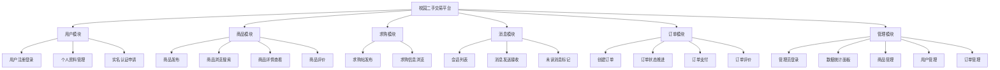
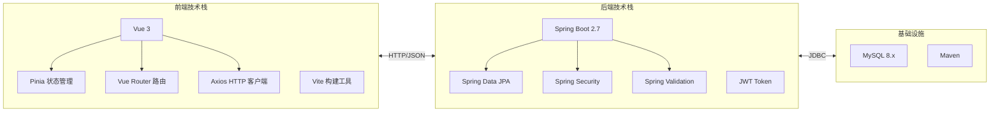
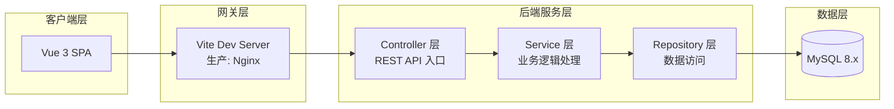
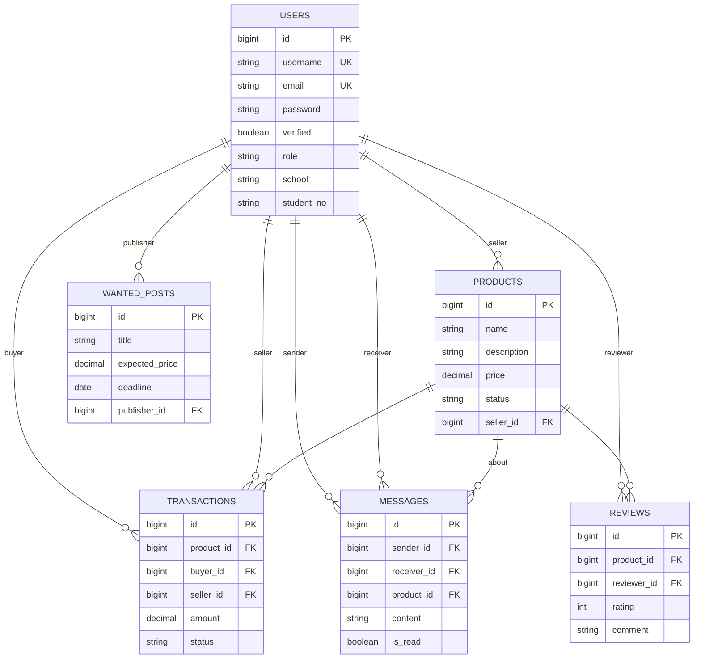
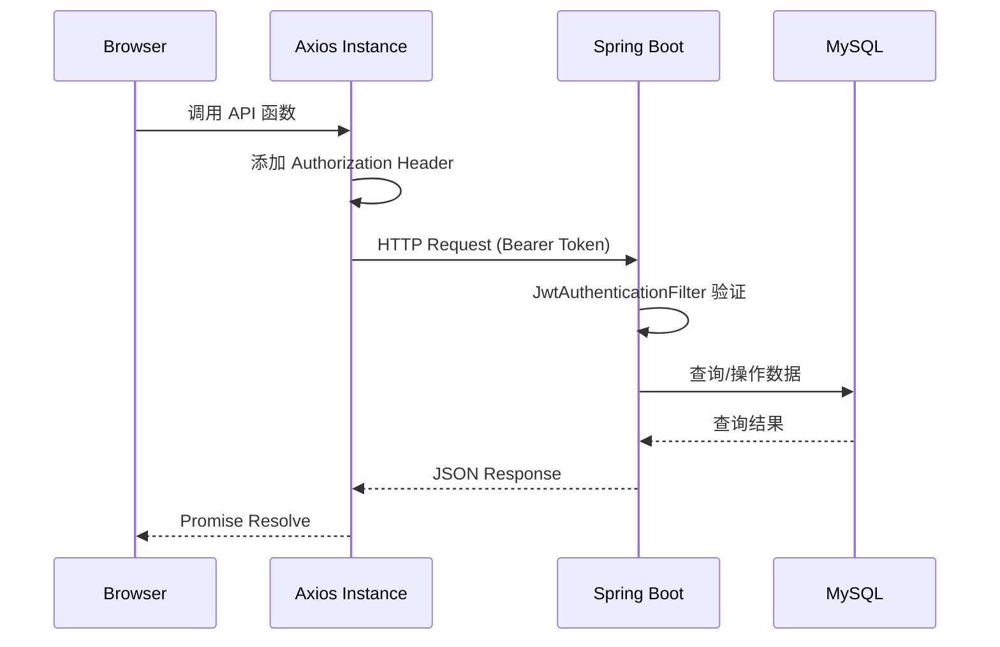
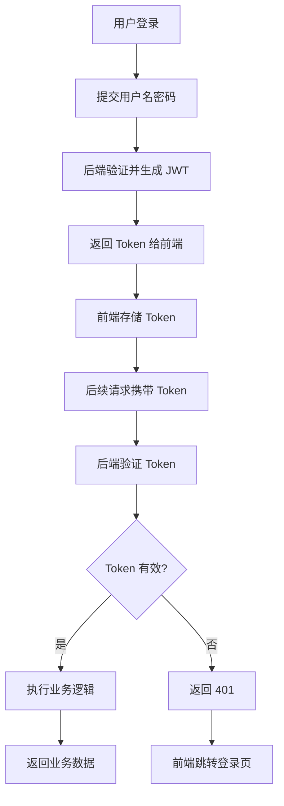

本文档为**校园二手交易平台**的概览性介绍，涵盖项目定位、核心功能、技术栈选型、系统架构与数据库设计等关键维度。作为入门指南的起点，本页面旨在帮助初学者快速建立对整个项目的全局认知，为后续的深入学习与技术实现奠定基础。

> **前置知识**：本项目采用前后端分离架构，前端基于 Vue 3 构建，后端基于 Spring Boot 构建。如对这些技术不熟悉，建议先阅读 [快速开始](2-kuai-su-kai-shi) 章节进行环境准备与项目运行。

## 1. 项目定位与背景

校园二手交易平台是针对校园场景设计的闲置物品交易系统，旨在解决学生群体在日常学习生活中产生的二手物品流通需求。相比于通用的二手交易平台，本项目具有以下鲜明的场景特征：

| 特征维度 | 校园场景 | 通用平台 |
|---------|---------|---------|
| **用户群体** | 学生、教师、教职工 | 社会各界人士 |
| **地理位置** | 限定于特定校区 | 全国/全球范围 |
| **交易方式** | 以线下面交为主 | 快递、面对面均可 |
| **信任机制** | 基于校园身份的实名认证 | 基于平台担保 |
| **商品类型** | 教材、电子产品、生活用品为主 | 全品类覆盖 |

本项目强调**轻量化**与**实用性**的平衡，聚焦于校园交易闭环中最核心的环节：商品展示、即时沟通、订单管理与评价反馈，而非追求大而全的功能堆砌。

Sources: [README.md](README.md#L1-L5), [HomePage.vue](src/views/HomePage.vue#L35-L45)

## 2. 核心功能模块

根据对源码的分析与业务梳理，本项目形成了以下六大核心功能模块：



### 2.1 用户模块

用户模块是整个平台的基础，提供身份认证与个人管理能力。系统采用 **JWT（JSON Web Token）** 实现无状态认证，用户登录后获取 Token，后续请求通过 Token 验证身份。

核心功能包括：基于用户名密码的登录、用户资料查看与编辑、实名认证申请与状态查询。其中实名认证是校园场景的重要特性，通过绑定手机号、姓名、学校与学号等信息，提升交易双方的信任度。

Sources: [src/stores/user.js](src/stores/user.js#L1-L67), [src/api/auth.js](src/api/auth.js#L1-L19)

### 2.2 商品模块

商品模块是平台的核心交易载体，支持商品的完整生命周期管理。用户可以发布二手商品，设置名称、描述、价格、原价、分类、成色、校区等属性，并上传商品图片。

商品状态机设计如下：`AVAILABLE`（在售）→ `SOLD`（已售）或 `DELETED`（已下架）。平台支持按分类、校区、成色、价格区间等条件筛选商品，并提供搜索功能帮助用户快速定位目标商品。

Sources: [src/stores/market.js](src/stores/market.js#L1-L41), [server/sql/init.sql](server/sql/init.sql#L25-L37)

### 2.3 求购模块

区别于传统二手平台仅支持"卖方发布商品"的模式，本项目增设了**求购帖**功能，允许买方主动表达需求。求购帖包含标题、期望价格、截止日期、描述与校区信息，为那些在平台上暂时找不到合适商品的用户提供另一种获取渠道。

这一功能在校园场景中尤为实用——例如学生可能在期末前急需某本教材，而平台上暂无出售，此时可以通过发布求购帖的方式主动寻找。

Sources: [server/sql/init.sql](server/sql/init.sql#L58-L67)

### 2.4 消息模块

消息模块为买卖双方提供**即时沟通**能力，支持围绕特定商品的会话功能。用户可以发起与商品卖方的对话，发送文字消息，并在消息列表中查看历史会话与未读状态。

消息系统采用"会话-消息"的二级结构：首先按交易对象聚合为会话列表（显示最新一条消息与未读计数），进入具体会话后可查看完整的消息历史。

Sources: [src/views/MessagesPage.vue](src/views/MessagesPage.vue#L1-L50)

### 2.5 订单模块

订单模块是交易闭环的关键，串联了从下单到完成的全部环节。本项目采用**步骤式订单推进**机制，订单状态沿着预设的流程节点逐步演进：

```
PENDING（待确认）→ CONFIRMED（已确认）→ PAID（已支付）→ SHIPPED（已发货）→ RECEIVED（已收货）→ COMPLETED（已完成）
```

每个状态下，用户可以执行特定操作推进流程（如支付、确认收货），同时订单支持中途取消（CANCELLED）。完整的订单流程还包括支付页面与评价页面，评价结果会关联到对应商品上。

Sources: [server/sql/init.sql](server/sql/init.sql#L39-L56), [src/views/OrderPage.vue](src/views/OrderPage.vue#L1-L50)

### 2.6 管理模块

管理模块为平台运营者提供后台能力，包括管理员登录入口、独立管理界面与四大管理功能：数据统计、商品管理、用户管理与订单管理。

管理员可以查看平台整体数据概览（用户数、商品数、订单数等），对商品进行下架处理或删除，对用户进行启用/禁用与实名认证审核，对订单状态进行监控与管理。

Sources: [src/layouts/AdminLayout.vue](src/layouts/AdminLayout.vue#L1-L182)

## 3. 技术栈选型

本项目采用**前后端分离**架构，前端与后端独立开发、部署，通过 RESTful API 进行数据交互。



### 3.1 前端技术栈详解

| 技术 | 版本 | 用途说明 |
|-----|-----|---------|
| **Vue 3** | 3.5.13 | 渐进式 JavaScript 框架，采用 Composition API 提供更灵活的组件逻辑组织方式 |
| **Pinia** | 2.3.1 | Vue 3 官方推荐的状态管理库，相比 Vuex 更轻量且对 TypeScript 支持更好 |
| **Vue Router** | 4.5.0 | Vue 官方路由管理器，负责页面导航与路由守卫逻辑 |
| **Axios** | 1.7.9 | 基于 Promise 的 HTTP 客户端，用于与后端 API 通信 |
| **Vite** | 6.1.0 | 新一代前端构建工具，提供极速的开发服务器启动与热更新体验 |

Sources: [package.json](package.json#L1-L22)

### 3.2 后端技术栈详解

| 技术 | 版本/说明 | 用途说明 |
|-----|----------|---------|
| **Spring Boot** | 2.7.0 | 基于 Spring Framework 的快速应用开发框架，内置 Tomcat 服务器 |
| **Spring Data JPA** | 继承自父项目 | 简化数据库访问层，支持 ORM 映射与 Repository 接口自动实现 |
| **Spring Security** | 继承自父项目 | 认证与授权框架，本项目用于 JWT Token 验证与权限控制 |
| **Spring Validation** | 继承自父项目 | 参数校验框架，对请求数据进行 Bean Validation |
| **MySQL Connector** | 运行时依赖 | MySQL 数据库 JDBC 驱动 |
| **JJWT** | 0.9.1 | Java 平台 JWT 库，用于 Token 生成与验证 |
| **Lombok** | 可选依赖 | 通过注解简化 Java 代码（如 getter/setter 自动生成） |

Sources: [server/pom.xml](server/pom.xml#L1-L93)

## 4. 系统架构设计

### 4.1 整体架构

本项目采用经典的三层架构设计，从前端到后端依次为：



**客户端层**由 Vue 3 构建的单页应用（SPA）构成，通过浏览器渲染页面并处理用户交互。

**网关层**在开发环境由 Vite 内置的开发服务器承担，负责反向代理前端请求到后端服务，同时提供静态资源服务。生产环境建议使用 Nginx。

**后端服务层**采用 Spring Boot 构建，遵循 **Controller → Service → Repository** 的分层结构。Controller 接收 HTTP 请求并调用 Service 层处理业务逻辑，Service 层执行核心业务操作并可能调用多个 Repository 进行数据持久化。

**数据层**采用 MySQL 8.x 作为关系型数据库，存储用户、商品、订单、消息等核心业务数据。

Sources: [vite.config.js](vite.config.js#L1-L28), [server/src/main/java/com/secondhand/controller](server/src/main/java/com/secondhand/controller)

### 4.2 前端目录结构

前端项目按照功能职责组织目录结构：

```
src/
├── api/                    # API 通信层
│   ├── auth.js            # Token 管理工具
│   ├── client.js          # Axios 实例与拦截器
│   ├── endpoints.js       # API 端点定义
│   ├── mappers.js         # 数据映射器
│   └── services/          # 业务 API 服务
│       ├── products.js
│       ├── users.js
│       └── system.js
├── components/            # 可复用 Vue 组件
│   ├── AppHeader.vue      # 顶部导航栏
│   ├── ProductCard.vue    # 商品卡片组件
│   ├── FilterPanel.vue    # 筛选面板
│   └── ...
├── layouts/               # 页面布局组件
│   ├── MainLayout.vue     # 用户端布局
│   └── AdminLayout.vue    # 管理端布局
├── stores/                # Pinia 状态管理
│   ├── user.js            # 用户状态与认证
│   ├── market.js          # 商品市场状态
│   ├── order.js           # 订单状态
│   └── chat.js            # 消息状态
├── views/                 # 页面视图组件
│   ├── HomePage.vue       # 首页
│   ├── ProductPage.vue    # 商品详情页
│   ├── OrderPage.vue      # 订单页
│   └── admin/             # 管理端页面
├── router/
│   └── index.js           # 路由配置与守卫
└── main.js                # 应用入口
```

这种目录组织方式遵循了**关注点分离**原则：API 层负责数据通信、组件层负责 UI 渲染、Store 层负责状态管理、路由层负责页面导航。

Sources: [get_dir_structure](src#L1-36)

### 4.3 后端目录结构

后端项目遵循标准的 Spring Boot 目录结构：

```
server/src/main/java/com/secondhand/
├── controller/            # 控制器层
│   ├── AuthController.java       # 认证接口
│   ├── UserController.java       # 用户接口
│   ├── ProductController.java    # 商品接口
│   ├── OrderController.java      # 订单接口
│   ├── MessageController.java    # 消息接口
│   ├── ReviewController.java     # 评价接口
│   ├── WantedController.java      # 求购帖接口
│   └── admin/                    # 管理端控制器
├── service/               # 服务层
│   ├── ProductService.java
│   ├── UserService.java
│   └── impl/              # 服务实现
├── repository/            # 数据访问层
│   ├── ProductRepository.java
│   ├── UserRepository.java
│   └── ...
├── entity/                # 实体类（JPA 实体）
│   ├── User.java
│   ├── Product.java
│   ├── Transaction.java
│   └── ...
├── dto/                   # 数据传输对象
│   ├── ProductRequest.java
│   ├── ProductResponse.java
│   └── ...
├── security/              # 安全认证组件
│   ├── JwtTokenUtil.java
│   └── JwtAuthenticationFilter.java
└── config/                # 配置类
    ├── SecurityConfig.java
    └── GlobalExceptionHandler.java
```

Sources: [get_dir_structure](server/src/main/java/com/secondhand#L1-32)

## 5. 数据库设计

### 5.1 核心实体关系

本项目设计了六个核心数据实体，它们之间的关系如下：



### 5.2 实体说明

| 实体 | 说明 | 核心字段 |
|-----|-----|---------|
| **User** | 用户信息，含认证字段与校园属性 | username, password, email, verified, role, school, student_no |
| **Product** | 商品信息 | name, price, original_price, category, condition, campus, status |
| **Transaction** | 交易订单，记录买卖关系与金额 | product_id, buyer_id, seller_id, amount, status |
| **Message** | 消息记录 | sender_id, receiver_id, product_id, content, is_read |
| **Review** | 商品评价 | product_id, reviewer_id, rating, comment |
| **WantedPost** | 求购帖 | title, expected_price, deadline, description, campus |

Sources: [server/sql/init.sql](server/sql/init.sql#L1-L173)

## 6. API 接口设计

### 6.1 API 通信机制

前端通过 Axios 封装统一的 HTTP 客户端，与后端进行 JSON 格式的数据交互。请求携带 JWT Token 进行身份验证，响应统一包装为 JSON 格式。



_sources: [src/api/client.js](src/api/client.js#L1-L31)_

### 6.2 核心接口分类

| 模块 | 主要接口 | 说明 |
|-----|---------|-----|
| **认证** | POST /api/auth/login | 用户登录获取 Token |
| **用户** | GET /api/users/me | 获取当前用户信息 |
| | POST /api/users/verify | 提交实名认证申请 |
| **商品** | GET /api/products | 商品列表（支持筛选） |
| | GET /api/products/{id} | 商品详情 |
| | POST /api/products | 发布商品 |
| **订单** | POST /api/orders | 创建订单 |
| | GET /api/orders/{id} | 订单详情 |
| | GET /api/orders/my | 我的订单列表 |
| | POST /api/orders/{id}/next-step | 推进订单状态 |
| **消息** | GET /api/messages/conversations | 会话列表 |
| | GET /api/messages/conversations/{userId} | 会话详情 |
| | POST /api/messages/conversations/{userId} | 发送消息 |
| **求购** | GET /api/wanted | 求购帖列表 |
| | POST /api/wanted | 发布求购帖 |
| **管理** | GET /api/admin/dashboard/stats | 统计数据 |
| | GET /api/admin/products | 管理端商品列表 |
| | PATCH /api/admin/products/{id}/status | 修改商品状态 |

_sources: [src/api/endpoints.js](src/api/endpoints.js#L1-L51)_

## 7. 认证与授权机制

### 7.1 JWT 认证流程

本项目采用 JWT 实现无状态认证，Token 存储于浏览器 LocalStorage 中：



_sources: [src/api/auth.js](src/api/auth.js#L1-L19), [src/stores/user.js](src/stores/user.js#L1-L67)_

### 7.2 角色权限模型

系统内置两种用户角色：

| 角色 | 标识 | 权限范围 |
|-----|-----|---------|
| **普通用户** | USER | 浏览商品、发布商品/求购、发起交易、发送消息、管理个人订单 |
| **管理员** | ADMIN | 所有普通用户权限 + 后台管理、数据统计、用户审核、商品/订单管理 |

_sources: [src/stores/user.js#L11](src/stores/user.js#L11), [server/sql/init.sql#L92](server/sql/init.sql#L92)_

## 8. 快速导航建议

完成本页面阅读后，建议按以下路径继续深入：

| 学习目标 | 推荐章节 | 说明 |
|---------|---------|-----|
| 运行项目 | [快速开始](2-kuai-su-kai-shi) | 掌握开发环境搭建与项目启动 |
| 前端深度 | [技术栈与目录结构](3-ji-zhu-zhan-yu-mu-lu-jie-gou) | 深入理解前端技术选型与代码组织 |
| 前端状态 | [状态管理设计](4-zhuang-tai-guan-li-she-ji) | 掌握 Pinia 状态管理的运用 |
| 前端路由 | [路由与权限守卫](5-lu-you-yu-quan-xian-shou-wei) | 理解路由配置与导航守卫 |
| 前端页面 | [页面组件体系](6-ye-mian-zu-jian-ti-xi) | 了解各页面的实现细节 |
| 后端架构 | [分层结构与控制器设计](7-fen-ceng-jie-gou-yu-kong-zhi-qi-she-ji) | 掌握 Spring Boot 分层设计 |
| 后端安全 | [安全配置与JWT认证](8-an-quan-pei-zhi-yu-jwtren-zheng) | 深入 Spring Security 与 JWT |
| 数据库 | [核心实体与关系](10-he-xin-shi-ti-yu-guan-xi) | 理解数据模型设计 |