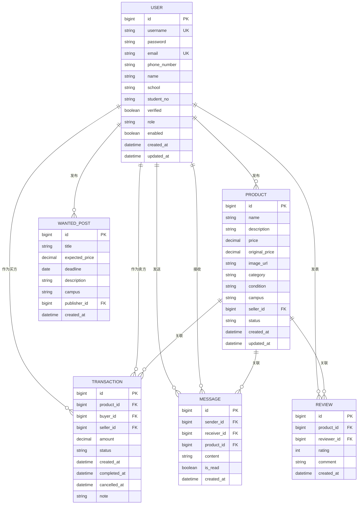
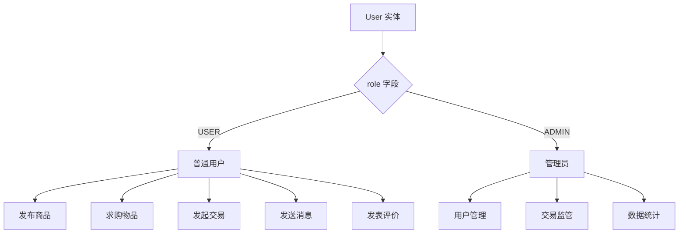
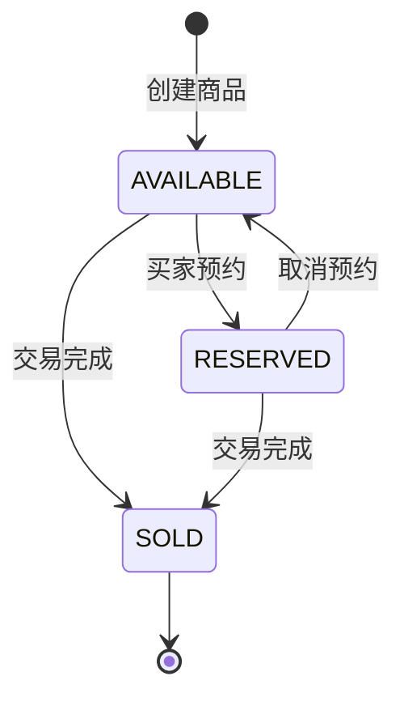
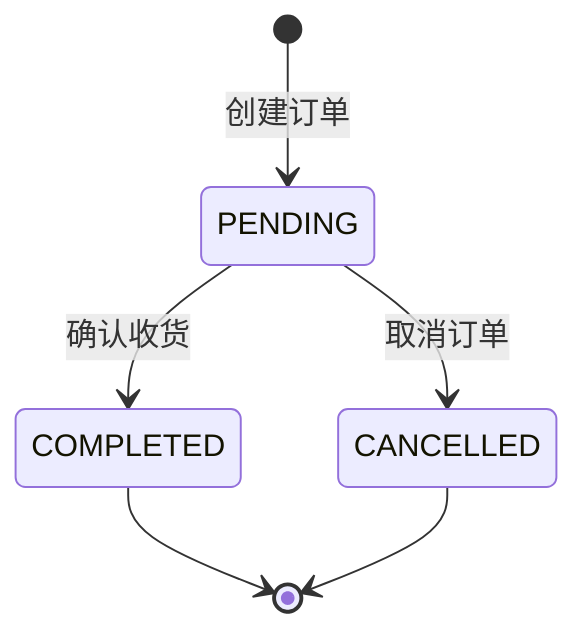
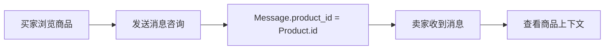
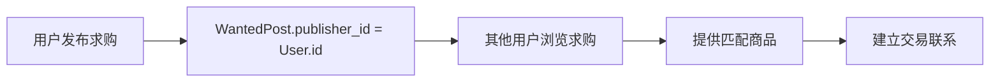
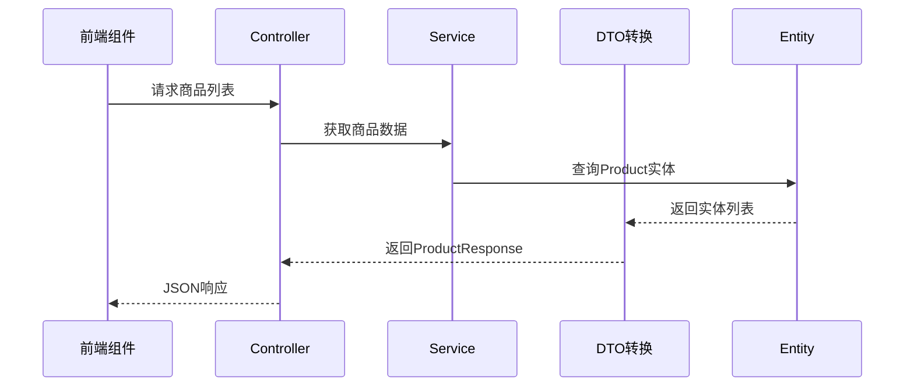

本文档系统阐述二手交易平台的数据模型设计，涵盖六个核心实体及其关联关系。该数据模型支撑从用户认证、 商品发布、交易达成、消息沟通到评价反馈的完整业务闭环。

## 实体概览与ER图

系统包含六个核心实体：**User（用户）**、**Product（商品）**、**Transaction（交易）**、**Message（消息）**、**Review（评价）** 和 **WantedPost（求购帖子）**。它们之间的关系可通过以下ER图直观理解：



上述ER图清晰展示了六张表之间的外键依赖关系。其中 **Transaction（交易）** 作为核心业务实体，关联了 Product、Buyer（User）和 Seller（User）三个实体，形成了交易闭环的核心路径。

Sources: [init.sql](server/sql/init.sql#L1-L173)
Sources: [Transaction.java](server/src/main/java/com/secondhand/entity/Transaction.java#L1-L51)
Sources: [User.java](server/src/main/java/com/secondhand/entity/User.java#L1-L82)
Sources: [Product.java](server/src/main/java/com/secondhand/entity/Product.java#L1-L64)

## 用户实体（User）

User 实体是整个系统的基础，承载用户认证、个人信息和权限管理等功能。

### 实体属性定义

| 属性名 | 数据类型 | 约束 | 说明 |
|--------|----------|------|------|
| id | BIGINT | PK, AUTO_INCREMENT | 用户唯一标识 |
| username | VARCHAR(255) | NOT NULL, UNIQUE | 登录用户名 |
| password | VARCHAR(255) | NOT NULL | 密码（BCrypt加密存储） |
| email | VARCHAR(255) | NOT NULL, UNIQUE | 邮箱地址 |
| phone_number | VARCHAR(255) | 可选 | 手机号码 |
| name | VARCHAR(255) | 可选 | 真实姓名 |
| school | VARCHAR(255) | 可选 | 所属校区 |
| student_no | VARCHAR(255) | 可选 | 学号 |
| verified | BIT(1) | NOT NULL, DEFAULT false | 认证状态 |
| role | VARCHAR(255) | DEFAULT 'USER' | 角色：USER 或 ADMIN |
| enabled | BIT(1) | NOT NULL, DEFAULT true | 账户启用状态 |
| created_at | DATETIME | 自动填充 | 创建时间 |
| updated_at | DATETIME | 自动填充 | 更新时间 |

### 用户角色与权限



系统设计了两种角色：**USER（普通用户）** 和 **ADMIN（管理员）**。普通用户可进行商品交易相关的全部操作，管理员则拥有系统级别的监管权限。

Sources: [User.java](server/src/main/java/com/secondhand/entity/User.java#L10-L40)

## 商品实体（Product）

Product 实体代表用户在平台上出售的二手物品，包含了商品描述、定价、状态等核心信息。

### 实体属性定义

| 属性名 | 数据类型 | 约束 | 说明 |
|--------|----------|------|------|
| id | BIGINT | PK, AUTO_INCREMENT | 商品唯一标识 |
| name | VARCHAR(255) | NOT NULL | 商品名称 |
| description | VARCHAR(1000) | 可选 | 商品详细描述 |
| price | DECIMAL(19,2) | NOT NULL | 售价 |
| original_price | DECIMAL(19,2) | 可选 | 原价 |
| image_url | VARCHAR(255) | 可选 | 商品图片URL |
| category | VARCHAR(255) | 可选 | 商品分类 |
| condition | VARCHAR(255) | 可选 | 成色描述 |
| campus | VARCHAR(255) | 可选 | 所在校区 |
| seller_id | BIGINT | FK, NOT NULL | 卖家ID |
| status | VARCHAR(255) | 可选 | 商品状态 |
| created_at | DATETIME | 自动填充 | 发布时间 |
| updated_at | DATETIME | 自动填充 | 更新时间 |

### 商品状态流转



商品状态包括：**AVAILABLE（可售）**、**RESERVED（已预约）** 和 **SOLD（已售出）**。状态变更由交易流程触发，确保商品状态与交易状态的一致性。

Sources: [Product.java](server/src/main/java/com/secondhand/entity/Product.java#L1-L64)
Sources: [init.sql](server/sql/init.sql#L34-L52)

## 交易实体（Transaction）

Transaction 是系统的核心业务实体，记录买卖双方就某件商品达成的交易意向与状态。

### 实体属性定义

| 属性名 | 数据类型 | 约束 | 说明 |
|--------|----------|------|------|
| id | BIGINT | PK, AUTO_INCREMENT | 交易唯一标识 |
| product_id | BIGINT | FK, NOT NULL | 关联商品 |
| buyer_id | BIGINT | FK, NOT NULL | 买家ID |
| seller_id | BIGINT | FK, NOT NULL | 卖家ID |
| amount | DECIMAL(19,2) | NOT NULL | 交易金额 |
| status | VARCHAR(255) | NOT NULL | 交易状态 |
| created_at | DATETIME | 自动填充 | 创建时间 |
| completed_at | DATETIME | 可选 | 完成时间 |
| cancelled_at | DATETIME | 可选 | 取消时间 |
| note | VARCHAR(1000) | 可选 | 备注信息 |

### 交易状态机



Transaction 在创建时自动设置状态为 **PENDING（待确认）**，之后根据买卖双方的确认操作流转为 COMPLETED 或 CANCELLED。实体通过 `@PrePersist` 注解在持久化时自动设置创建时间和初始状态。

Sources: [Transaction.java](server/src/main/java/com/secondhand/entity/Transaction.java#L1-L51)
Sources: [init.sql](server/sql/init.sql#L53-L67)

## 消息实体（Message）

Message 实体实现用户间的即时沟通功能，支持围绕特定商品展开的上下文对话。

### 实体属性定义

| 属性名 | 数据类型 | 约束 | 说明 |
|--------|----------|------|------|
| id | BIGINT | PK, AUTO_INCREMENT | 消息唯一标识 |
| sender_id | BIGINT | FK, NOT NULL | 发送者ID |
| receiver_id | BIGINT | FK, NOT NULL | 接收者ID |
| product_id | BIGINT | FK, 可选 | 关联商品（用于上下文） |
| content | VARCHAR(1000) | NOT NULL | 消息内容 |
| is_read | BIT(1) | DEFAULT false | 已读状态 |
| created_at | DATETIME | 自动填充 | 发送时间 |

### 消息与商品关联



Message 实体通过可选的 `product_id` 外键关联商品，使买卖双方在沟通过程中能够清晰了解对话发生在哪个商品上下文中。当用户从商品详情页发起咨询时，系统自动携带商品ID创建消息记录。

Sources: [Message.java](server/src/main/java/com/secondhand/entity/Message.java#L1-L40)
Sources: [init.sql](server/sql/init.sql#L68-L81)

## 评价实体（Review）

Review 实体允许买家对已完成交易进行评分和评论，构建平台信用体系。

### 实体属性定义

| 属性名 | 数据类型 | 约束 | 说明 |
|--------|----------|------|------|
| id | BIGINT | PK, AUTO_INCREMENT | 评价唯一标识 |
| product_id | BIGINT | FK, NOT NULL | 关联商品 |
| reviewer_id | BIGINT | FK, NOT NULL | 评价者ID（买家） |
| rating | INT | NOT NULL | 评分（1-5星） |
| comment | VARCHAR(1000) | 可选 | 评价内容 |
| created_at | DATETIME | 自动填充 | 评价时间 |

### 评价与交易绑定

Review 实体通过外键约束确保评价只能针对已存在的商品和评价者。每条评价必须关联一个有效的 Product 记录，且评价者必须是在该商品上有过交易记录的买家，从而保证评价的真实性和可追溯性。

Sources: [Review.java](server/src/main/java/com/secondhand/entity/Review.java#L1-L36)
Sources: [init.sql](server/sql/init.sql#L82-L93)

## 求购帖子实体（WantedPost）

WantedPost 实体支持用户发布求购需求，形成"我要买"的信息发布渠道，与商品发布形成互补。

### 实体属性定义

| 属性名 | 数据类型 | 约束 | 说明 |
|--------|----------|------|------|
| id | BIGINT | PK, AUTO_INCREMENT | 求购帖子唯一标识 |
| title | VARCHAR(255) | NOT NULL | 帖子标题 |
| expected_price | DECIMAL(19,2) | 可选 | 期望价格 |
| deadline | DATE | 可选 | 截止日期 |
| description | VARCHAR(1000) | 可选 | 详细需求描述 |
| campus | VARCHAR(255) | 可选 | 希望交易校区 |
| publisher_id | BIGINT | FK, NOT NULL | 发布者ID |
| created_at | DATETIME | 自动填充 | 发布时间 |

### 求购流程示意



WantedPost 作为独立的信息发布实体，其生命周期独立于商品和交易。用户可以发布求购意向，其他用户看到后可以选择提供商品并建立联系，形成反向交易的业务模式。

Sources: [WantedPost.java](server/src/main/java/com/secondhand/entity/WantedPost.java#L1-L45)
Sources: [init.sql](server/sql/init.sql#L94-L106)

## 实体关系矩阵

下表汇总了六张核心表之间的外键依赖关系：

| 源实体 | 目标实体 | 关系类型 | 外键字段 | 说明 |
|--------|----------|----------|----------|------|
| Product | User | N:1 | seller_id | 每个商品有且仅有一个卖家 |
| Transaction | Product | N:1 | product_id | 每笔交易关联一个商品 |
| Transaction | User (buyer) | N:1 | buyer_id | 每笔交易有一个买家 |
| Transaction | User (seller) | N:1 | seller_id | 每笔交易有一个卖家 |
| Message | User (sender) | N:1 | sender_id | 每条消息有一个发送者 |
| Message | User (receiver) | N:1 | receiver_id | 每条消息有一个接收者 |
| Message | Product | N:1 | product_id | 消息可关联商品（可选） |
| Review | Product | N:1 | product_id | 每条评价针对一个商品 |
| Review | User | N:1 | reviewer_id | 每条评价来自一个用户 |
| WantedPost | User | N:1 | publisher_id | 每个求购帖子有一个发布者 |

从上述关系矩阵可见，**User 实体是所有业务实体的中心节点**，承担着卖家、买家、消息收发双方、评价者、求购发布者等多重角色。这种设计体现了校园二手交易场景中"用户即核心"的特点。

## 数据完整性约束

系统通过外键约束和业务规则确保数据的完整性和一致性。

### 数据库层面约束

```sql
-- 商品必须关联有效卖家
CONSTRAINT `fk_products_seller` FOREIGN KEY (`seller_id`) REFERENCES `users` (`id`)

-- 交易必须关联有效商品和用户
CONSTRAINT `fk_transactions_product` FOREIGN KEY (`product_id`) REFERENCES `products` (`id`)
CONSTRAINT `fk_transactions_buyer` FOREIGN KEY (`buyer_id`) REFERENCES `users` (`id`)
CONSTRAINT `fk_transactions_seller` FOREIGN KEY (`seller_id`) REFERENCES `users` (`id`)
```

所有业务表均设置了适当的外键约束，确保数据引用的有效性。级联删除策略默认不启用，需要通过应用层逻辑显式处理关联数据的删除操作。

### 应用层约束

实体类通过 JPA 注解在持久化前后自动维护时间戳和默认值：

- `@PrePersist` 在插入记录前自动设置创建时间
- `@PreUpdate` 在更新记录前自动更新时间戳
- Transaction 创建时自动设置 status 为 "PENDING"

Sources: [init.sql](server/sql/init.sql#L1-L173)
Sources: [Transaction.java](server/src/main/java/com/secondhand/entity/Transaction.java#L42-L50)
Sources: [User.java](server/src/main/java/com/secondhand/entity/User.java#L53-L78)

## 初始数据策略

系统通过 init.sql 脚本预置了测试账号和示例数据，便于开发调试和功能演示。

### 预置测试账号

| username | password | role | 用途 |
|----------|----------|------|------|
| seller01 | 123456 | USER | 卖家角色测试 |
| buyer01 | 123456 | USER | 买家角色测试 |
| seller02 | 123456 | USER | 备用卖家 |
| admin | 123456 | ADMIN | 管理员功能测试 |

所有测试账号的密码均使用 BCrypt 算法加密存储，加密后的哈希值为 `$2a$10$VreBkEVIIqIvynfocMCYruDyMRShpmj5ynkdNwKw94VEYsRWSRt9i`。

Sources: [init.sql](server/sql/init.sql#L86-L95)
Sources: [11-chu-shi-hua-shu-ju-ce-lue](11-chu-shi-hua-shu-ju-ce-lue)

## 前后端数据映射

后端实体通过 DTO（Data Transfer Object）转换为 API 响应格式，供前端组件消费。



例如 OrderResponse 对 Transaction 实体进行扁平化处理，提取买家、卖家和商品信息中的关键字段供前端展示，避免暴露完整的实体结构。

Sources: [OrderResponse.java](server/src/main/java/com/secondhand/dto/OrderResponse.java#L1-L41)
Sources: [06-ye-mian-zu-jian-ti-xi](6-ye-mian-zu-jian-ti-xi)

## 总结

本系统的数据模型设计遵循以下核心原则：

1. **实体单一职责**：每个实体聚焦于一个业务概念，避免功能混杂
2. **外键清晰引用**：通过外键约束确保数据引用完整性
3. **状态机规范**：Transaction 和 Product 采用状态机模式管理生命周期
4. **时间戳自动维护**：通过 JPA 生命周期回调自动维护审计字段
5. **角色权限分离**：User 实体通过 role 字段支持功能权限隔离

这一数据模型为上层业务逻辑和服务交互提供了坚实的数据基础，后续可在此基础上扩展更多业务功能。