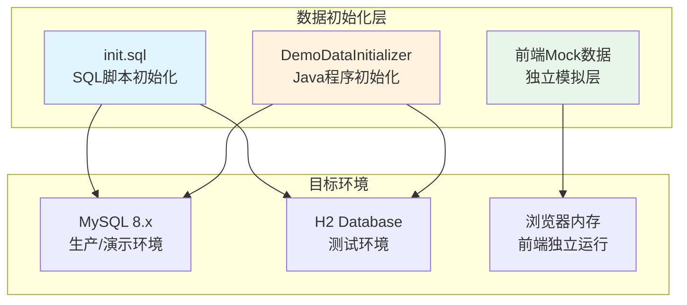
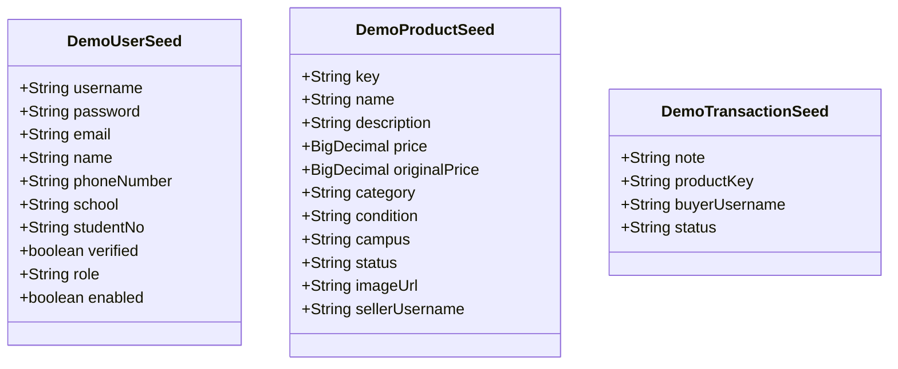
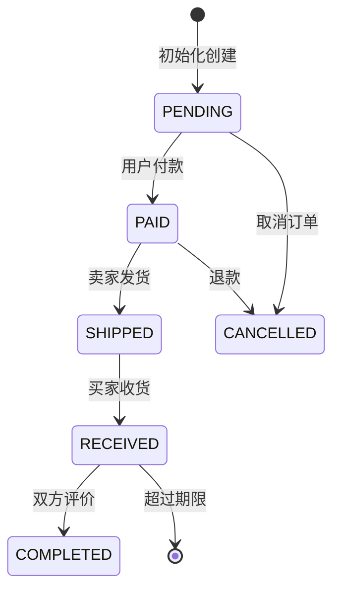
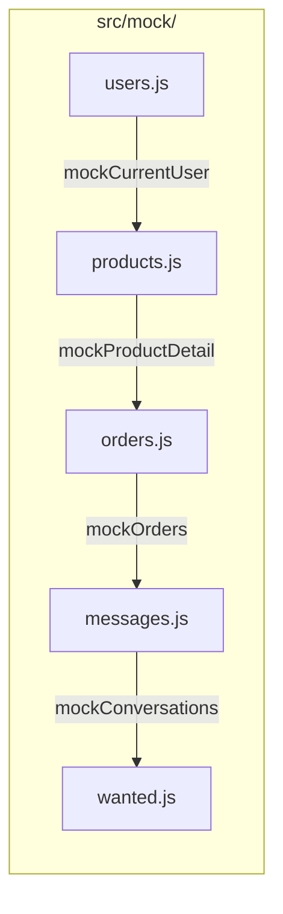
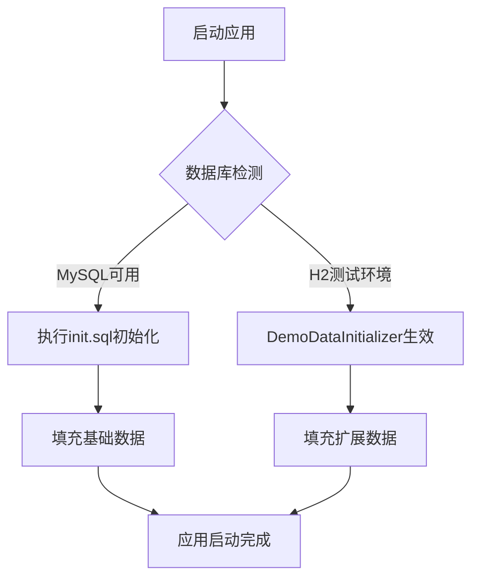

本页面详细阐述校园二手交易平台的初始化数据设计策略，包括后端数据库初始化脚本、前端模拟数据层以及两者协同工作的机制。理解这一策略对于本地开发环境搭建、功能演示以及毕设答辩演示至关重要。

## 设计理念

系统采用**双层初始化架构**，分别在数据库层和应用程序层提供独立的数据初始化能力。这种设计既满足了快速手动部署的需求（`init.sql`），也保证了 Spring Boot 应用启动时能够自动填充完整的演示数据（`DemoDataInitializer`）。



Sources: [server/sql/init.sql](server/sql/init.sql#L1-L173), [server/src/main/java/com/secondhand/config/DemoDataInitializer.java](server/src/main/java/com/secondhand/config/DemoDataInitializer.java#L1-L65)

## SQL 脚本初始化

### 设计特点

`server/sql/init.sql` 采用**先清后插**模式，通过预定义的 ID 范围清理旧数据后重新插入，确保脚本可重复执行而不会产生主键冲突或数据膨胀。这种设计特别适合以下场景：

- 初次搭建 MySQL 数据库环境
- 演示环境快速重置
- 毕设答辩前的环境准备

脚本在执行任何 INSERT 操作前，会依次清理关联表的演示数据，利用外键约束确保引用完整性。

Sources: [server/sql/init.sql](server/sql/init.sql#L120-L126)

### 密码策略

所有测试账号的密码统一为 `123456`，存储时使用 BCrypt 加密算法。脚本通过预计算的哈希值避免运行时计算：

```java
// BCrypt(123456) 预计算哈希
SET @PWD_HASH = '$2a$10$VreBkEVIIqIvynfocMCYruDyMRShpmj5ynkdNwKw94VEYsRWSRt9i';
```

Sources: [server/sql/init.sql](server/sql/init.sql#L128-L129)

### 初始数据规模

| 数据类型 | 数量 | 说明 |
|---------|------|------|
| 用户 | 4 | 包含管理员、卖家、未认证用户 |
| 商品 | 4 | 覆盖数码、书籍、交通工具类别 |
| 订单 | 2 | 包含已完成和待确认两种状态 |
| 消息 | 3 | 覆盖已读和未读状态 |
| 求购帖 | 2 | 不同校区和截止日期 |
| 评价 | 2 | 展示双向评价场景 |

Sources: [server/sql/init.sql](server/sql/init.sql#L131-L170)

### 测试账号矩阵

| 用户名 | 角色 | 认证状态 | 默认密码 | 适用场景 |
|--------|------|----------|----------|----------|
| admin | ADMIN | 已认证 | 123456 | 后台管理系统登录 |
| seller01 | USER | 已认证 | 123456 | 卖家身份交易演示 |
| buyer01 | USER | 已认证 | 123456 | 买家身份交易演示 |
| seller02 | USER | 未认证 | 123456 | 认证流程演示 |

Sources: [server/sql/init.sql](server/sql/init.sql#L131-L137)

## Java 程序初始化

### 架构设计

`DemoDataInitializer` 实现 Spring Boot 的 `CommandLineRunner` 接口，在应用上下文刷新完成后自动执行。其核心设计理念包括：

**幂等性保证**：通过唯一键检测避免重复插入数据，支持应用重启时不会产生数据污染。

**依赖顺序管理**：按 Users → Products → WantedPosts → Transactions → Messages → Reviews 的顺序执行，确保外键约束不被违反。

**向后兼容**：包含 `normalizeLegacyUsers` 方法，自动修复历史数据中的角色和启用状态字段。

Sources: [server/src/main/java/com/secondhand/config/DemoDataInitializer.java](server/src/main/java/com/secondhand/config/DemoDataInitializer.java#L56-L65)

### 种子数据结构

系统为每种实体定义了专用的种子数据结构，便于集中管理和扩展：



Sources: [server/src/main/java/com/secondhand/config/DemoDataInitializer.java](server/src/main/java/com/secondhand/config/DemoDataInitializer.java#L403-L486)

### 数据规模对比

| 数据类型 | init.sql | DemoDataInitializer | 增长倍数 |
|---------|----------|---------------------|---------|
| 用户 | 4 | 10 | 2.5x |
| 商品 | 4 | 16 | 4x |
| 订单 | 2 | 10 | 5x |
| 消息 | 3 | 8 | 2.7x |
| 求购帖 | 2 | 8 | 4x |
| 评价 | 2 | 4 | 2x |

DemoDataInitializer 提供了更丰富的数据集，覆盖更多商品类别（数码、书籍、生活电器、运动、乐器等）和订单状态（待支付、已支付、已发货、已收货、已完成、已取消）。

Sources: [server/src/main/java/com/secondhand/config/DemoDataInitializer.java](server/src/main/java/com/secondhand/config/DemoDataInitializer.java#L67-L111)

### 订单状态覆盖

DemoDataInitializer 初始化了覆盖完整交易生命周期的订单数据：



| 状态码 | 说明 | 示例场景 |
|--------|------|----------|
| PENDING | 待支付 | seed-order-001 |
| PAID | 已支付待发货 | seed-order-002, seed-order-007 |
| SHIPPED | 已发货 | seed-order-003, seed-order-008 |
| RECEIVED | 已收货待评价 | seed-order-004, seed-order-009 |
| COMPLETED | 已完成 | seed-order-005, seed-order-010 |
| CANCELLED | 已取消 | seed-order-006 |

Sources: [server/src/main/java/com/secondhand/config/DemoDataInitializer.java](server/src/main/java/com/secondhand/config/DemoDataInitializer.java#L268-L320)

## 前端模拟数据层

### 设计定位

前端 `src/mock/` 目录下的模拟数据服务于以下目标：

- **独立演示**：不依赖后端服务即可展示页面效果
- **开发调试**：快速验证前端组件逻辑
- **视觉稿验证**：提供真实感的数据结构用于 UI 校验

Sources: [src/mock/products.js](src/mock/products.js#L1-L58), [src/mock/orders.js](src/mock/orders.js#L1-L23)

### 数据格式差异

| 维度 | 后端格式 | 前端Mock格式 | 示例 |
|------|----------|--------------|------|
| ID类型 | Long (数字) | String (前缀) | 1 vs "p-1001" |
| 用户ID | Long | String | 1 vs "u-2001" |
| 价格 | BigDecimal | Number | 199.00 vs 5499 |
| 图片 | 单URL | 数组 | "url" vs ["url"] |

Sources: [src/mock/products.js](src/mock/products.js#L1-L37), [src/mock/users.js](src/mock/users.js#L1-L10)

### Mock 数据结构



Sources: [src/mock/users.js](src/mock/users.js#L1-L10), [src/mock/products.js](src/mock/products.js#L1-L58), [src/mock/orders.js](src/mock/orders.js#L1-L23), [src/mock/messages.js](src/mock/messages.js#L1-L25), [src/mock/wanted.js](src/mock/wanted.js#L1-L23)

## 协同工作机制

### 环境匹配策略



两种初始化方式可以共存：手动执行 `init.sql` 建立基础结构后，Spring Boot 启动时会通过 `DemoDataInitializer` 补充更多演示数据。

Sources: [server/README.md](server/README.md#L104-L123)

### 重复执行保护

DemoDataInitializer 通过多重机制防止重复数据：

1. **用户同步**：`syncSeedUser` 方法检查现有用户的必填字段，为空时自动补充
2. **商品去重**：基于 `sellerId + productName` 组合键判断是否已存在
3. **消息去重**：基于 `senderId + receiverId + productId + content` 组合键确保消息唯一性
4. **订单标记**：订单 `note` 字段以 `seed-order-` 前缀标识，便于识别和跳过

Sources: [server/src/main/java/com/secondhand/config/DemoDataInitializer.java](server/src/main/java/com/secondhand/config/DemoDataInitializer.java#L113-L154), [server/src/main/java/com/secondhand/config/DemoDataInitializer.java](server/src/main/java/com/secondhand/config/DemoDataInitializer.java#L393-L401)

## 最佳实践建议

### 开发环境

对于日常开发，推荐仅使用 `DemoDataInitializer`，无需手动执行 SQL 脚本。其优势在于：

- 自动处理密码 BCrypt 加密
- 支持 H2 测试数据库
- 便于通过 `@Transactional` 回滚测试数据

### 演示环境

毕设答辩前，建议按以下步骤准备：

1. 执行 `init.sql` 建立干净的 MySQL 数据库
2. 启动 Spring Boot 应用，`DemoDataInitializer` 会自动补充扩展数据
3. 使用 admin/123456 登录管理端，验证统计数据完整性

### 数据重置

需要完全重置演示数据时，可采用以下任一方式：

**SQL 脚本方式**：
```bash
mysql -u root -p secondhand < server/sql/init.sql
```

**删除后重启方式**：
直接删除 MySQL 数据库，重新启动 Spring Boot 应用。

Sources: [server/README.md](server/README.md#L120-L122)

## 扩展指南

### 添加新测试用户

在 `DemoDataInitializer.seedUsers()` 方法的 `userSeeds` 列表中追加新条目：

```java
new DemoUserSeed("newhandle", "123456", "new@campus.com", "新人", 
                 "13800000099", "主校区", "20220099", true, "USER", true)
```

Sources: [server/src/main/java/com/secondhand/config/DemoDataInitializer.java](server/src/main/java/com/secondhand/config/DemoDataInitializer.java#L67-L80)

### 添加新商品类别

在 `seedProducts` 方法的 `seeds` 列表中追加，指定对应的卖家用户名：

```java
new DemoProductSeed("p-newitem", "新商品名称", "商品描述", 
                   "价格", "原价", "类别", "成色", "校区", 
                   "AVAILABLE", "图片URL", "卖家用户名")
```

Sources: [server/src/main/java/com/secondhand/config/DemoDataInitializer.java](server/src/main/java/com/secondhand/config/DemoDataInitializer.java#L173-L191)

---

**相关文档**：[核心实体与关系](10-he-xin-shi-ti-yu-guan-xi) | [角色模型与权限规则](12-jiao-se-mo-xing-yu-quan-xian-gui-ze) | [用户交易闭环](14-yong-hu-jiao-yi-bi-huan)