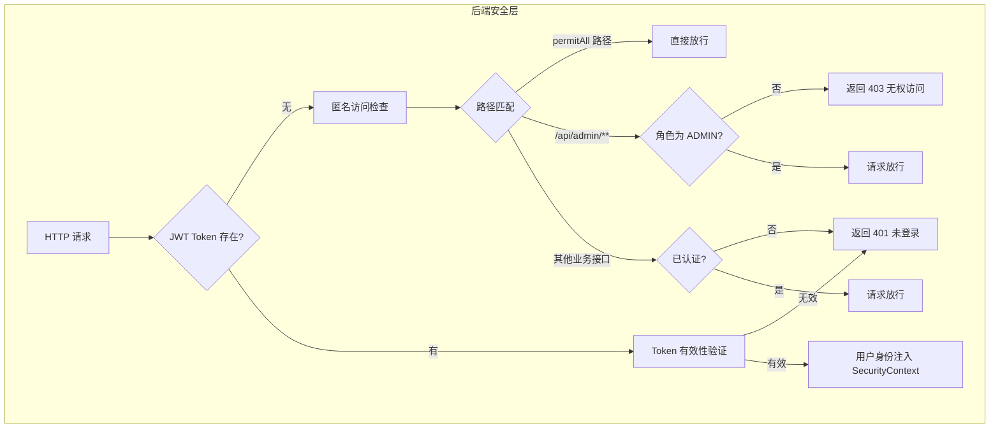
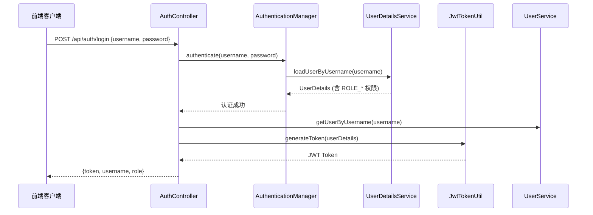

本章节系统阐述二手交易平台的身份认证架构与访问控制体系，涵盖数据库层面的角色定义、后端 Spring Security 权限配置、前端 Vue Router 路由守卫以及 Pinia 状态管理中的角色同步机制。通过理解这套双层（前后端）权限模型，开发者能够掌握用户身份与管理员身份的隔离策略，以及 token 认证在分布式环境下的工作原理。

---

## 1. 角色模型概述

系统采用**基于角色的访问控制（RBAC）**简化模型，仅定义两种核心角色以覆盖业务场景：

| 角色标识 | 角色名称 | 权限范围 | 典型用户 |
|----------|----------|----------|----------|
| `USER` | 普通用户 | 商品浏览、发布、交易、消息、订单管理 | 买卖双方 |
| `ADMIN` | 管理员 | 前台全部功能 + 管理端 `/api/admin/**` 接口 | 平台运营者 |

除了角色字段外，`enabled` 布尔字段承担**账号状态控制**职责，用于实现账号的软禁用能力。

Sources: [User.java](server/src/main/java/com/secondhand/entity/User.java#L42-L46) [init.sql](server/sql/init.sql#L27-L28)

---

## 2. 数据库层角色定义

用户表的角色存储采用字符串字段，设计上保留了角色扩展的灵活性：

```sql
CREATE TABLE IF NOT EXISTS `users` (
  `id` BIGINT NOT NULL AUTO_INCREMENT,
  `username` VARCHAR(255) NOT NULL,
  `role` VARCHAR(255) DEFAULT 'USER',     -- 角色标识
  `enabled` BIT(1) NOT NULL DEFAULT b'1', -- 账号启用状态
  -- ...
);
```

初始化脚本预置了四类测试账号：

| 用户名 | 角色 | 认证状态 | 账号状态 | 密码 |
|--------|------|----------|----------|------|
| `seller01` | USER | 已认证 | 启用 | 123456 |
| `buyer01` | USER | 已认证 | 启用 | 123456 |
| `seller02` | USER | 未认证 | 启用 | 123456 |
| `admin` | ADMIN | 已认证 | 启用 | 123456 |

User 实体在持久化时通过 `@PrePersist` 钩子确保默认值生效：

```java
@PrePersist
protected void onCreate() {
    if (role == null || role.trim().isEmpty()) {
        role = "USER";
    }
    if (enabled == null) {
        enabled = true;
    }
}
```

Sources: [User.java](server/src/main/java/com/secondhand/entity/User.java#L54-L64) [init.sql](server/sql/init.sql#L131-L137)

---

## 3. 后端安全配置与权限规则

### 3.1 Spring Security 过滤器链

系统使用 Spring Security 6.x 的新型配置风格，通过 `SecurityFilterChain` Bean 定义过滤器链：

```java
@Bean
public SecurityFilterChain securityFilterChain(
        HttpSecurity http,
        JwtAuthenticationFilter jwtAuthenticationFilter,
        JwtAuthenticationEntryPoint jwtAuthenticationEntryPoint) throws Exception {
    http
        .cors().and()
        .csrf().disable()
        .authorizeRequests(auth -> auth
            .antMatchers("/", "/api/auth/**", "/api/system/db-health").permitAll()
            .antMatchers(HttpMethod.GET, "/api/system/summary").permitAll()
            .antMatchers(HttpMethod.GET, "/api/products/**").permitAll()
            .antMatchers(HttpMethod.GET, "/api/wanted").permitAll()
            .antMatchers("/api/admin/**").hasRole("ADMIN")
            .anyRequest().authenticated()
        )
        .exceptionHandling(exception -> exception
            .authenticationEntryPoint(jwtAuthenticationEntryPoint))
        .sessionManagement(session -> session
            .sessionCreationPolicy(SessionCreationPolicy.STATELESS))
        .addFilterBefore(jwtAuthenticationFilter, 
            UsernamePasswordAuthenticationFilter.class);
    return http.build();
}
```

### 3.2 权限规则层级



| 路径模式 | 权限要求 | 说明 |
|----------|----------|------|
| `/`, `/api/auth/**`, `/api/system/db-health` | 允许匿名 | 首页、认证端点、健康检查 |
| `GET /api/system/summary` | 允许匿名 | 系统摘要查询 |
| `GET /api/products/**` | 允许匿名 | 商品列表与详情 |
| `GET /api/wanted` | 允许匿名 | 求购帖子列表 |
| `/api/admin/**` | 必须具备 `ADMIN` 角色 | 管理端全部接口 |
| 其他业务接口 | 必须已认证 | 用户订单、消息、发布等 |

Sources: [SecurityConfig.java](server/src/main/java/com/secondhand/config/SecurityConfig.java#L39-L46)

---

## 4. JWT 认证过滤器

### 4.1 Token 验证流程

`JwtAuthenticationFilter` 继承自 `OncePerRequestFilter`，确保每个请求仅执行一次认证逻辑：

```java
@Override
protected void doFilterInternal(HttpServletRequest request, HttpServletResponse response, FilterChain chain)
        throws ServletException, IOException {
    final String authorizationHeader = request.getHeader("Authorization");
    String username = null;
    String jwt = null;

    if (authorizationHeader != null && authorizationHeader.startsWith("Bearer ")) {
        jwt = authorizationHeader.substring(7);
        try {
            username = jwtTokenUtil.extractUsername(jwt);
        } catch (ExpiredJwtException ex) {
            log.info("JWT 已过期，已忽略本次认证，请求路径: {}", request.getRequestURI());
        } catch (JwtException | IllegalArgumentException ex) {
            log.warn("JWT 无效，已忽略本次认证，请求路径: {}", request.getRequestURI());
        }
    }

    if (username != null && SecurityContextHolder.getContext().getAuthentication() == null) {
        UserDetails userDetails = this.userDetailsService.loadUserByUsername(username);
        if (jwtTokenUtil.validateToken(jwt, userDetails)) {
            UsernamePasswordAuthenticationToken authToken = new UsernamePasswordAuthenticationToken(
                    userDetails, null, userDetails.getAuthorities());
            authToken.setDetails(new WebAuthenticationDetailsSource().buildDetails(request));
            SecurityContextHolder.getContext().setAuthentication(authToken);
        }
    }
    chain.doFilter(request, response);
}
```

关键设计决策：token 过期或无效时**不会阻断请求**，而是允许请求继续流转，仅将未认证的匿名身份注入 SecurityContext。这样 permitAll 路径可以正常访问，而受保护路径会在后续的 `authorizeRequests` 检查中拒绝未认证请求。

Sources: [JwtAuthenticationFilter.java](server/src/main/java/com/secondhand/security/JwtAuthenticationFilter.java#L34-L64)

### 4.2 Token 生成与验证

`JwtTokenUtil` 组件负责 token 的创建与校验，采用 HS512 签名算法：

```java
public String generateToken(UserDetails userDetails) {
    Map<String, Object> claims = new HashMap<>();
    return createToken(claims, userDetails.getUsername());
}

private String createToken(Map<String, Object> claims, String subject) {
    return Jwts.builder()
            .setClaims(claims)
            .setSubject(subject)
            .setIssuedAt(new Date(System.currentTimeMillis()))
            .setExpiration(new Date(System.currentTimeMillis() + expiration * 1000))
            .signWith(SignatureAlgorithm.HS512, secret)
            .compact();
}

public Boolean validateToken(String token, UserDetails userDetails) {
    try {
        final String username = extractUsername(token);
        return (username.equals(userDetails.getUsername()) && !isTokenExpired(token));
    } catch (ExpiredJwtException | JwtException | IllegalArgumentException ex) {
        return false;
    }
}
```

Token 中仅存储用户名（subject），用户权限信息通过 `UserDetailsService` 在每次请求时从数据库重新加载，确保角色变更实时生效。

Sources: [JwtTokenUtil.java](server/src/main/java/com/secondhand/security/JwtTokenUtil.java#L26-L50)

### 4.3 异常响应规范

| 异常类型 | HTTP 状态码 | 响应消息 | 触发场景 |
|----------|-------------|----------|----------|
| `JwtAuthenticationEntryPoint` | 401 | `"未登录或登录已过期"` | token 缺失或无效 |
| `BadCredentialsException` | 401 | `"用户名或密码错误"` | 登录认证失败 |
| `DisabledException` | 403 | `"账号已被禁用，请联系管理员"` | enabled=false 的账号尝试登录 |
| `AccessDeniedException` | 403 | `"无权执行该操作"` | 具备 USER 角色访问 `/api/admin/**` |

Sources: [JwtAuthenticationEntryPoint.java](server/src/main/java/com/secondhand/security/JwtAuthenticationEntryPoint.java#L14-L20) [GlobalExceptionHandler.java](server/src/main/java/com/secondhand/config/GlobalExceptionHandler.java#L30-L34)

---

## 5. 登录认证流程

### 5.1 后端认证流程



登录时通过 `AuthenticationManager` 验证凭证后，返回包含 token、用户名和角色的 `AuthResponse` DTO：

```java
return ResponseEntity.ok(new AuthResponse(
    token, 
    userDetails.getUsername(), 
    currentUser.getRole()
));
```

`UserDetailsService` 实现将数据库角色映射为 Spring Security 权限字符串：

```java
@Override
public UserDetails loadUserByUsername(String username) throws UsernameNotFoundException {
    User user = userRepository.findByUsername(username)
            .orElseThrow(() -> new UsernameNotFoundException("User not found"));
    return new org.springframework.security.core.userdetails.User(
            user.getUsername(),
            user.getPassword(),
            user.isEnabled(),
            true, true, true,
            Collections.singletonList(new SimpleGrantedAuthority("ROLE_" + resolveRole(user)))
    );
}
```

Sources: [AuthController.java](server/src/main/java/com/secondhand/controller/AuthController.java#L40-L57) [UserServiceImpl.java](server/src/main/java/com/secondhand/service/impl/UserServiceImpl.java#L29-L41)

---

## 6. 前端权限守卫

### 6.1 路由守卫架构

前端路由守卫在 `router/index.js` 中统一拦截所有导航请求，根据目标路径和用户身份进行权限判断：

```javascript
router.beforeEach(async (to) => {
  const userStore = useUserStore();
  const isAdminRoute = to.path.startsWith("/admin") && to.path !== "/admin/login";
  const isUserLoginPage = to.path === "/login";
  const isAdminLoginPage = to.path === "/admin/login";

  userStore.syncAuthState();

  if (userStore.isAuthenticated && !userStore.profileLoaded) {
    try {
      await userStore.loadProfile();
    } catch {
      userStore.logout();
    }
  }

  // 管理员路由权限检查
  if (isAdminRoute) {
    if (!userStore.isAuthenticated) {
      return createAdminLoginLocation(to);
    }
    if (!userStore.isAdmin) {
      return "/profile";
    }
  }

  // 防止已登录用户访问登录页
  if (isUserLoginPage && userStore.isAuthenticated) {
    return "/profile";
  }

  // 管理员登录页特殊处理
  if (isAdminLoginPage) {
    if (!userStore.isAuthenticated) {
      return true;
    }
    if (userStore.isAdmin) {
      return "/admin/dashboard";
    }
    return createLoginLocation(to);
  }

  return true;
});
```

### 6.2 权限守卫决策表

| 目标路径 | 认证状态 | 角色 | 导航结果 |
|----------|----------|------|----------|
| `/admin/*` | 未认证 | - | 重定向至 `/admin/login?redirect=...` |
| `/admin/*` | 已认证 | USER | 重定向至 `/profile` |
| `/admin/*` | 已认证 | ADMIN | 允许访问 |
| `/admin/login` | 未认证 | - | 允许访问 |
| `/admin/login` | 已认证 | ADMIN | 重定向至 `/admin/dashboard` |
| `/admin/login` | 已认证 | USER | 重定向至 `/login?redirect=...` |
| `/login` | 已认证 | - | 重定向至 `/profile` |
| 其他路径 | 已认证 | - | 允许访问 |

Sources: [router/index.js](src/router/index.js#L68-L108)

---

## 7. 前端状态管理

### 7.1 用户状态存储

Pinia 的 `userStore` 维护认证状态与用户资料：

```javascript
export const useUserStore = defineStore("user", {
  state: () => ({
    token: getToken(),
    profile: null,
    profileLoaded: false
  }),
  getters: {
    isAuthenticated: (state) => Boolean(state.token),
    isAdmin: (state) => state.profile?.role === "ADMIN"
  },
  actions: {
    syncAuthState() {
      this.token = getToken();
      if (!this.token) {
        this.profile = null;
        this.profileLoaded = false;
      }
      return this.token;
    },
    async loadProfile(force = false) {
      if (!this.isAuthenticated) {
        this.profile = null;
        this.profileLoaded = false;
        return null;
      }
      if (!force && this.profileLoaded && this.profile) {
        return this.profile;
      }
      try {
        this.profile = await fetchCurrentUser();
        this.profileLoaded = true;
        return this.profile;
      } catch (error) {
        if (error?.response?.status === 401) {
          this.syncAuthState();
          this.profile = null;
          this.profileLoaded = false;
        }
        throw error;
      }
    },
    async login(payload) {
      const result = await loginByPassword(payload);
      this.syncAuthState();
      await this.loadProfile(true);
      return result;
    },
    logout() {
      clearToken();
      this.syncAuthState();
      this.profile = null;
      this.profileLoaded = false;
    }
  }
});
```

关键设计：`isAdmin` getter 直接依赖 `profile.role`，确保角色信息实时从后端获取，而非仅依赖 token 解析。登录成功后强制刷新资料页面，保证角色信息同步。

Sources: [user.js](src/stores/user.js#L1-L66)

---

## 8. 管理员功能接口

管理员通过 `AdminController` 暴露的 `/api/admin/**` 接口执行平台治理操作：

| 接口路径 | 方法 | 功能描述 |
|----------|------|----------|
| `/admin/dashboard/stats` | GET | 获取平台统计摘要 |
| `/admin/products` | GET | 查询商品列表（支持关键词、状态过滤） |
| `/admin/products/{id}/status` | PATCH | 修改商品状态 |
| `/admin/products/{id}` | DELETE | 删除商品 |
| `/admin/users` | GET | 查询用户列表（支持角色、状态过滤） |
| `/admin/users/{id}/enabled` | PATCH | 启用/禁用用户账号 |
| `/admin/users/{id}/verify` | PATCH | 设置/取消用户认证状态 |
| `/admin/orders` | GET | 查询订单列表（支持状态过滤） |

用户管理页面实现了账号的启用/禁用切换与认证状态管理：

```javascript
async function toggleVerify(item) {
  await adminStore.updateUserVerify(item.id, !item.verified);
}

async function toggleEnabled(item) {
  await adminStore.updateUserEnabled(item.id, !item.enabled);
}
```

Sources: [AdminController.java](server/src/main/java/com/secondhand/controller/AdminController.java#L47-L136) [AdminUsersPage.vue](src/views/admin/AdminUsersPage.vue#L89-L94)

---

## 9. 总结与扩展建议

本系统采用**简洁双角色模型**满足毕设场景的需求，核心优势包括：

**前后端分离的安全设计**：后端通过 Spring Security + JWT 实现无状态认证，前端通过路由守卫实现页面级权限隔离，形成纵深防御。

**实时角色同步**：token 仅作为身份凭证，角色信息在每次请求时从数据库加载，确保管理员禁用账号或调整权限即时生效。

**统一的异常处理**：通过 `GlobalExceptionHandler` 与 `JwtAuthenticationEntryPoint` 规范所有认证授权异常为标准 JSON 响应，便于前端统一处理。

**扩展方向**：若需演进为复杂权限体系，可将角色模型扩展为用户-角色-权限多对多关系，并通过 Spring Security 的 `@PreAuthorize` 注解实现方法级权限控制。

---

## 相关章节

- [JWT认证流程实现](13-jwtren-zheng-liu-cheng-shi-xian) — 深入解析 token 生成、刷新与存储机制
- [安全配置与JWT认证](8-an-quan-pei-zhi-yu-jwtren-zheng) — Spring Security 配置细节与过滤器链编排
- [管理端监管流程](16-guan-li-duan-jian-guan-liu-cheng) — 管理员功能完整业务流程