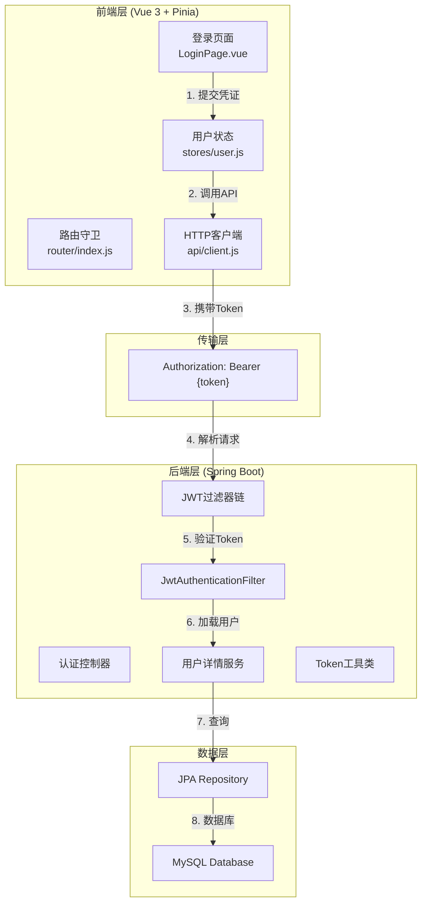
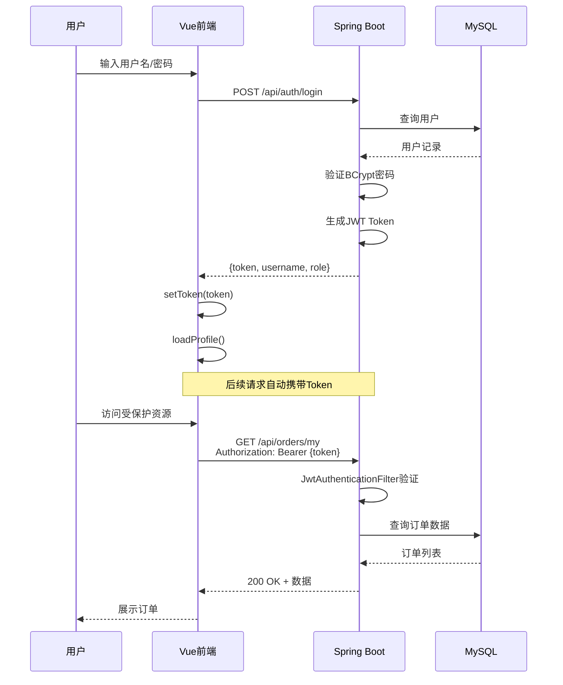

本文档深入解析校园二手交易平台的JWT（JSON Web Token）认证体系，涵盖从后端Token生成与验证到前端状态管理与路由守卫的完整闭环。系统采用Spring Security 5.7+的现代配置风格，结合Vue 3 + Pinia的前端架构，实现了无状态的分布式认证机制。

## 整体架构概览

### 认证架构分层模型

本系统采用**前后端分离架构**，JWT作为唯一的身份凭证载体，在请求头中携带并在服务端实现无状态验证。整体架构可分为三个核心层次：



### 技术选型对比

| 组件 | 技术选型 | 版本 | 职责定位 |
|------|----------|------|----------|
| 后端框架 | Spring Boot | 2.7.0 | RESTful API服务 |
| 安全框架 | Spring Security | 5.7+ | 认证授权核心 |
| Token库 | jjwt | 0.9.1 | JWT生成与解析 |
| 前端框架 | Vue 3 | 3.x | 渐进式前端框架 |
| 状态管理 | Pinia | 2.x | 用户状态集中管理 |
| HTTP客户端 | Axios | - | API请求封装 |
| 数据库 | MySQL 8.x | 8.0 | 用户数据持久化 |

## 后端核心组件详解

### JWT Token工具类

`JwtTokenUtil`是整个认证体系的核心，负责Token的生成、解析与验证。系统使用JJWT库实现，所有操作基于配置注入的密钥和过期时间。

```java
@Component
public class JwtTokenUtil {
    @Value("${jwt.secret}")
    private String secret;

    @Value("${jwt.expiration}")
    private Long expiration;  // 默认86400秒（24小时）
    
    public String generateToken(UserDetails userDetails) {
        Map<String, Object> claims = new HashMap<>();
        return createToken(claims, userDetails.getUsername());
    }

    private String createToken(Map<String, Object> claims, String subject) {
        return Jwts.builder()
                .setClaims(claims)
                .setSubject(subject)
                .setIssuedAt(new Date(System.currentTimeMillis()))
                .setExpiration(new Date(System.currentTimeMillis() + expiration * 1000))
                .signWith(SignatureAlgorithm.HS512, secret)  // HS512签名算法
                .compact();
    }
    
    public Boolean validateToken(String token, UserDetails userDetails) {
        try {
            final String username = extractUsername(token);
            return (username.equals(userDetails.getUsername()) && !isTokenExpired(token));
        } catch (ExpiredJwtException | JwtException | IllegalArgumentException ex) {
            return false;
        }
    }
}
```

**关键技术细节**：
- **签名算法**：采用`HS512`，相较于HS256提供更强的抗碰撞能力
- **过期机制**：Token有效期24小时，通过`setExpiration`设置
- **双重验证**：验证用户名匹配且Token未过期，防止Token盗用

Sources: [JwtTokenUtil.java](server/src/main/java/com/secondhand/security/JwtTokenUtil.java#L18-L72)

### JWT认证过滤器

`JwtAuthenticationFilter`继承自`OncePerRequestFilter`，确保每个请求仅被处理一次。该过滤器是Spring Security过滤器链的关键环节，在`UsernamePasswordAuthenticationFilter`之前执行。

```java
@Component
public class JwtAuthenticationFilter extends OncePerRequestFilter {

    @Override
    protected void doFilterInternal(HttpServletRequest request, 
                                    HttpServletResponse response, 
                                    FilterChain chain) throws ServletException, IOException {
        final String authorizationHeader = request.getHeader("Authorization");
        String username = null;
        String jwt = null;

        // 1. 从请求头提取JWT
        if (authorizationHeader != null && authorizationHeader.startsWith("Bearer ")) {
            jwt = authorizationHeader.substring(7);
            try {
                username = jwtTokenUtil.extractUsername(jwt);
            } catch (ExpiredJwtException ex) {
                log.info("JWT 已过期，已忽略本次认证，请求路径: {}", request.getRequestURI());
            } catch (JwtException | IllegalArgumentException ex) {
                log.warn("JWT 无效，已忽略本次认证，请求路径: {}", request.getRequestURI());
            }
        }

        // 2. 用户名有效且无现有认证时进行验证
        if (username != null && SecurityContextHolder.getContext().getAuthentication() == null) {
            UserDetails userDetails = this.userDetailsService.loadUserByUsername(username);
            if (jwtTokenUtil.validateToken(jwt, userDetails)) {
                UsernamePasswordAuthenticationToken authToken = 
                    new UsernamePasswordAuthenticationToken(
                        userDetails, null, userDetails.getAuthorities());
                authToken.setDetails(
                    new WebAuthenticationDetailsSource().buildDetails(request));
                SecurityContextHolder.getContext().setAuthentication(authToken);
            }
        }
        chain.doFilter(request, response);
    }
}
```

**设计亮点**：
- **优雅降级**：Token过期或无效时不阻断请求，仅跳过认证（适用于公开接口）
- **延迟加载**：仅在需要认证时查询数据库，避免不必要的性能开销
- **上下文隔离**：在`SecurityContextHolder`中设置认证信息，供后续组件使用

Sources: [JwtAuthenticationFilter.java](server/src/main/java/com/secondhand/security/JwtAuthenticationFilter.java#L34-L65)

### 安全配置策略

`SecurityConfig`采用Spring Security 5.7引入的新配置风格（基于`SecurityFilterChain` Bean），摒弃了已弃用的`WebSecurityConfigurerAdapter`。

```java
@Configuration
@EnableWebSecurity
@EnableGlobalMethodSecurity(prePostEnabled = true)
public class SecurityConfig {

    @Bean
    public SecurityFilterChain securityFilterChain(
            HttpSecurity http,
            JwtAuthenticationFilter jwtAuthenticationFilter,
            JwtAuthenticationEntryPoint jwtAuthenticationEntryPoint) throws Exception {
        http
            .cors().and()
            .csrf().disable()
            .authorizeRequests(auth -> auth
                .antMatchers("/", "/api/auth/**", "/api/system/db-health").permitAll()
                .antMatchers(HttpMethod.GET, "/api/system/summary").permitAll()
                .antMatchers(HttpMethod.GET, "/api/products/**").permitAll()
                .antMatchers(HttpMethod.GET, "/api/wanted").permitAll()
                .antMatchers("/api/admin/**").hasRole("ADMIN")
                .anyRequest().authenticated()
            )
            .exceptionHandling(exception -> exception
                .authenticationEntryPoint(jwtAuthenticationEntryPoint))
            .sessionManagement(session -> session
                .sessionCreationPolicy(SessionCreationPolicy.STATELESS))
            .addFilterBefore(jwtAuthenticationFilter, 
                UsernamePasswordAuthenticationFilter.class);

        return http.build();
    }
}
```

**配置要点解析**：

| 配置项 | 设置值 | 说明 |
|--------|--------|------|
| CORS | enabled | 允许跨域资源共享 |
| CSRF | disabled | JWT天然防御CSRF（无Cookie） |
| Session | STATELESS | 完全无状态，不创建HttpSession |
| 公开接口 | `/`, `/api/auth/**`, `/api/products/**` 等 | 无需认证即可访问 |
| 管理员接口 | `/api/admin/**` | 仅限`ROLE_ADMIN`访问 |

Sources: [SecurityConfig.java](server/src/main/java/com/secondhand/config/SecurityConfig.java#L29-L52)

### 认证入口点处理

当未认证用户访问受保护资源时，`JwtAuthenticationEntryPoint`返回标准化的JSON错误响应：

```java
@Component
public class JwtAuthenticationEntryPoint implements AuthenticationEntryPoint {
    @Override
    public void commence(HttpServletRequest request, 
                         HttpServletResponse response, 
                         AuthenticationException authException) throws IOException {
        response.setStatus(HttpServletResponse.SC_UNAUTHORIZED);
        response.setContentType("application/json;charset=UTF-8");
        response.getWriter().write("{\"message\":\"未登录或登录已过期\"}");
    }
}
```

Sources: [JwtAuthenticationEntryPoint.java](server/src/main/java/com/secondhand/security/JwtAuthenticationEntryPoint.java#L12-L21)

## 认证控制器与用户服务

### 登录注册流程

`AuthController`处理`/api/auth/login`和`/api/auth/register`两个端点，采用Spring Security的`AuthenticationManager`进行凭证验证：

```java
@RestController
@RequestMapping("/api/auth")
public class AuthController {

    @PostMapping("/login")
    public ResponseEntity<?> login(@Valid @RequestBody AuthRequest authRequest) {
        try {
            // 1. AuthenticationManager验证用户名密码
            authenticationManager.authenticate(
                new UsernamePasswordAuthenticationToken(
                    authRequest.getUsername(), 
                    authRequest.getPassword()));
            
            // 2. 加载用户详情并生成Token
            final UserDetails userDetails = 
                userDetailsService.loadUserByUsername(authRequest.getUsername());
            final String token = jwtTokenUtil.generateToken(userDetails);
            
            // 3. 获取完整用户信息并返回
            final User currentUser = userService.getUserByUsername(userDetails.getUsername());
            return ResponseEntity.ok(new AuthResponse(
                token, userDetails.getUsername(), currentUser.getRole()));
        } catch (BadCredentialsException ex) {
            return ResponseEntity.status(401)
                .body(Collections.singletonMap("message", "用户名或密码错误"));
        } catch (DisabledException ex) {
            return ResponseEntity.status(403)
                .body(Collections.singletonMap("message", "账号已被禁用，请联系管理员"));
        }
    }
}
```

Sources: [AuthController.java](server/src/main/java/com/secondhand/controller/AuthController.java#L40-L57)

### UserDetailsService实现

`UserServiceImpl`同时实现了`UserDetailsService`接口，为Spring Security提供用户加载能力：

```java
@Service
public class UserServiceImpl implements UserService, UserDetailsService {

    @Override
    public UserDetails loadUserByUsername(String username) throws UsernameNotFoundException {
        User user = userRepository.findByUsername(username)
                .orElseThrow(() -> new UsernameNotFoundException(
                    "User not found with username: " + username));

        return new org.springframework.security.core.userdetails.User(
                user.getUsername(),
                user.getPassword(),
                user.isEnabled(),
                true,  // accountNonExpired
                true,  // credentialsNonExpired
                true,  // accountNonLocked
                Collections.singletonList(
                    new SimpleGrantedAuthority("ROLE_" + resolveRole(user)))
        );
    }
    
    private String resolveRole(User user) {
        if (user.getRole() == null || user.getRole().trim().isEmpty()) {
            return "USER";
        }
        return user.getRole().trim().toUpperCase();
    }
}
```

**角色映射机制**：
- 数据库`role`字段存储原始角色名（如`USER`、`ADMIN`）
- 转换为Spring Security权限时自动添加`ROLE_`前缀
- 权限检查通过`@PreAuthorize("hasRole('ADMIN')")`或配置`hasRole("ADMIN")`实现

Sources: [UserServiceImpl.java](server/src/main/java/com/secondhand/service/impl/UserServiceImpl.java#L28-L42)

## 前端认证体系

### Token管理模块

前端通过`localStorage`实现Token的持久化，并提供事件驱动的状态通知机制：

```javascript
// src/api/auth.js
export function getToken() {
  return window.localStorage.getItem("token") || "";
}

export function setToken(token) {
  if (!token) return;
  window.localStorage.setItem("token", token);
  window.dispatchEvent(new Event("auth-changed"));  // 通知状态变更
}

export function clearToken() {
  window.localStorage.removeItem("token");
  window.dispatchEvent(new Event("auth-changed"));
}

export function hasToken() {
  return Boolean(getToken());
}
```

**设计模式**：使用原生`CustomEvent`实现跨组件状态同步，避免Pinia store的直接耦合。

Sources: [auth.js](src/api/auth.js#L1-L19)

### API客户端拦截器

Axios拦截器统一处理Token注入和401响应：

```javascript
// src/api/client.js
const apiClient = axios.create({
  baseURL: apiBaseURL,
  timeout: 8000
});

// 请求拦截：自动注入Token
apiClient.interceptors.request.use((config) => {
  const token = getToken();
  if (token) {
    config.headers.Authorization = `Bearer ${token}`;
  }
  return config;
});

// 响应拦截：处理401清除Token
apiClient.interceptors.response.use(
  (response) => response,
  (error) => {
    const status = error?.response?.status;
    if (status === 401) {
      clearToken();
    }
    return Promise.reject(error);
  }
);
```

Sources: [client.js](src/api/client.js#L11-L28)

### 用户状态管理

Pinia store集中管理用户认证状态和资料：

```javascript
// src/stores/user.js
export const useUserStore = defineStore("user", {
  state: () => ({
    token: getToken(),
    profile: null,
    profileLoaded: false
  }),
  getters: {
    isAuthenticated: (state) => Boolean(state.token),
    isAdmin: (state) => state.profile?.role === "ADMIN"
  },
  actions: {
    syncAuthState() {
      this.token = getToken();
      if (!this.token) {
        this.profile = null;
        this.profileLoaded = false;
      }
      return this.token;
    },
    async loadProfile(force = false) {
      if (!this.isAuthenticated) return null;
      if (!force && this.profileLoaded && this.profile) return this.profile;
      
      try {
        this.profile = await fetchCurrentUser();
        this.profileLoaded = true;
        return this.profile;
      } catch (error) {
        if (error?.response?.status === 401) {
          this.syncAuthState();
          this.profile = null;
        }
        throw error;
      }
    },
    async login(payload) {
      const result = await loginByPassword(payload);
      this.syncAuthState();
      await this.loadProfile(true);
      return result;
    },
    logout() {
      clearToken();
      this.syncAuthState();
      this.profile = null;
      this.profileLoaded = false;
    }
  }
});
```

**状态同步机制**：
- 初始化时从`localStorage`恢复Token
- 登录后调用`loadProfile`获取用户完整信息
- 401响应自动触发`logout`清理状态

Sources: [user.js](src/stores/user.js#L1-L66)

### 路由守卫设计

路由守卫在导航前执行身份校验和权限验证：

```javascript
// src/router/index.js
router.beforeEach(async (to) => {
  const userStore = useUserStore();
  const isAdminRoute = to.path.startsWith("/admin") && to.path !== "/admin/login";
  
  // 1. 同步本地Token状态
  userStore.syncAuthState();
  
  // 2. 未认证时加载用户资料（处理刷新场景）
  if (userStore.isAuthenticated && !userStore.profileLoaded) {
    try {
      await userStore.loadProfile();
    } catch {
      userStore.logout();
    }
  }

  // 3. 管理员路由权限校验
  if (isAdminRoute) {
    if (!userStore.isAuthenticated) {
      return createAdminLoginLocation(to);
    }
    if (!userStore.isAdmin) {
      return "/profile";
    }
  }
  
  // 4. 已登录用户访问登录页重定向
  if (to.path === "/login" && userStore.isAuthenticated) {
    return "/profile";
  }
  
  return true;
});
```

**守卫执行时机**：在路由切换前同步执行，确保用户状态与路由权限一致。

Sources: [router/index.js](src/router/index.js#L68-L108)

## 完整认证流程时序

### 登录与请求认证流程



### 前后端完整交互代码对照

| 阶段 | 前端代码 | 后端代码 |
|------|----------|----------|
| 登录请求 | `loginByPassword(form)` | `AuthController.login()` |
| Token存储 | `setToken(token)` | `JwtTokenUtil.generateToken()` |
| 请求携带 | `Authorization: Bearer {token}` | `JwtAuthenticationFilter` |
| 状态恢复 | `userStore.loadProfile()` | `UserDetailsService.loadUserByUsername()` |
| 登出清理 | `clearToken()` | Session清理 |

## 配置与安全参数

### JWT配置参数

```yaml
# application.yml
jwt:
  secret: 9a4f2c8d3b7a1e6f45c8a0b3f267d8b1d4e6f3c8a9d2b5f8e3a9c6b1d4f7e2a5
  expiration: 86400  # 24小时（秒）
```

**密钥生成建议**：
- 生产环境应使用至少512位随机密钥
- 建议通过环境变量注入，避免硬编码
- 可使用`openssl rand -base64 64`生成强随机密钥

Sources: [application.yml](server/src/main/resources/application.yml#L22-L25)

### 数据库用户表结构

```sql
CREATE TABLE `users` (
  `id` BIGINT NOT NULL AUTO_INCREMENT,
  `username` VARCHAR(255) NOT NULL,
  `password` VARCHAR(255) NOT NULL,  -- BCrypt加密
  `email` VARCHAR(255) NOT NULL,
  `role` VARCHAR(255) DEFAULT 'USER',
  `enabled` BIT(1) NOT NULL DEFAULT b'1',
  `verified` BIT(1) NOT NULL DEFAULT b'0',
  `created_at` DATETIME DEFAULT NULL,
  PRIMARY KEY (`id`),
  UNIQUE KEY `uk_users_username` (`username`)
);
```

测试账号（密码均为`123456`，BCrypt加密）：
- `seller01` / `buyer01` / `seller02`（普通用户）
- `admin`（管理员）

Sources: [init.sql](server/sql/init.sql#L17-L34)

## 双端认证机制

系统支持普通用户和管理员两种角色，通过统一的JWT Token携带角色信息：

```javascript
// 前端权限判断
isAdmin: (state) => state.profile?.role === "ADMIN"

// 管理员路由守卫
if (isAdminRoute) {
  if (!userStore.isAuthenticated) {
    return createAdminLoginLocation(to);
  }
  if (!userStore.isAdmin) {
    return "/profile";  // 非管理员重定向到个人中心
  }
}
```

**管理员登录验证流程**：
1. 用户在`/admin/login`页面提交凭证
2. 调用相同的`/api/auth/login`端点
3. 登录成功后检查`role === "ADMIN"`
4. 非管理员账号强制登出并提示权限不足

Sources: [AdminLoginPage.vue](src/views/admin/AdminLoginPage.vue#L58-L75)

## 异常处理与边界情况

| 场景 | 后端处理 | 前端响应 |
|------|----------|----------|
| 用户名不存在 | 抛出`UsernameNotFoundException` | 返回401 |
| 密码错误 | 抛出`BadCredentialsException` | 提示"用户名或密码错误" |
| 账号已禁用 | 抛出`DisabledException` | 提示"账号已被禁用" |
| Token已过期 | `JwtAuthenticationFilter`捕获 | 自动清理Token |
| Token格式无效 | 跳过认证，不阻断请求 | 需重新登录 |

Sources: [JwtAuthenticationFilter.java](server/src/main/java/com/secondhand/security/JwtAuthenticationFilter.java#L46-L50)

## 进阶阅读

- **[角色模型与权限规则](12-jiao-se-mo-xing-yu-quan-xian-gui-ze)**：深入了解USER/ADMIN双角色体系的设计与实现
- **[安全配置与JWT认证](8-an-quan-pei-zhi-yu-jwtren-zheng)**：Spring Security配置的高级选项
- **[前端状态管理设计](4-zhang-tai-guan-li-she-ji)**：Pinia store与路由守卫的协同机制