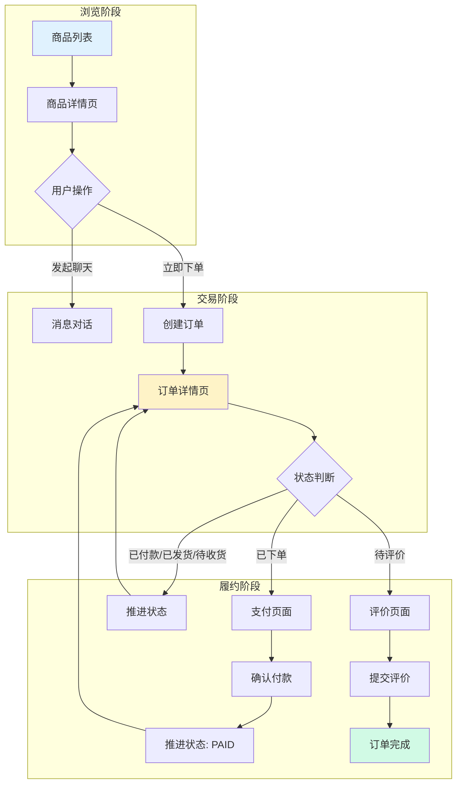
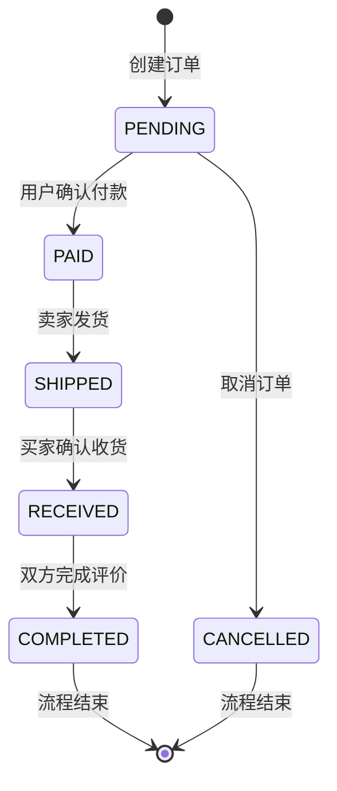
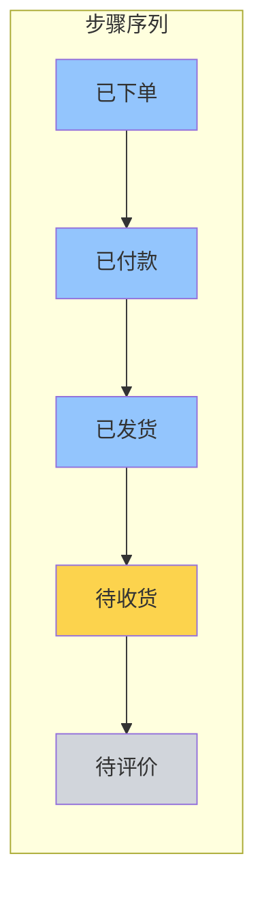
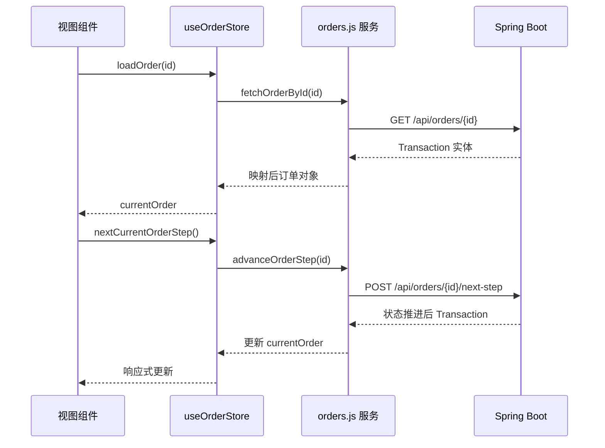

本文档详细阐述校园二手交易平台中用户从发现商品到完成交易的完整业务流程，涵盖前端交互逻辑、后端状态机设计以及各环节的接口调用模式。

## 1. 交易流程总览

用户交易闭环是指从商品浏览、下单、支付、发货、收货到评价的完整生命周期。该流程涉及前端视图层、Pinia 状态管理层、API 服务层以及 Spring Boot 后端的协同工作。



## 2. 订单状态机设计

后端采用有限状态机模式管理交易状态，状态转换由 `TransactionServiceImpl` 中的 `STATUS_FLOW` 映射表定义。

### 2.1 状态流转图



### 2.2 状态映射表

| 后端枚举值 | 前端显示 | 含义说明 |
|-----------|---------|----------|
| `PENDING` | 已下单 | 订单已创建，等待买家付款 |
| `PAID` | 已付款 | 买家已确认付款，通知卖家发货 |
| `SHIPPED` | 已发货 | 卖家已发货，等待买家收货 |
| `RECEIVED` | 待收货 | 买家已收到货物，等待评价 |
| `COMPLETED` | 待评价 | 交易完成，等待买家提交评价 |
| `CANCELLED` | 已取消 | 订单被取消，资金退回 |

Sources: [TransactionServiceImpl.java](server/src/main/java/com/secondhand/service/impl/TransactionServiceImpl.java#L21-L27)
Sources: [mappers.js](src/api/mappers.js#L28-L36)

## 3. 前端关键组件解析

### 3.1 订单状态进度条组件

`OrderStepBar.vue` 组件以五步进度条形式可视化展示当前订单状态，其中活跃步骤通过 CSS 类 `active` 高亮显示。



组件接收 `status` 属性后，通过 `normalizedStatus` 计算函数将后端枚举值映射为中文显示：

```javascript
const map = {
    PENDING: "已下单",
    PAID: "已付款",
    SHIPPED: "已发货",
    RECEIVED: "待收货",
    COMPLETED: "待评价",
    CANCELLED: "已下单"
};
```

Sources: [OrderStepBar.vue](src/components/OrderStepBar.vue#L1-L68)

### 3.2 订单详情页逻辑

`OrderPage.vue` 根据当前订单状态动态渲染操作按钮，实现状态驱动的 UI 交互：

| 当前状态 | 渲染操作 | 触发行为 |
|---------|---------|---------|
| `已下单` | 去付款 | 跳转支付页面 |
| `已付款/已发货/待收货` | 下一步 | 调用 `nextCurrentOrderStep()` |
| `待评价` | 去评价 | 跳转评价页面 |
| 其他 | 无操作 | 订单已完成或已取消 |

Sources: [OrderPage.vue](src/views/OrderPage.vue#L53-L65)

### 3.3 支付页面交互

`OrderPayPage.vue` 支持三种支付方式选择：微信支付、支付宝、银行卡。银行卡支付需要额外校验持卡人信息。

```javascript
const payMethods = [
    { value: "wechat", label: "微信支付", desc: "推荐，到账快" },
    { value: "alipay", label: "支付宝", desc: "支持余额与花呗" },
    { value: "bank", label: "银行卡", desc: "支持储蓄卡/信用卡" }
];
```

支付确认按钮的可用性由 `canPay` 计算属性控制，仅当订单状态为 `已下单` 且支付方式校验通过时可用。

Sources: [OrderPayPage.vue](src/views/OrderPayPage.vue#L1-L197)

### 3.4 评价页面设计

`OrderReviewPage.vue` 提供五星评分与文字评价功能，评价提交后触发订单状态推进至完成。

评分采用五角星交互组件，点击即可选：

```javascript
const rating = ref(5); // 默认满分
const comment = ref(""); // 选填评价内容
```

Sources: [OrderReviewPage.vue](src/views/OrderReviewPage.vue#L1-L189)

## 4. Pinia 状态管理设计

`order.js` 状态库管理订单相关数据，封装了四个核心异步方法：



Sources: [order.js](src/stores/order.js#L1-L50)

## 5. 后端接口实现

### 5.1 订单控制器核心逻辑

`OrderController.java` 统一处理订单相关请求，其中 `nextStep` 方法是状态推进的入口：

```java
@PostMapping("/{id}/next-step")
public ResponseEntity<?> nextStep(@PathVariable String id, Principal principal) {
    // 权限校验：仅订单买卖双方可操作
    boolean canOperate = transaction.getBuyer().getId().equals(currentUser.getId())
            || transaction.getSeller().getId().equals(currentUser.getId());
    
    Transaction updated = transactionService.advanceTransactionStep(transactionId);
    return ResponseEntity.ok(toOrderResponse(updated));
}
```

Sources: [OrderController.java](server/src/main/java/com/secondhand/controller/OrderController.java#L95-L106)

### 5.2 状态推进服务实现

`TransactionServiceImpl.advanceTransactionStep()` 方法执行实际的状态转换：

```java
@Override
@Transactional
public Transaction advanceTransactionStep(Long id) {
    Transaction transaction = getTransactionById(id);
    String current = transaction.getStatus();

    if ("CANCELLED".equals(current)) {
        throw new RuntimeException("已取消订单无法推进");
    }

    String next = STATUS_FLOW.get(current);
    if (next == null) {
        return transaction; // 已达终态
    }

    transaction.setStatus(next);
    if ("COMPLETED".equals(next)) {
        transaction.setCompletedAt(LocalDateTime.now());
    }
    return transactionRepository.save(transaction);
}
```

Sources: [TransactionServiceImpl.java](server/src/main/java/com/secondhand/service/impl/TransactionServiceImpl.java#L62-L80)

## 6. API 端点汇总

| 端点 | 方法 | 功能说明 |
|-----|------|---------|
| `/api/orders` | POST | 创建订单 |
| `/api/orders/{id}` | GET | 获取订单详情 |
| `/api/orders/my` | GET | 获取当前用户全部订单 |
| `/api/orders/{id}/next-step` | POST | 推进订单状态 |

Sources: [endpoints.js](src/api/endpoints.js#L17-L22)

## 7. 交易闭环完整性保障

为确保交易闭环的完整性，系统在多个层面进行校验：

**前端防护层**：未登录用户无法访问订单页面，会被重定向至登录页；订单状态不满足条件时，操作按钮处于禁用状态。

**接口防护层**：后端校验操作用户是否为订单的买方或卖方，非参与者将收到 403 禁止访问响应；已取消订单无法推进状态。

**数据完整性层**：订单完成后自动记录 `completedAt` 时间戳；取消订单记录 `cancelledAt` 时间戳。

Sources: [OrderController.java](server/src/main/java/com/secondhand/controller/OrderController.java#L97-L100)
Sources: [TransactionServiceImpl.java](server/src/main/java/com/secondhand/service/impl/TransactionServiceImpl.java#L68-L71)

---

**延伸阅读**：

- 交易前的沟通环节请参阅 [消息协同机制](15-xiao-xi-xie-tong-ji-zhi)
- 订单数据持久化细节请参阅 [核心实体与关系](10-he-xin-shi-ti-yu-guan-xi)
- 后端安全配置请参阅 [安全配置与JWT认证](8-an-quan-pei-zhi-yu-jwtren-zheng)