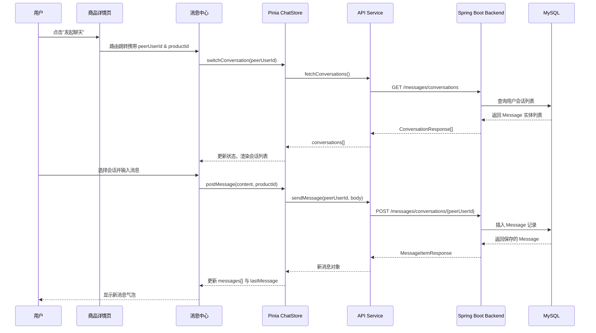

消息协同机制是二手交易系统中连接买家与卖家的核心桥梁。该机制通过会话抽象将用户间的点对点沟通与商品上下文关联，支持从商品详情页直接发起咨询，并在消息界面中嵌入商品快捷操作入口。整体设计遵循前后端分离原则，前端基于 Pinia 状态管理实现响应式交互，后端采用 Spring Boot RESTful 架构处理消息持久化与权限校验。

## 前端架构概览

### 状态管理层

消息模块的前端状态管理集中在 `src/stores/chat.js` 文件中，通过 Pinia 的 `defineStore` 模式定义 `chat` store。该 store 维护了四个核心状态变量：`conversations` 存储会话列表、`activeId` 标记当前活跃会话标识、`messages` 保存当前会话的消息记录、`loading` 与 `errorMessage` 分别管控加载状态与错误提示。

```javascript
// src/stores/chat.js 行 19-26
export const useChatStore = defineStore("chat", {
  state: () => ({
    conversations: [],
    activeId: "",
    messages: [],
    loading: false,
    errorMessage: ""
  }),
  getters: {
    activeConversation(state) {
      return state.conversations.find((item) => item.id === state.activeId) || null;
    }
  }
});
```

会话列表的加载通过 `loadConversations` action 触发，该 action 调用 `fetchConversations` API 并在成功后自动将首条会话设为主动切换目标。当用户选择特定会话时，`switchConversation` action 会先通过 `ensureConversation` 保障会话存在于列表中，再调用 `fetchConversationMessages` 获取历史消息记录。

Sources: [chat.js](src/stores/chat.js#L19-L70)

### 消息发送流程

消息发送由 `postMessage` action 统一处理，该方法接受消息内容与可选的商品标识两个参数。当存在商品上下文时，消息体会同时携带 `productId` 字段，使后端能够建立消息与商品的关联关系。

```javascript
// src/stores/chat.js 行 71-84
async postMessage(content, productId = null) {
  if (!this.activeId || !content) return;
  this.errorMessage = "";
  try {
    const data = await sendMessage(this.activeId, content, productId);
    this.messages = [...this.messages, data];
    this.conversations = this.conversations.map((item) =>
      item.id === this.activeId ? { ...item, lastMessage: content } : item
    );
  } catch (error) {
    this.errorMessage =
      error?.response?.data?.message || "发送失败，请检查会话对象是否存在";
  }
}
```

发送成功后，store 会同时更新 `messages` 列表与当前会话的 `lastMessage` 预览文本，确保界面状态同步。

Sources: [chat.js](src/stores/chat.js#L71-L84)

## API 服务层设计

### 端点配置

消息相关的 API 端点统一在 `src/api/endpoints.js` 中定义，采用函数式配置支持动态路径参数。

```javascript
// src/api/endpoints.js 行 11-17
export const messageEndpoints = {
  conversations: [{ method: "get", url: "/messages/conversations" }],
  detail: (peerUserId) => [{ method: "get", url: `/messages/conversations/${peerUserId}` }],
  send: (peerUserId, payload) => [
    { method: "post", url: `/messages/conversations/${peerUserId}`, data: payload }
  ]
};
```

该配置模式允许前端直接传入 `peerUserId` 参数，API 层会自动组装完整的请求对象。`send` 方法的第二个参数为请求体载荷，包含消息内容与可选的商品标识。

Sources: [endpoints.js](src/api/endpoints.js#L11-L17)

### 消息服务封装

`src/api/services/messages.js` 文件封装了三个核心异步函数：`fetchConversations` 获取会话列表、`fetchConversationMessages` 获取指定会话的历史消息、`sendMessage` 发送新消息。这些函数内部调用 `requestWithCandidates` 实现请求发送，并使用 `unwrapList` 与 `unwrapPayload` 处理多格式响应包装。

```javascript
// src/api/services/messages.js 完整实现
export async function fetchConversationMessages(peerUserId) {
  const { data } = await requestWithCandidates(messageEndpoints.detail(peerUserId));
  const payload = unwrapPayload(data);
  return Array.isArray(payload) ? payload : Array.isArray(payload?.messages) ? payload.messages : [];
}
```

对于历史消息的解析，代码采用多级降级策略：首先尝试直接将 payload 作为数组返回，其次尝试从 `payload.messages` 字段提取，最后返回空数组作为兜底。

Sources: [messages.js](src/api/services/messages.js#L15-L19)

## 会话与消息映射

### 数据归一化处理

`src/api/mappers.js` 中的 `mapConversation` 函数负责将后端返回的原始会话对象转换为前端标准化格式。

```javascript
// src/api/mappers.js 行 107-115
export function mapConversation(raw = {}) {
  return {
    id: String(pick(raw, ["id", "conversationId", "sessionId"], "")),
    peerUser: pick(raw, ["peerUser", "targetUser", "toUser", "contactUser"], {}),
    lastMessage: pick(raw, ["lastMessage", "latestMessage", "messageContent"], ""),
    unreadCount: Number(pick(raw, ["unreadCount"], 0)),
    messages: pick(raw, ["messages"], [])
  };
}
```

该函数通过 `pick` 工具函数实现字段的优先级匹配，支持后端使用不同命名规范的字段名。例如，`lastMessage` 字段可能以 `latestMessage` 或 `messageContent` 的形式返回，`mapConversation` 均能正确解析。

Sources: [mappers.js](src/api/mappers.js#L107-L115)

### 响应兼容层

`src/api/compat.js` 中的 `unwrapPayload` 函数实现了深层响应解包机制。该函数通过 `extractFromEnvelope` 遍历可能的包装层级，从 `data`、`result`、`body`、`payload`、`rows`、`records`、`list` 等候选字段中递归提取实际数据。

```javascript
// src/api/compat.js 行 28-36
export function unwrapPayload(payload) {
  let current = payload;
  let next = extractFromEnvelope(current);
  while (next !== current) {
    current = next;
    next = extractFromEnvelope(current);
  }
  return current;
}
```

这种设计使前端能够兼容不同的后端响应格式规范，无论是标准的 `{ code, data }` 封装还是简单的 `{ list: [...] }` 结构均可正确解析。

Sources: [compat.js](src/api/compat.js#L28-L36)

## 页面组件协同

### 消息中心页面

`src/views/MessagesPage.vue` 是消息模块的核心交互页面，采用左侧会话列表 + 右侧聊天区域的双栏布局。页面初始化时通过 `onMounted` 钩子触发会话加载，并支持通过路由 query 参数直接定位特定会话与商品上下文。

```javascript
// src/views/MessagesPage.vue 行 164-177
onMounted(async () => {
  if (!authed) return;
  await loadRelatedProduct();
  await chatStore.loadConversations();
  const peerUserId = route.query.peerUserId || route.query.conversation;
  const peerName = typeof route.query.peerName === "string" ? route.query.peerName : "";
  if (typeof peerUserId === "string") {
    await chatStore.switchConversation(peerUserId, peerName);
    return;
  }
  if (chatStore.activeId) {
    await chatStore.switchConversation(chatStore.activeId);
  }
});
```

路由 query 参数说明：
- `peerUserId`: 目标用户的标识符，格式为 `u-{userId}`
- `peerName`: 目标用户的显示名称
- `productId`: 关联商品的标识符

Sources: [MessagesPage.vue](src/views/MessagesPage.vue#L164-L177)

### 商品上下文集成

MessagesPage 在聊天区域顶部嵌入了商品快捷面板，当消息发送时携带了 `productId`，该面板会展示关联商品的缩略信息并提供"查看商品"与"直接去购买"两个快捷操作按钮。

```javascript
// src/views/MessagesPage.vue 行 99-117
const relatedProductId = computed(() => {
  const raw = route.query.productId;
  if (typeof raw !== "string") return null;
  const id = Number(raw);
  return Number.isFinite(id) && id > 0 ? id : null;
});

const productContextEnabled = computed(() => {
  if (!relatedProductId.value) return false;
  if (!conversationQueryId.value) return false;
  return chatStore.activeId === conversationQueryId.value;
});
```

商品面板的显示条件为：`relatedProductId` 与 `conversationQueryId` 均存在且当前激活的会话 ID 与 query 参数中的会话 ID 相匹配。

Sources: [MessagesPage.vue](src/views/MessagesPage.vue#L99-L117)

### 会话列表组件

`src/components/MessageConversationList.vue` 负责渲染左侧会话列表，支持高亮当前选中会话、显示未读消息数量红点等功能。

```vue
<!-- src/components/MessageConversationList.vue 行 1-33 -->
<template>
  <aside class="card list-wrap">
    <h3>消息会话</h3>
    <button
      v-for="item in conversations"
      :key="item.id"
      class="conversation"
      :class="{ active: activeId === item.id }"
      @click="$emit('select', item.id)"
    >
      <div>
        <strong>{{ item.peerUser?.name || "未知用户" }}</strong>
        <p>{{ item.lastMessage }}</p>
      </div>
      <span v-if="item.unreadCount" class="badge">{{ item.unreadCount }}</span>
    </button>
  </aside>
</template>
```

组件通过 `defineProps` 接收 `conversations` 与 `activeId` 两个属性，通过 `defineEmits` 向父组件暴露 `select` 事件，实现会话切换的父子组件通信。

Sources: [MessageConversationList.vue](src/components/MessageConversationList.vue#L1-L33)

## 商品页发起聊天

`src/views/ProductPage.vue` 的商品详情页提供了"发起聊天"按钮，点击后通过 Vue Router 导航至消息页面并携带目标用户与商品信息。

```javascript
// src/views/ProductPage.vue 行 56-70
function toMessage() {
  if (!authed.value) {
    router.push(createLoginLocation(route));
    return;
  }
  if (!product.value?.sellerId) return;
  router.push({
    path: "/messages",
    query: {
      peerUserId: `u-${product.value.sellerId}`,
      peerName: product.value.seller?.name || "",
      productId: route.params.id
    }
  });
}
```

该函数首先进行登录状态校验，未登录用户会被引导至登录页。登录成功后，点击"发起聊天"会携带卖家标识（格式化为 `u-{sellerId}`）与商品 ID 跳转到消息页面，实现从商品浏览到即时沟通的无缝衔接。

Sources: [ProductPage.vue](src/views/ProductPage.vue#L56-L70)

## 后端服务实现

### 消息实体设计

消息实体 `Message.java` 采用 JPA 注解映射到 `messages` 数据表，包含发送者、接收者、可选关联商品、消息内容、已读标记与创建时间六个字段。

```java
// server/src/main/java/com/secondhand/entity/Message.java
@Entity
@Table(name = "messages")
public class Message {
    @Id
    @GeneratedValue(strategy = GenerationType.IDENTITY)
    private Long id;

    @ManyToOne
    @JoinColumn(name = "sender_id", nullable = false)
    private User sender;

    @ManyToOne
    @JoinColumn(name = "receiver_id", nullable = false)
    private User receiver;

    @ManyToOne
    @JoinColumn(name = "product_id")
    private Product product;

    @Column(nullable = false, length = 1000)
    private String content;

    @Column(name = "is_read")
    private boolean isRead = false;

    @Column(name = "created_at")
    private LocalDateTime createdAt;
}
```

表结构设计包含三个外键约束确保数据完整性，索引覆盖 `sender_id`、`receiver_id`、`product_id` 三个字段加速会话查询。

Sources: [Message.java](server/src/main/java/com/secondhand/entity/Message.java#L1-L40)

### 控制器端点

`MessageController.java` 暴露了完整的消息 REST API，包括会话列表获取、消息历史拉取、新消息发送、未读计数查询与消息删除等操作。

```java
// server/src/main/java/com/secondhand/controller/MessageController.java 行 38-64
@GetMapping("/conversations")
public ResponseEntity<List<ConversationResponse>> getConversations(Principal principal) {
    User currentUser = userService.getUserByUsername(principal.getName());
    Long currentUserId = currentUser.getId();

    List<Message> raw = messageService.getUserConversations(currentUserId);
    Map<Long, ConversationResponse> map = new LinkedHashMap<>();

    for (Message item : raw) {
        User peer = item.getSender().getId().equals(currentUserId) ? item.getReceiver() : item.getSender();
        ConversationResponse existing = map.get(peer.getId());
        if (existing == null) {
            existing = new ConversationResponse(
                    "u-" + peer.getId(),
                    new ConversationResponse.PeerUser(peer.getId(), displayName(peer)),
                    item.getContent(),
                    0
            );
            map.put(peer.getId(), existing);
        }

        if (item.getReceiver().getId().equals(currentUserId) && !item.isRead()) {
            existing.setUnreadCount(existing.getUnreadCount() + 1);
        }
    }
    return ResponseEntity.ok(new ArrayList<>(map.values()));
}
```

会话列表接口通过 `LinkedHashMap` 按消息时间倒序聚合消息，以每个对话方的最后一条消息作为会话预览，并统计接收方未读消息数量。

Sources: [MessageController.java](server/src/main/java/com/secondhand/controller/MessageController.java#L38-L64)

### 用户标识解析

消息接口采用 `u-{数字ID}` 的格式标识用户身份，后端通过 `parsePeerId` 方法将其解析为数值型数据库主键。

```java
// server/src/main/java/com/secondhand/controller/MessageController.java 行 205-210
private Long parsePeerId(String peerUserId) {
    if (peerUserId != null && peerUserId.startsWith("u-")) {
        return Long.parseLong(peerUserId.substring(2));
    }
    return Long.parseLong(peerUserId);
}
```

这种设计使前端能够使用统一的字符串格式处理用户标识，无需区分本地 ID 与远程 ID。

Sources: [MessageController.java](server/src/main/java/com/secondhand/controller/MessageController.java#L205-L210)

## 数据库查询层

`MessageRepository.java` 定义了消息数据的持久化操作，包含自定义 JPQL 查询用于会话聚合与双向消息检索。

```java
// server/src/main/java/com/secondhand/repository/MessageRepository.java
@Query("SELECT m FROM Message m WHERE " +
       "(m.sender.id = :userId OR m.receiver.id = :userId) " +
       "ORDER BY m.createdAt DESC")
List<Message> findUserConversations(@Param("userId") Long userId);

@Query("SELECT m FROM Message m WHERE " +
       "((m.sender.id = :user1Id AND m.receiver.id = :user2Id) OR " +
       "(m.sender.id = :user2Id AND m.receiver.id = :user1Id)) " +
       "ORDER BY m.createdAt ASC")
List<Message> findConversationBetweenUsers(
        @Param("user1Id") Long user1Id,
        @Param("user2Id") Long user2Id);

@Query("SELECT COUNT(m) FROM Message m WHERE " +
       "m.receiver.id = :userId AND m.isRead = false")
long countUnreadMessages(@Param("userId") Long userId);
```

Sources: [MessageRepository.java](server/src/main/java/com/secondhand/repository/MessageRepository.java#L16-L31)

## 端到端数据流

消息协同的完整数据流可归纳为以下步骤：



## 阅读建议

本篇文档描述的消息协同机制涉及前后端多个层次的交互，建议按以下顺序深入阅读相关章节以建立完整认知：

1. 首先阅读 [状态管理设计](4-zhuang-tai-guan-li-she-ji) 了解 Pinia store 的通用模式
2. 再研读 [接口设计参考](17-jie-kou-she-ji-can-kao) 掌握 API 的响应格式约定
3. 最后参考 [用户交易闭环](14-yong-hu-jiao-yi-bi-huan) 理解消息系统与订单流程的衔接