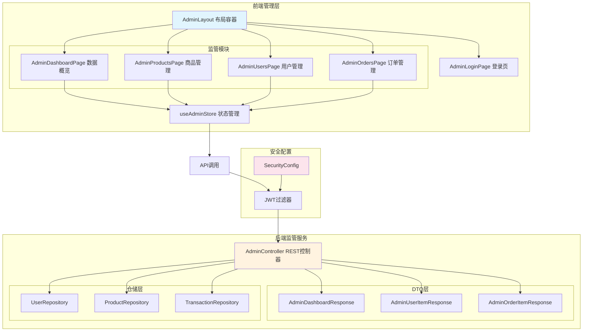
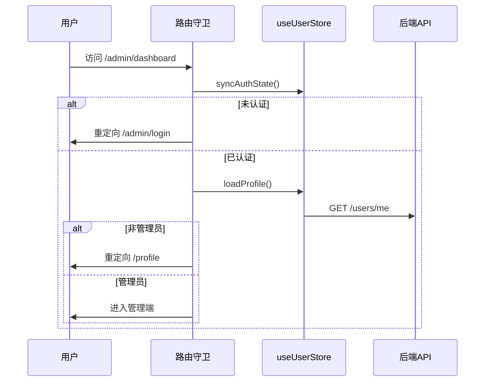
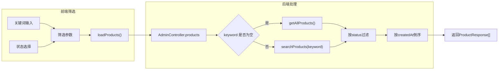
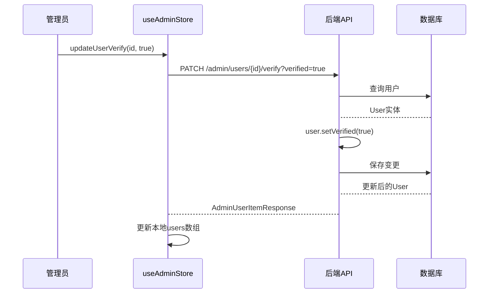

管理端是整个二手交易平台的核心监管中心，为管理员提供用户、商品、订单等核心业务数据的查看与操作能力。本章节系统阐述管理端的架构设计、认证流程、各模块监管功能以及前后端交互机制，帮助开发者理解平台运营监管的全貌。

## 架构概览

管理端采用与前台一致的前后端分离架构，前端基于 Vue 3 + Pinia 构建单页应用，后端基于 Spring Boot 提供 RESTful API 服务。两者之间通过统一的 JWT 认证机制进行身份校验，确保只有具备 `ADMIN` 角色的用户才能访问管理端接口。



前端管理端的核心文件位于 `src/views/admin/` 目录下，包含四个主要页面组件和一个登录组件。这些页面组件均挂载在 `AdminLayout.vue` 布局容器之下，通过 `useAdminStore` 进行跨组件状态共享。

Sources: [AdminLayout.vue](src/layouts/AdminLayout.vue#L1-L10), [admin.js](src/stores/admin.js#L1-L15)

## 认证与权限控制

管理端的认证流程遵循标准 JWT 机制，但增加了角色校验环节。用户必须同时满足「已登录」与「角色为 ADMIN」两个条件才能进入管理端。

### 前端路由守卫

路由守卫在每次路由切换时执行三段式校验：首先检查用户是否已认证，若未认证则重定向至管理端登录页；若已认证但非管理员角色，则跳转至个人中心页面。前端通过 Pinia store 中的 `isAdmin` getter 判断用户角色，该 getter 读取 `profile.role === "ADMIN"` 的值。



管理端登录页面 (`AdminLoginPage.vue`) 在登录成功后额外校验用户角色，若登录账号不具备管理员权限，则执行登出操作并显示错误提示。这一设计防止了普通用户通过猜测管理端登录页 URL 绕过权限检查的可能性。

Sources: [router/index.js](src/router/index.js#L74-L85), [AdminLoginPage.vue](src/views/admin/AdminLoginPage.vue#L71-L80)

### 后端接口级防护

后端安全配置通过 Spring Security 实现接口级权限控制。在 `SecurityConfig.java` 中，所有 `/api/admin/**` 路径均要求具备 `ROLE_ADMIN` 权限，该角色由 JWT 过滤器在请求解析时注入。

```java
.antMatchers("/api/admin/**").hasRole("ADMIN")
```

后端控制器本身不额外编写权限注解，依赖 Spring Security 的统一配置实现。这意味着即使某管理员账号被禁用（`enabled=false`），其 JWT token 失效后将无法访问任何管理端接口，实现了前端视图层与后端数据层的双重防护。

Sources: [SecurityConfig.java](server/src/main/java/com/secondhand/config/SecurityConfig.java#L40), [User.java](server/src/main/java/com/secondhand/entity/User.java#L32-L34)

## 数据概览模块

数据概览页面是管理员登录后的默认视图，以卡片矩阵形式展示平台运行的核心指标。该模块通过调用 `/api/admin/dashboard/stats` 接口获取聚合统计数据，后端通过六个仓储的计数查询一次性返回所有指标。

### 统计指标体系

| 指标名称 | 数据来源 | 业务含义 |
|---------|---------|---------|
| 用户总数 | `userRepository.count()` | 平台注册规模 |
| 商品总数 | `productRepository.count()` | 市场供给总量 |
| 求购信息 | `wantedPostRepository.count()` | 用户需求活跃度 |
| 订单总数 | `transactionRepository.count()` | 交易发生频次 |
| 已完成订单 | `transactionRepository.countByStatus("COMPLETED")` | 交易成功率 |
| 已认证用户 | 过滤 `User::isVerified` | 用户信任度 |
| 在售商品 | `productRepository.findByStatus("AVAILABLE")` | 市场活跃度 |

前端通过计算属性将后端返回的原始数据映射为带描述文字的卡片数组，每个统计卡片包含标签、数值和业务提示三个元素。这种展示方式帮助管理员快速定位平台运行状态，无需进入具体管理页面即可了解全局概况。

Sources: [AdminDashboardPage.vue](src/views/admin/AdminDashboardPage.vue#L24-L36), [AdminController.java](server/src/main/java/com/secondhand/controller/AdminController.java#L30-L44)

## 商品监管模块

商品管理页面提供商品的查询、状态变更与删除功能，是平台内容监管的核心入口。管理员可以下架违规商品或删除无效发布，保持平台交易环境的健康有序。

### 筛选与查询机制

商品列表支持按关键词和商品状态两个维度进行筛选。关键词筛选通过 `ProductService.searchProducts()` 实现模糊匹配，状态筛选则在后端通过 `matchesStatus()` 方法判断。查询参数通过 Pinia store 的 `loadProducts()` action 封装，统一的错误处理机制将后端异常信息展示在页面顶部。



### 状态变更与删除

商品状态变更采用 PATCH 方法调用 `/api/admin/products/{id}/status`，管理员可以在「在售」与「已售出」两种状态间切换。删除操作则使用 DELETE 方法直接移除商品记录。前端通过 `updateProductStatus()` 和 `deleteProduct()` 两个 action 更新本地状态列表，无需重新加载即可反映变更结果，这种乐观更新策略提升了交互响应速度。

状态标签采用颜色编码区分不同状态：在售商品显示绿色背景，已售出显示红色背景，已预留显示灰色背景，直观反映商品当前交易状态。

Sources: [AdminProductsPage.vue](src/views/admin/AdminProductsPage.vue#L1-L80), [AdminController.java](server/src/main/java/com/secondhand/controller/AdminController.java#L47-L59)

## 用户监管模块

用户管理页面支持查看用户列表、筛选特定用户以及切换用户的启用状态和认证状态。该模块是平台账号安全的最后防线，管理员可通过禁用账号阻止问题用户继续操作。

### 多维度筛选体系

| 筛选维度 | 可选值 | 数据字段 |
|---------|-------|---------|
| 关键词 | 任意字符串 | username、name |
| 角色 | 全部/普通用户/管理员 | role |
| 状态 | 全部/启用/禁用 | enabled |

关键词筛选通过 JPA 的 `findByUsernameContainingIgnoreCaseOrNameContainingIgnoreCase()` 方法实现，角色与启用状态的筛选则通过 Stream API 的 `filter()` 方法组合实现。这种设计将筛选逻辑集中在后端，减少了前端的数据传输量。

### 用户状态变更

用户认证状态（`verified`）表示用户是否已完成身份信息完善，影响其在平台的可信度展示。启用状态（`enabled`）控制用户是否能够登录和进行交易操作，禁用后的用户无法通过任何方式访问平台。



两个状态变更接口均返回更新后的用户对象，前端通过 `map()` 方法替换本地数组中对应项，实现了无需重新加载整个列表的增量更新。

Sources: [AdminUsersPage.vue](src/views/admin/AdminUsersPage.vue#L1-L95), [AdminController.java](server/src/main/java/com/secondhand/controller/AdminController.java#L62-L78)

## 订单监管模块

订单管理页面提供交易订单的统一视图，管理员可按订单状态筛选查看不同阶段的交易记录。该模块不提供修改功能，仅供监管查阅，帮助管理员快速定位异常订单。

### 订单状态流转

| 状态码 | 显示名称 | 流转方向 |
|-------|---------|---------|
| PENDING | 已下单 | 初始状态 |
| PAID | 已付款 | 买家付款后 |
| SHIPPED | 已发货 | 卖家发货后 |
| RECEIVED | 待收货 | 买家确认发货 |
| COMPLETED | 待评价 | 买家确认收货 |
| CANCELLED | 已取消 | 任意方可取消 |

订单列表展示包含订单号、商品名称、买家卖家姓名、状态、金额和创建时间等关键字段。后端通过 `Transaction` 实体关联查询获取 `Product`、`User(buyer)`、`User(seller)` 的关联信息，封装为 `AdminOrderItemResponse` 返回。

列表数据按创建时间倒序排列，便于管理员优先查看最新发生的交易。页面顶部的统计条显示当前筛选条件下的结果数量和选中的状态标签。

Sources: [AdminOrdersPage.vue](src/views/admin/AdminOrdersPage.vue#L1-L70), [AdminOrderItemResponse.java](server/src/main/java/com/secondhand/dto/AdminOrderItemResponse.java#L1-L19)

## API 端点总览

管理端所有接口均以 `/api/admin` 为前缀，需要携带有效的 JWT Token 且用户角色为 `ADMIN`。

| 接口路径 | HTTP方法 | 功能描述 | 请求参数 |
|---------|---------|---------|---------|
| `/api/admin/dashboard/stats` | GET | 获取平台统计 | 无 |
| `/api/admin/products` | GET | 获取商品列表 | keyword, status |
| `/api/admin/products/{id}/status` | PATCH | 更新商品状态 | status |
| `/api/admin/products/{id}` | DELETE | 删除商品 | 无 |
| `/api/admin/users` | GET | 获取用户列表 | keyword, role, enabled |
| `/api/admin/users/{id}/enabled` | PATCH | 切换启用状态 | enabled |
| `/api/admin/users/{id}/verify` | PATCH | 切换认证状态 | verified |
| `/api/admin/orders` | GET | 获取订单列表 | status |

所有 GET 接口返回列表数据，PATCH 接口返回更新后的单个对象，DELETE 接口仅返回 HTTP 200 状态码。前端 API 服务层通过 `requestWithCandidates()` 方法实现请求发送，通过 `unwrapList()` 或 `unwrapPayload()` 解包响应数据。

Sources: [endpoints.js](src/api/endpoints.js#L35-L46), [admin.js](src/api/services/admin.js#L1-L49)

## 初始化数据

系统初始化脚本预置了一个管理员账号用于测试验证：

- **用户名**: `admin`
- **密码**: `123456`
- **角色**: `ADMIN`
- **认证状态**: 已认证
- **启用状态**: 启用

该账号的密码经过 BCrypt 加密存储，加密盐值为 `$2a$10$VreBkEVIIqIvynfocMCYruDyMRShpmj5ynkdNwKw94VEYsRWSRt9i`。管理员可使用该账号登录管理端体验全部监管功能。

Sources: [init.sql](server/sql/init.sql#L110-L111)

---

## 延伸阅读

- [角色模型与权限规则](12-jiao-se-mo-xing-yu-quan-xian-gui-ze) — 了解系统中 ADMIN、USER 等角色的设计差异
- [JWT认证流程实现](13-jwtren-zheng-liu-cheng-shi-xian) — 深入理解前后端 JWT 校验机制
- [用户交易闭环](14-yong-hu-jiao-yi-bi-huan) — 理解订单状态与商品状态的联动关系