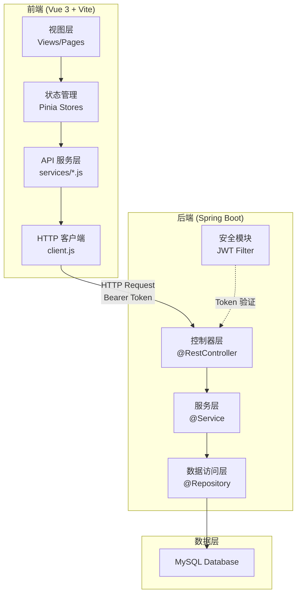
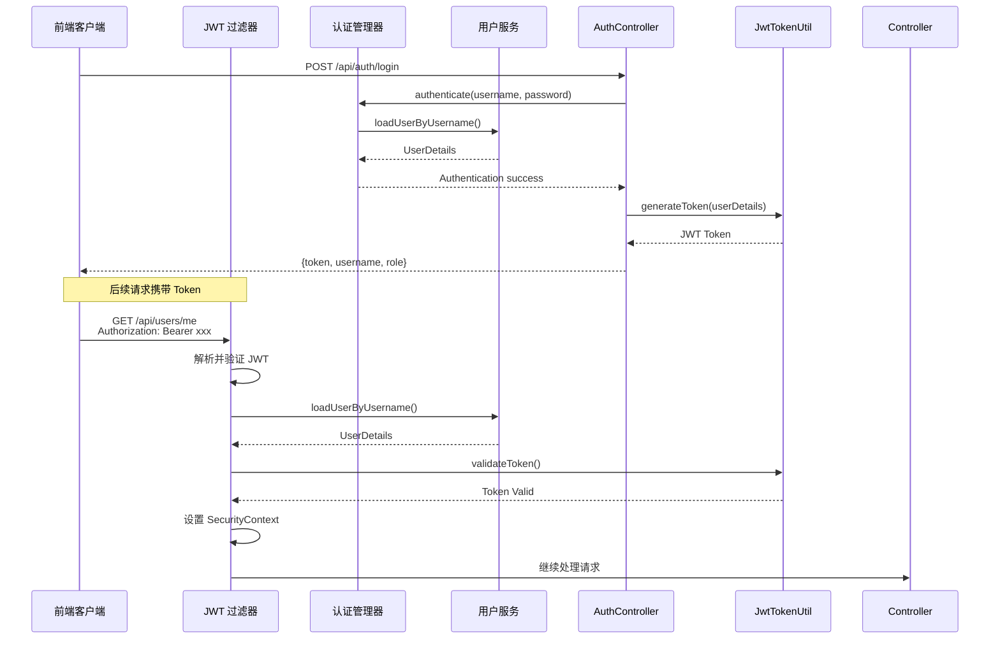
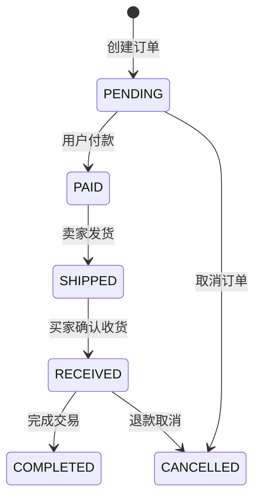

本文档系统梳理校园二手交易平台的接口设计体系，涵盖 API 架构、安全机制、端点规范及前后端协作模式。作为连接前端视图层与后端服务层的核心契约文档，本章节为开发者提供接口调用的完整参考。

---

## 1. API 架构总览

### 1.1 分层架构设计

该平台采用典型的三层 API 架构，通过 Spring Boot REST Controller 暴露接口，前端 Vue 应用通过 Axios 进行 HTTP 通信。



API 基础前缀统一为 `/api`，请求超时时间配置为 8000 毫秒。前端通过环境变量 `VITE_API_BASE_URL` 配置接口地址，默认为 `/api`。

Sources: [client.js](src/api/client.js#L1-L10)

### 1.2 接口模块划分

根据业务领域，后端控制器划分为十个主要模块：

| 模块前缀 | 控制器 | 职责范围 |
|---------|--------|----------|
| `/api/auth` | AuthController | 用户认证与注册 |
| `/api/users` | UserController | 用户资料与认证管理 |
| `/api/products` | ProductController | 商品发布与查询 |
| `/api/orders` | OrderController | 订单创建与状态流转 |
| `/api/wanted` | WantedController | 求购信息管理 |
| `/api/messages` | MessageController | 即时消息通信 |
| `/api/reviews` | ReviewController | 商品评价体系 |
| `/api/system` | SystemController | 系统健康检查与统计 |
| `/api/admin` | AdminController | 后台管理功能 |
| `/api/transactions` | TransactionController | 交易记录查询 |

Sources: [API.md](API.md#L1-L50)

---

## 2. 安全认证机制

### 2.1 JWT 认证流程

系统采用无状态 JWT（JSON Web Token）认证机制，所有需要身份验证的接口通过 `Authorization: Bearer <token>` 请求头传递令牌。



JwtAuthenticationFilter 在请求到达 Controller 之前拦截，检查 Authorization 头并验证令牌有效性。Token 过期或无效时，过滤器记录日志但不阻断请求，仅由 Controller 层返回 401 错误。

Sources: [JwtAuthenticationFilter.java](server/src/main/java/com/secondhand/security/JwtAuthenticationFilter.java#L33-L64)

### 2.2 端点安全配置

Spring Security 配置文件中定义了细粒度的端点访问控制策略：

```java
.authorizeRequests(auth -> auth
    .antMatchers("/", "/api/auth/**", "/api/system/db-health").permitAll()
    .antMatchers(HttpMethod.GET, "/api/system/summary").permitAll()
    .antMatchers(HttpMethod.GET, "/api/products/**").permitAll()
    .antMatchers(HttpMethod.GET, "/api/wanted").permitAll()
    .antMatchers("/api/admin/**").hasRole("ADMIN")
    .anyRequest().authenticated()
)
```

| 端点模式 | 访问策略 | 说明 |
|---------|---------|------|
| `/api/auth/**` | 公开 | 登录、注册无需认证 |
| `/api/system/db-health` | 公开 | 数据库健康检查 |
| `/api/system/summary` | 公开 | 首页统计摘要（仅 GET） |
| `/api/products/**` | 公开 | 商品查询（仅 GET） |
| `/api/wanted` | 公开 | 求购列表查询（仅 GET） |
| `/api/admin/**` | 仅管理员 | 后台管理接口需 ADMIN 角色 |
| 其他 | 需认证 | 必须携带有效 JWT Token |

Sources: [SecurityConfig.java](server/src/main/java/com/secondhand/config/SecurityConfig.java#L39-L46)

---

## 3. 核心接口规范

### 3.1 认证接口

认证模块提供登录与注册两个核心端点，登录成功后返回 JWT 令牌用于后续请求认证。

| 方法 | 路径 | 鉴权 | 说明 |
|------|------|------|------|
| `POST` | `/api/auth/login` | 否 | 用户登录 |
| `POST` | `/api/auth/register` | 否 | 用户注册 |

登录请求体：
```json
{
  "username": "alice",
  "password": "123456"
}
```

登录成功响应：
```json
{
  "token": "eyJhbGciOiJIUzI1NiJ9...",
  "username": "alice",
  "role": "USER"
}
```

注册成功后同样返回 Token，实现注册即登录的用户体验。系统预设三个测试账号：`alice / 123456`（普通用户）、`bob / 123456`（普通用户）、`admin / 123456`（管理员）。

Sources: [API.md](API.md#L16-L40)

### 3.2 用户接口

| 方法 | 路径 | 鉴权 | 说明 |
|------|------|------|------|
| `GET` | `/api/users/me` | 是 | 获取当前用户资料与聚合数据 |
| `POST` | `/api/users/verify` | 是 | 提交实名认证 |

`/api/users/me` 返回的用户资料包含丰富的聚合数据：

```json
{
  "id": 1,
  "username": "alice",
  "name": "李同学",
  "school": "计算机学院",
  "verified": true,
  "role": "USER",
  "enabled": true,
  "publishCount": 5,
  "soldCount": 3,
  "wantedCount": 2,
  "orderCount": 8,
  "unreadMessageCount": 4,
  "favoriteCount": 0,
  "latestOrderId": "o-12"
}
```

实名认证接口接收姓名、学号、院校信息，认证成功后标记用户为已认证状态。

Sources: [UserController.java](server/src/main/java/com/secondhand/controller/UserController.java#L48-L75)

### 3.3 商品接口

商品接口是平台最核心的业务模块，支持完整的 CRUD 操作与多维度查询：

```mermaid
graph LR
    A[商品查询] --> B[列表查询<br/>GET /products]
    A --> C[详情查询<br/>GET /products/{id}]
    A --> D[搜索<br/>GET /products/search]
    A --> E[分类查询<br/>GET /products/category/{category}]
    A --> F[价格区间<br/>GET /products/price-range]
    A --> G[卖家商品<br/>GET /products/seller/{sellerId}]
    
    H[商品管理] --> I[发布商品<br/>POST /products]
    H --> J[修改商品<br/>PUT /products/{id}]
    H --> K[删除商品<br/>DELETE /products/{id}]
    H --> L[状态更新<br/>PATCH /products/{id}/status]
```

商品列表查询支持多参数组合筛选：

| 参数 | 类型 | 说明 |
|------|------|------|
| `keyword` | String | 关键字搜索 |
| `campus` | String | 校区筛选（如"主校区"） |
| `sort` | String | 排序方式：`priceAsc`、`priceDesc` |
| `status` | String | 商品状态：`AVAILABLE`、`SOLD` 等 |

Sources: [ProductController.java](server/src/main/java/com/secondhand/controller/ProductController.java#L42-L59)

### 3.4 订单接口

订单模块采用状态机模式管理交易生命周期：



| 方法 | 路径 | 鉴权 | 说明 |
|------|------|------|------|
| `POST` | `/api/orders` | 是 | 创建订单 |
| `GET` | `/api/orders/{id}` | 是 | 获取订单详情 |
| `GET` | `/api/orders/my` | 是 | 获取当前用户相关订单 |
| `POST` | `/api/orders/{id}/next-step` | 是 | 推进订单状态 |

订单 ID 支持两种格式：纯数字 ID（如 `12`）和前缀格式（如 `o-12`）。系统自动解析两种格式，内部统一转换为 Long 类型处理。

Sources: [OrderController.java](server/src/main/java/com/secondhand/controller/OrderController.java#L95-L109)

### 3.5 消息接口

消息系统支持用户间的即时通信，支持按会话聚合展示：

| 方法 | 路径 | 鉴权 | 说明 |
|------|------|------|------|
| `GET` | `/api/messages/conversations` | 是 | 获取会话列表 |
| `GET` | `/api/messages/conversations/{peerUserId}` | 是 | 获取会话消息 |
| `POST` | `/api/messages/conversations/{peerUserId}` | 是 | 发送消息 |
| `PATCH` | `/api/messages/{id}/read` | 是 | 标记已读 |
| `GET` | `/api/messages/user/{userId}/unread-count` | 是 | 获取未读数 |

会话消息接口自动聚合两个用户间的所有消息，按时间排序。消息可关联商品 ID，便于在交易场景中追踪上下文。

Sources: [MessageController.java](server/src/main/java/com/secondhand/controller/MessageController.java#L38-L64)

### 3.6 评价接口

评价模块允许交易完成后双方互评：

| 方法 | 路径 | 鉴权 | 说明 |
|------|------|------|------|
| `POST` | `/api/reviews` | 是 | 创建评价 |
| `GET` | `/api/reviews/product/{productId}` | 否 | 商品评价列表 |
| `GET` | `/api/reviews/product/{productId}/rating` | 否 | 平均评分 |
| `GET` | `/api/reviews/check` | 否 | 检查是否已评价 |

创建评价请求：
```json
{
  "productId": 1,
  "rating": 5,
  "comment": "商品与描述一致，交易顺利。"
}
```

评价权限控制：用户可修改或删除自己的评价，管理员可删除任意评价。

Sources: [ReviewController.java](server/src/main/java/com/secondhand/controller/ReviewController.java#L78-L106)

---

## 4. 数据传输对象设计

### 4.1 DTO 层级结构

后端采用不可变 DTO（Immutable DTO）模式，所有响应对象使用 final 字段和构造函数初始化：

```java
public class ProductResponse {
    private final Long id;
    private final String name;
    private final String description;
    private final BigDecimal price;
    private final BigDecimal originalPrice;
    private final String imageUrl;
    private final String category;
    private final String condition;
    private final String campus;
    private final String status;
    private final String createdAt;
    private final SellerSummary seller;
    
    // Getter 方法仅提供只读访问
}
```

### 4.2 嵌套对象设计

复杂响应使用嵌套内部类表达关联关系，例如商品响应中嵌入卖家摘要信息：

```java
public static class SellerSummary {
    private final Long id;
    private final String username;
    private final String name;
    private final String school;
}
```

Sources: [ProductResponse.java](server/src/main/java/com/secondhand/dto/ProductResponse.java#L84-L112)

---

## 5. 前端 API 服务层

### 5.1 端点定义模式

前端采用端点配置与请求执行分离的设计，按业务模块组织端点定义：

```javascript
export const productEndpoints = {
  list: [{ method: "get", url: "/products" }],
  detail: (id) => [{ method: "get", url: `/products/${id}` }],
  create: [{ method: "post", url: "/products" }]
};
```

动态参数通过函数闭包注入，支持路径参数和请求体的灵活配置。

Sources: [endpoints.js](src/api/endpoints.js#L1-L5)

### 5.2 响应适配层

为兼容不同后端响应格式，前端实现了智能响应解包机制：

```javascript
function extractFromEnvelope(payload) {
  const candidates = [
    payload.data,
    payload.result,
    payload.body,
    payload.payload,
    payload.rows,
    payload.records,
    payload.list
  ];
  for (const item of candidates) {
    if (item !== undefined && item !== null) {
      return item;
    }
  }
  return payload;
}
```

系统按优先级尝试从各种常见的包装字段中提取真实数据，确保 API 响应的灵活性。

Sources: [compat.js](src/api/compat.js#L5-L26)

### 5.3 数据映射转换

前端通过映射函数统一不同接口的字段命名差异：

```javascript
export function mapProduct(raw = {}) {
  return {
    id: String(pick(raw, ["id", "productId", "goodsId"], "")),
    title: pick(raw, ["title", "name", "goodsName"], "未命名商品"),
    price: Number(pick(raw, ["price", "currentPrice", "sellPrice"], 0)),
    images: normalizeImages(raw),
    seller: {
      id: seller?.id || "",
      name: seller?.name || seller?.username || "未知卖家"
    }
  };
}
```

Sources: [mappers.js](src/api/mappers.js#L40-L61)

---

## 6. 错误处理规范

### 6.1 统一错误响应格式

所有接口错误采用统一格式返回错误信息：

```json
{
  "message": "错误说明"
}
```

### 6.2 典型错误场景

| 场景 | HTTP 状态码 | 返回 message |
|------|-------------|--------------|
| 未登录或 Token 失效 | 401 | "未登录或登录已过期" |
| 权限不足 | 403 | "无权执行该操作" |
| 参数校验失败 | 400 | "请求参数不合法" |
| 用户名或密码错误 | 401 | "用户名或密码错误" |
| 账号被禁用 | 403 | "账号已被禁用，请联系管理员" |

Sources: [API.md](API.md#L258-L266)

### 6.3 前端 401 自动处理

Axios 响应拦截器自动捕获 401 状态码，清除本地 Token 并触发认证状态变更事件：

```javascript
apiClient.interceptors.response.use(
  (response) => response,
  (error) => {
    const status = error?.response?.status;
    if (status === 401) {
      clearToken();
    }
    return Promise.reject(error);
  }
);
```

Sources: [client.js](src/api/client.js#L19-L28)

---

## 7. 管理端接口

管理后台通过 `/api/admin` 前缀统一暴露监管功能，所有接口强制要求 ADMIN 角色权限：

| 方法 | 路径 | 说明 |
|------|------|------|
| `GET` | `/api/admin/dashboard/stats` | 获取后台统计概览 |
| `GET` | `/api/admin/products` | 获取商品列表（支持关键词和状态筛选） |
| `PATCH` | `/api/admin/products/{id}/status` | 修改商品状态 |
| `DELETE` | `/api/admin/products/{id}` | 删除商品 |
| `GET` | `/api/admin/users` | 获取用户列表（支持角色和状态筛选） |
| `PATCH` | `/api/admin/users/{id}/enabled` | 启用/禁用用户 |
| `PATCH` | `/api/admin/users/{id}/verify` | 修改用户认证状态 |
| `GET` | `/api/admin/orders` | 获取订单列表（支持状态筛选） |

后台统计接口返回聚合数据：
```json
{
  "userCount": 100,
  "productCount": 500,
  "wantedCount": 80,
  "orderCount": 200,
  "completedOrderCount": 150,
  "verifiedUserCount": 60,
  "availableProductCount": 400
}
```

Sources: [AdminController.java](server/src/main/java/com/secondhand/controller/AdminController.java#L47-L61)

---

## 8. 接口调用示例

### 8.1 完整交易流程

```javascript
// 1. 登录获取 Token
const auth = await loginByPassword({ username: 'alice', password: '123456' });
// 响应: { token: 'xxx', username: 'alice', role: 'USER' }

// 2. 获取商品列表
const products = await fetchProducts({ campus: '主校区', sort: 'priceAsc' });

// 3. 创建订单
const order = await createOrder({ productId: products[0].id });

// 4. 推进订单状态
const updatedOrder = await advanceOrderStep(order.id);

// 5. 发布评价
const review = await createReview({ 
  productId: products[0].id, 
  rating: 5, 
  comment: '商品很好！' 
});

// 6. 发送消息
const message = await sendMessage(sellerId, '请问商品还在吗？', products[0].id);
```

### 8.2 消息会话获取

```javascript
// 获取会话列表
const conversations = await fetchConversations();
// [{ id: 'u-2', peerUser: {...}, lastMessage: '...', unreadCount: 2 }]

// 获取与某用户的聊天记录
const messages = await fetchConversationMessages('u-2');
// [{ id: 1, content: '...', createdAt: '...', senderId: 1, receiverId: 2 }]
```

Sources: [services/messages.js](src/api/services/messages.js#L10-L19)

---

## 9. 下一步阅读建议

深入理解接口设计后，建议按以下路径继续学习：

- **[安全配置与JWT认证](8-an-quan-pei-zhi-yu-jwtren-zheng)** — 深入了解 Spring Security 配置细节与 JWT 令牌生成机制
- **[用户交易闭环](14-yong-hu-jiao-yi-bi-huan)** — 结合实际业务流程理解各接口的协作调用
- **[状态管理设计](4-zhuang-tai-guan-li-she-ji)** — 了解前端如何管理 API 调用产生的数据状态