本文档系统性地梳理校园二手交易平台的测试策略、验收清单与演示流程，为毕业设计答辩提供完整可验证的交付依据。项目采用后端单元测试与集成测试结合、前端功能验收配合的综合验证方案，确保系统具备"可验证、可复现、可讲解"的交付特征。

Sources: [wiki/08-测试与答辩支撑.md](wiki/08-测试与答辩支撑.md)

---

## 1. 后端测试体系

项目后端基于 Spring Boot 2.7 + JUnit 5 构建了覆盖认证、安全、业务接口的多层测试体系。测试框架使用 `@SpringBootTest` + `@AutoConfigureMockMvc` 实现端到端集成测试，同时引入 `@ExtendWith(MockitoExtension.class)` 支持单元测试隔离。

Sources: [server/pom.xml](server/pom.xml#L55-L68)

### 1.1 测试目录结构

```
server/src/test/
├── java/com/secondhand/
│   ├── controller/
│   │   ├── AuthControllerTest.java      # 认证控制器测试
│   │   ├── ProductControllerTest.java   # 商品控制器测试
│   │   ├── UserControllerTest.java      # 用户控制器测试
│   │   ├── SystemControllerTest.java    # 系统健康检查测试
│   │   └── AdminControllerTest.java     # 管理端控制器测试
│   └── security/
│       ├── JwtTokenUtilTest.java        # JWT工具类测试
│       ├── JwtAuthenticationFilterTest.java  # 认证过滤器测试
│       └── JwtAuthenticationEntryPointTest.java  # 认证入口测试
└── resources/
    └── application.yml                  # 测试环境配置
```

Sources: [server/src/test/java/com/secondhand/controller/AuthControllerTest.java](server/src/test/java/com/secondhand/controller/AuthControllerTest.java#L1-L15)

### 1.2 测试环境配置

测试环境使用 H2 内存数据库隔离生产数据，通过 `application.yml` 独立配置测试专用的数据源和 JWT 密钥。测试完成后自动清理，无需手动维护测试数据状态。

```yaml
# server/src/test/resources/application.yml
spring:
  datasource:
    url: jdbc:h2:mem:secondhand_test;MODE=MySQL;DB_CLOSE_DELAY=-1
    driver-class-name: org.h2.Driver
  jpa:
    hibernate:
      ddl-auto: update

jwt:
  secret: test-secret-key-for-jwt
  expiration: 86400
```

Sources: [server/src/test/resources/application.yml](server/src/test/resources/application.yml#L1-L23)

---

## 2. 核心测试用例详解

### 2.1 认证流程测试（AuthControllerTest）

认证测试覆盖登录成功与失败两种核心场景，验证统一响应结构的正确性。测试采用动态生成用户名方式避免数据冲突，使用 `uuid.randomUUID()` 确保每次测试的独立性。

```java
@Test
public void testLoginSuccess() throws Exception {
    String username = "auth_" + UUID.randomUUID().toString().replace("-", "").substring(0, 8);
    // 创建测试用户
    User user = new User();
    user.setUsername(username);
    user.setPassword(passwordEncoder.encode("password123"));
    userRepository.save(user);
    
    Map<String, String> request = new HashMap<>();
    request.put("username", username);
    request.put("password", "password123");
    
    mockMvc.perform(post("/api/auth/login")
                    .contentType(MediaType.APPLICATION_JSON)
                    .content(objectMapper.writeValueAsString(request)))
            .andExpect(status().isOk())
            .andExpect(jsonPath("$.token").isNotEmpty())
            .andExpect(jsonPath("$.username").value(username));
}
```

| 测试场景 | 预期状态码 | 验证内容 |
|---------|-----------|---------|
| 正确账号密码登录 | 200 OK | token 非空、username 匹配 |
| 错误账号密码登录 | 401 Unauthorized | message 字段为"用户名或密码错误" |

Sources: [server/src/test/java/com/secondhand/controller/AuthControllerTest.java](server/src/test/java/com/secondhand/controller/AuthControllerTest.java#L23-L73)

### 2.2 商品接口测试（ProductControllerTest）

商品测试验证 DTO 字段完整性与发布流程绑定逻辑。测试重点检查新增的 `campus` 与 `originalPrice` 字段在接口响应中的正确返回，以及发布接口自动绑定当前用户的实现。

```java
@Test
public void testGetProductDetailContainsNewFields() throws Exception {
    mockMvc.perform(get("/api/products/" + product.getId()))
            .andExpect(status().isOk())
            .andExpect(jsonPath("$.originalPrice").value(168.00))
            .andExpect(jsonPath("$.campus").value("东校区"))
            .andExpect(jsonPath("$.seller.id").value(seller.getId()));
}

@Test
public void testCreateProductBindsCurrentUserAndReturnsDto() throws Exception {
    mockMvc.perform(post("/api/products")
                    .with(user(username))
                    .contentType(MediaType.APPLICATION_JSON)
                    .content(objectMapper.writeValueAsString(request)))
            .andExpect(status().isOk())
            .andExpect(jsonPath("$.seller.username").value(username));
}
```

Sources: [server/src/test/java/com/secondhand/controller/ProductControllerTest.java](server/src/test/java/com/secondhand/controller/ProductControllerTest.java#L40-L80)

### 2.3 管理端测试（AdminControllerTest）

管理端测试是整个测试体系的核心，验证角色权限隔离与数据持久化的一致性。测试覆盖后台概览统计、权限拦截、商品/用户管理操作等关键场景。

```java
@Test
public void testDashboardStatsRequiresAdminRole() throws Exception {
    // 普通用户访问管理端应被拒绝
    mockMvc.perform(get("/api/admin/dashboard/stats")
                    .with(user("normal-user").roles("USER")))
            .andExpect(status().isForbidden());
}

@Test
public void testUpdateProductStatusPersistsChange() throws Exception {
    // 管理员修改商品状态应持久化到数据库
    mockMvc.perform(patch("/api/admin/products/" + product.getId() + "/status")
                    .param("status", "SOLD")
                    .with(user("admin-user").roles("ADMIN")))
            .andExpect(status().isOk());
    
    Product updated = productRepository.findById(product.getId()).orElseThrow();
    assertThat(updated.getStatus()).isEqualTo("SOLD");
}
```

| 测试场景 | 测试用户角色 | 预期结果 |
|---------|-------------|---------|
| 仪表盘统计访问 | ADMIN | 200 + 统计数据 |
| 仪表盘统计访问 | USER | 403 Forbidden |
| 商品状态修改 | ADMIN | 状态持久化成功 |
| 用户启用状态修改 | ADMIN | enabled/verified 字段更新 |

Sources: [server/src/test/java/com/secondhand/controller/AdminControllerTest.java](server/src/test/java/com/secondhand/controller/AdminControllerTest.java#L1-L100)

### 2.4 安全组件测试

安全层测试覆盖 JWT 认证过滤器与异常处理入口，确保认证失败场景的正确响应。

```java
@Test
public void validateTokenShouldReturnFalseWhenTokenExpired() {
    String expiredToken = Jwts.builder()
            .setExpiration(new Date(System.currentTimeMillis() - 1_000))
            .signWith(SignatureAlgorithm.HS512, "test-secret-key-for-jwt")
            .compact();
    
    boolean valid = jwtTokenUtil.validateToken(expiredToken, userDetails);
    assertFalse(valid);
}

@Test
public void commenceShouldReturnUnauthorizedJsonResponse() {
    entryPoint.commence(request, response, 
            new InsufficientAuthenticationException("未登录或登录已过期"));
    assertEquals(401, response.getStatus());
    assertEquals("{\"message\":\"未登录或登录已过期\"}", response.getContentAsString());
}
```

Sources: [server/src/test/java/com/secondhand/security/JwtTokenUtilTest.java](server/src/test/java/com/secondhand/security/JwtTokenUtilTest.java#L1-L42)

---

## 3. 测试执行方式

### 3.1 后端测试运行

项目后端使用 Maven 作为构建工具，测试命令与构建命令保持一致：

```bash
# 进入后端目录
cd server

# 运行所有测试
mvn test

# 运行指定测试类
mvn test -Dtest=AuthControllerTest

# 生成测试报告
mvn test surefire-report:report
```

Sources: [server/README.md](server/README.md#L120-L125)

### 3.2 前端开发验证

前端采用 Vite 作为开发服务器，通过代理配置连接后端接口，实现本地一体化验证：

```bash
# 安装依赖
npm install

# 启动开发服务器
npm run dev

# 生产构建
npm run build
```

Sources: [FRONTEND_DEMO.md](FRONTEND_DEMO.md#L90-L96)

---

## 4. 验收清单

### 4.1 用户端功能验收

| 验收点 | 验证内容 | 预期状态 |
|-------|---------|---------|
| 首页展示 | 平台数据摘要、热门分类、推荐商品 | 正常加载 |
| 登录功能 | 正确账号登录成功跳转、错误提示显示 | 反馈完整 |
| 搜索功能 | 筛选、排序、空状态、加载态处理 | 状态齐全 |
| 商品详情 | 商品信息、卖家信息、聊天入口 | 展示完整 |
| 订单流程 | 订单创建、支付确认、状态推进 | 链路完整 |
| 评价功能 | 订单完成后评价提交 | 正常提交 |
| 个人中心 | 认证状态、统计数据、未读消息 | 数据聚合 |

Sources: [FRONTEND_DEMO.md](FRONTEND_DEMO.md#L40-L50)

### 4.2 管理端功能验收

| 验收点 | 验证内容 | 预期状态 |
|-------|---------|---------|
| 管理员登录 | 独立登录页、管理员账号认证 | 登录成功 |
| 权限隔离 | 普通用户访问 `/admin/**` 路由 | 403 或重定向 |
| 后台概览 | 用户数、商品数、订单数统计展示 | 数据准确 |
| 商品管理 | 上架/下架、删除异常商品 | 操作成功 |
| 用户管理 | 启用/禁用、认证状态调整 | 状态更新 |
| 订单管理 | 订单状态检索、异常订单定位 | 查询正常 |

Sources: [server/src/test/java/com/secondhand/controller/AdminControllerTest.java](server/src/test/java/com/secondhand/controller/AdminControllerTest.java#L30-L50)

---

## 5. 测试覆盖矩阵

```mermaid
flowchart TB
    subgraph 认证测试["认证测试"]
        A1[登录成功验证] --> A2[登录失败统一消息]
        A2 --> A3[禁用账号拦截]
    end
    
    subgraph 商品测试["商品接口测试"]
        B1[商品详情字段完整] --> B2[发布绑定当前用户]
        B2 --> B3[状态更新持久化]
    end
    
    subgraph 用户测试["用户资料测试"]
        C1[未登录访问拦截] --> C2[用户资料聚合统计]
    end
    
    subgraph 系统测试["系统健康检查"]
        D1[数据库连接验证] --> D2[健康状态返回]
    end
    
    subgraph 管理端测试["管理端测试"]
        E1[权限角色隔离] --> E2[统计数据准确性]
        E2 --> E3[后台操作落库验证]
        E3 --> E4[订单列表DTO格式]
    end
    
    subgraph 安全测试["安全组件测试"]
        F1[JWT过期验证] --> F2[过期Token处理]
        F2 --> F3[认证失败统一响应]
    end
```



---

## 6. 演示流程建议

### 6.1 完整演示链路

1. **开场展示**：从首页和登录页介绍平台定位，展示成品感
2. **用户主链路**：搜索商品 → 商品详情 → 消息沟通 → 下单 → 支付 → 评价
3. **工作台展示**：登录普通用户 → 个人中心 → 认证状态、统计数据
4. **管理端展示**：管理员登录 → 后台概览 → 商品管理 → 用户管理 → 订单管理

### 6.2 默认测试账号

| 角色 | 用户名 | 密码 |
|-----|-------|------|
| 普通用户 | alice | 123456 |
| 普通用户 | bob | 123456 |
| 管理员 | admin | 123456 |

Sources: [FRONTEND_DEMO.md](FRONTEND_DEMO.md#L38-L48)

### 6.3 技术讲解要点

演示时可重点围绕以下三个核心设计展开：

- **认证与角色隔离**：JWT Token 携带用户信息，`/api/admin/**` 路由统一要求 ADMIN 角色
- **DTO 化与统一异常**：控制器返回 DTO 而非实体，统一 `{ "message": "..." }` 响应结构
- **双角色闭环**：用户端完成交易全流程，管理端实现平台监管能力

Sources: [server/README.md](server/README.md#L140-L145)

---

## 7. 后续扩展方向

当前测试体系主要覆盖核心接口与管理端功能，未来可考虑以下扩展方向：

- 引入 Mockito 隔离依赖服务，提升单元测试执行速度
- 添加消息接口与评价接口的集成测试
- 前端引入 Vitest 或 Playwright 实现端到端自动化测试
- 补充压力测试验证高并发场景下系统稳定性

---

## 8. 文档关联

本文档是项目验证的核心参考，与其他文档形成完整支撑体系：

- [接口设计参考](17-jie-kou-she-ji-can-kao) — 提供完整 API 清单
- [JWT认证流程实现](13-jwtren-zheng-liu-cheng-shi-xian) — 详解认证机制原理
- [管理端监管流程](16-guan-li-duan-jian-guan-liu-cheng) — 管理端功能详解
- [数据库设计](10-he-xin-shi-ti-yu-guan-xi) — 数据层设计参考