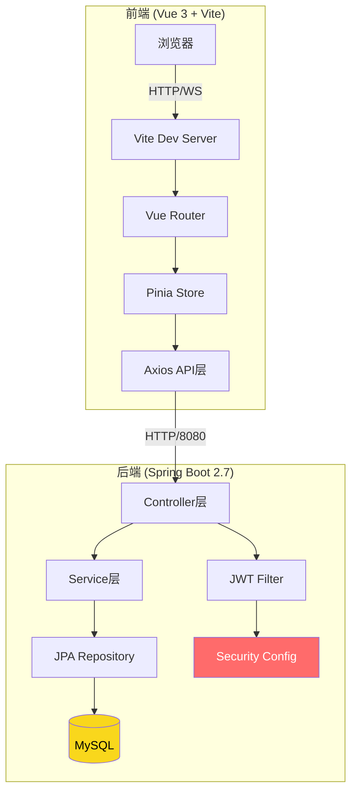
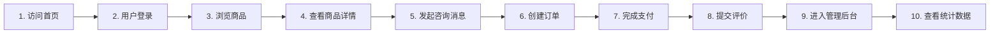

本指南面向零基础开发者，帮助你在本地机器上快速搭建并运行校园二手交易平台。本文涵盖环境准备、项目启动、默认账号登录等核心内容，确保你能在 15 分钟内完成基础体验。

## 环境要求一览

在开始之前，请确认你的开发环境满足以下依赖要求。项目采用前后端分离架构，前端使用 Vue 3 + Vite 构建工具，后端基于 Spring Boot 2.7 框架，两者通过 RESTful API 进行通信。

| 组件 | 最低版本 | 推荐版本 | 用途说明 |
|------|---------|---------|---------|
| Node.js | 16.x | 18.x LTS | 运行前端构建工具 Vite |
| npm | 8.x | 10.x | 前端依赖包管理器 |
| JDK | 17 | 17 LTS | 运行后端 Spring Boot 应用 |
| Maven | 3.8 | 3.9.x | 后端项目构建与依赖管理 |
| MySQL | 8.0 | 8.0.x | 持久化存储用户、商品、订单数据 |

Sources: [package.json](package.json#L1-L22), [server/pom.xml](server/pom.xml#L20-L25)

## 项目架构总览

为了帮助你建立整体认知，以下是系统架构的简化示意图。系统划分为三个主要部分：**前端展示层**负责用户界面渲染，**后端服务层**处理业务逻辑与数据访问，**数据库层**负责结构化数据持久化。



系统遵循典型的**三层架构**设计：控制层（Controller）接收前端请求，调用业务层（Service）处理核心逻辑，最终通过数据访问层（Repository）与 MySQL 数据库交互。JWT 认证过滤器在请求到达 Controller 之前进行身份校验，确保接口访问的安全性。

Sources: [vite.config.js](vite.config.js#L1-L28), [src/main.js](src/main.js#L1-L11)

## 前端环境配置

### 第一步：安装 Node.js 依赖

项目根目录下的 `package.json` 定义了前端所需的全部依赖包。打开终端，进入项目根目录，执行以下命令安装依赖：

```bash
npm install
```

该命令会根据 `package.json` 中的配置自动下载 Vue 3、Vue Router、Pinia 状态管理库、Axios HTTP 客户端以及 Vite 构建工具。安装完成后，你会看到 `node_modules` 文件夹出现在项目根目录中。

安装过程的预期输出包含以下核心依赖的安装确认：
- `vue@^3.5.13`：渐进式 JavaScript 框架的核心库
- `vue-router@^4.5.0`：官方路由管理方案
- `pinia@^2.3.1`：新一代状态管理库
- `axios@^1.7.9`：HTTP 请求库，用于与后端 API 通信
- `vite@^6.1.0`：下一代前端构建工具

Sources: [package.json](package.json#L1-L22)

### 第二步：配置 API 代理

项目根目录下的 `.env` 文件控制前端的环境变量配置。其中 `VITE_API_TARGET` 指定了后端服务的地址：

```env
VITE_API_BASE_URL=/api
VITE_API_TARGET=http://localhost:8080
```

`Vite.config.js` 中的代理配置确保开发环境下所有 `/api` 开头的请求都会被转发到 `http://localhost:8080`（后端服务地址）。这解决了跨域问题，让前端可以无缝调用后端接口。

Sources: [.env](.env#L1-L3), [vite.config.js](vite.config.js#L15-L21)

### 第三步：启动前端开发服务器

安装完依赖后，执行以下命令启动开发服务器：

```bash
npm run dev
```

Vite 会启动一个本地开发服务器，默认监听 `http://localhost:5173`。终端会显示类似以下输出：

```
  VITE v6.1.0  ready in 1234 ms

  ➜  Local:   http://localhost:5173/
  ➜  Network: http://192.168.x.x:5173/
```

打开浏览器访问 `http://localhost:5173`，即可看到校园二手交易平台的前端界面。

Sources: [vite.config.js](vite.config.js#L14)

## 后端环境配置

### 第一步：配置 MySQL 数据库

在启动后端服务之前，你需要确保 MySQL 数据库已正确安装并运行。进入 MySQL 命令行客户端或使用图形化工具（如 Navicat、DBeaver），创建项目专用数据库：

```sql
CREATE DATABASE secondhand DEFAULT CHARACTER SET utf8mb4 COLLATE utf8mb4_unicode_ci;
```

或者直接执行项目提供的初始化脚本，它会自动创建数据库并插入测试数据：

```bash
mysql -u root -p < server/sql/init.sql
```

Sources: [server/sql/init.sql](server/sql/init.sql#L1-L20)

### 第二步：配置数据库连接

打开 `server/.env` 文件，根据你的 MySQL 配置修改以下参数：

```env
DB_HOST=localhost
DB_PORT=3306
DB_NAME=secondhand
DB_USER=root
DB_PASSWORD=your_password_here
DB_USE_SSL=false
```

确保 `DB_PASSWORD` 与你的 MySQL root 密码一致，`DB_NAME` 与上一步创建的数据库名称匹配。

Sources: [server/.env](server/.env#L1-L7)

### 第三步：构建与启动后端服务

进入 `server` 目录，使用 Maven 构建项目：

```bash
cd server
mvn clean package -DskipTests
```

构建完成后，运行生成的 JAR 文件：

```bash
java -jar target/second-hand-goods-transaction-1.0-SNAPSHOT.jar
```

或者如果你在 IDE（如 IntelliJ IDEA、VS Code）中打开项目，可以直接运行主类 `SecondHandGoodsTransactionApplication`。Spring Boot 应用启动后，默认监听 `http://localhost:8080`。

Sources: [server/README.md](server/README.md#L65-L75)

## 默认测试账号

项目内置了 `DemoDataInitializer`，会在应用启动时自动插入测试数据。以下是可供使用的默认账号：

| 角色 | 用户名 | 密码 | 认证状态 |
|------|--------|------|---------|
| 管理员 | admin | 123456 | 已认证 |
| 普通用户 | alice | 123456 | 已认证 |
| 普通用户 | bob | 123456 | 已认证 |
| 普通用户 | seller01 | 123456 | 已认证 |
| 普通用户 | buyer01 | 123456 | 已认证 |

**前端登录入口**：
- 普通用户登录：`http://localhost:5173/login`
- 管理员登录：`http://localhost:5173/admin/login`

使用管理员账号登录后，可以访问 `http://localhost:5173/admin/dashboard` 进入管理后台，进行商品审核、用户管理、订单监控等操作。

Sources: [server/README.md](server/README.md#L77-L88), [server/sql/init.sql](server/sql/init.sql#L90-L95)

## 核心页面导航

项目启动成功后，你可以通过以下路径访问核心功能页面：

| 页面路径 | 功能说明 | 访问条件 |
|---------|---------|---------|
| `/` | 首页，展示商品列表 | 公开 |
| `/search` | 商品搜索与筛选 | 公开 |
| `/product/:id` | 商品详情页 | 公开 |
| `/wanted` | 求购帖子列表 | 公开 |
| `/login` | 用户登录 | 公开（已登录用户会自动跳转） |
| `/profile` | 个人中心 | 需要登录 |
| `/publish` | 发布商品 | 需要登录且已认证 |
| `/messages` | 消息中心 | 需要登录 |
| `/orders/recent` | 我的订单 | 需要登录 |
| `/admin/*` | 管理后台 | 需要管理员角色 |

Sources: [src/router/index.js](src/router/index.js#L25-L70)

## 常见问题排查

### 前端无法连接后端

**症状**：浏览器控制台显示 `Failed to fetch` 或 `Network Error`。

**排查步骤**：
1. 确认后端服务已在 `http://localhost:8080` 运行（检查终端输出）
2. 确认 MySQL 数据库正在运行且 `secondhand` 数据库已创建
3. 检查 `server/.env` 中的数据库密码是否正确
4. 清除浏览器缓存后刷新页面

### 数据库初始化失败

**症状**：启动后端时报错 `Access denied` 或 `Unknown database`。

**解决方案**：
1. 手动创建数据库：`CREATE DATABASE secondhand;`
2. 确认 `server/.env` 中的 `DB_USER` 和 `DB_PASSWORD` 与 MySQL 配置一致
3. 如果使用 H2 内存数据库（开发模式），确保 `application.yml` 中启用了 H2 配置

### 登录后页面未跳转

**症状**：登录成功后页面停留在登录页或提示未认证。

**排查步骤**：
1. 打开浏览器开发者工具 → Application → Local Storage
2. 检查是否存在 `token` 字段
3. 如果 token 存在但仍无法访问，尝试清除缓存后重新登录

Sources: [src/stores/user.js](src/stores/user.js#L1-L67), [src/App.vue](src/App.vue#L1-L35)

## 快速体验路线图

以下是建议的新手体验路径，帮助你在最短时间内熟悉系统的核心功能：



建议首次体验时按顺序完成上述步骤，感受完整的用户交易闭环。如果你对系统架构或技术实现感兴趣，可以继续阅读后续文档深入了解。

---

## 下一步阅读

完成快速开始后，推荐按以下顺序深入学习：

- **[项目概述](1-xiang-mu-gai-shu)** — 了解系统的设计目标、核心功能与技术选型背景
- **[前端架构](3-ji-zhu-zhan-yu-mu-lu-jie-gou)** — 深入理解 Vue 3 + Vite 的项目组织方式
- **[后端架构](7-fen-ceng-jie-gou-yu-kong-zhi-qi-she-ji)** — 掌握 Spring Boot 分层设计与控制器实现
- **[数据库设计](10-he-xin-shi-ti-yu-guan-xi)** — 学习核心数据表设计与关联关系