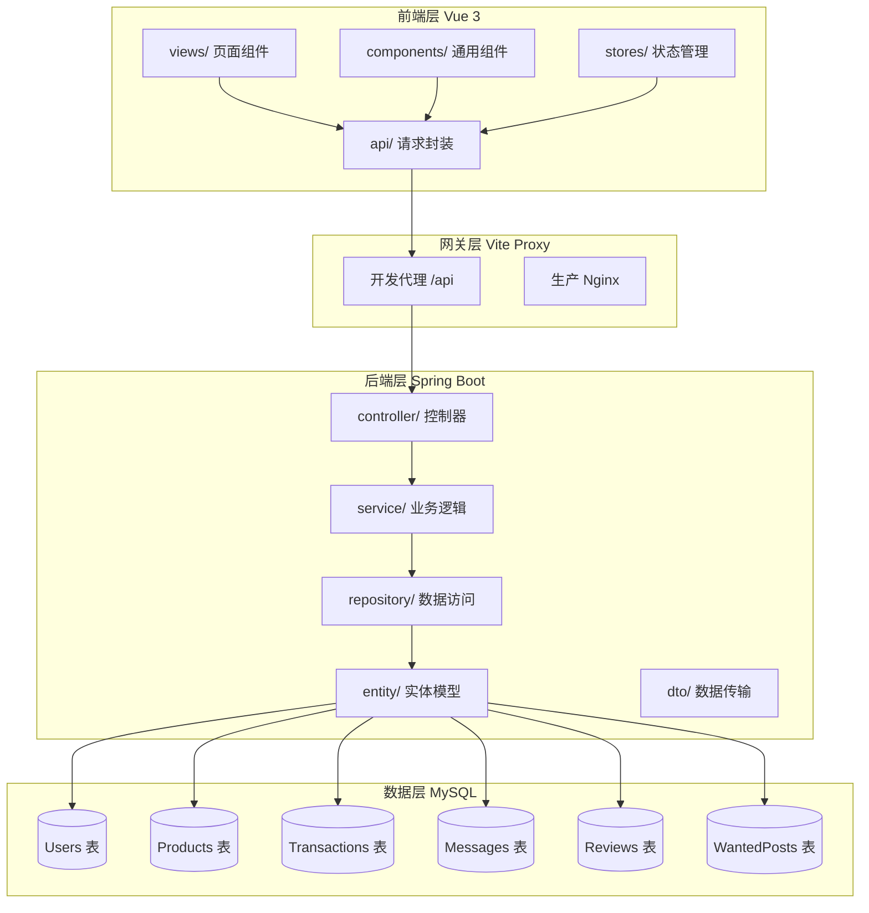
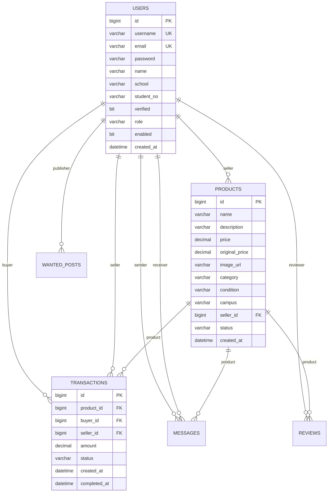
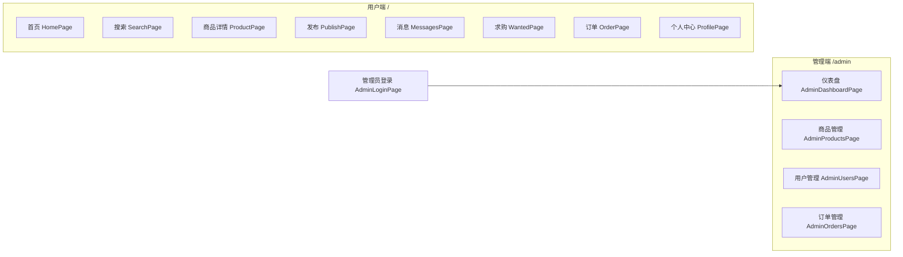
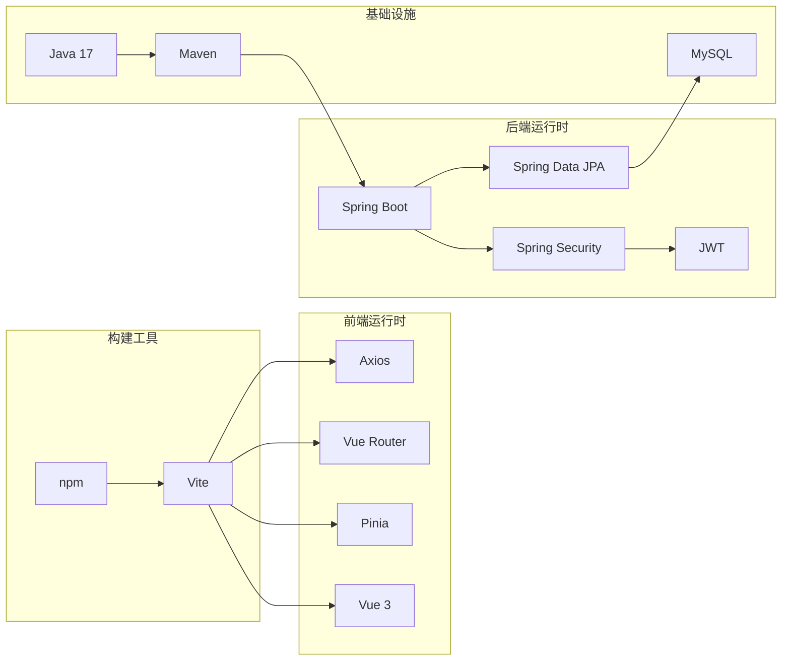

本文档系统梳理二手交易系统的技术选型依据与代码组织架构，帮助开发者快速建立全局视角，为后续深入各模块奠定基础。前端采用 Vue 3 + Vite 的现代化组合，后端基于 Spring Boot 2.7 + JPA 构建，数据库选用 MySQL 8.x，整体形成经典的全栈分离架构。

## 1. 技术栈概览

### 1.1 前端技术选型

| 层级 | 技术选型 | 版本 | 选型理由 |
|------|----------|------|----------|
| 核心框架 | Vue 3 | 3.5.13 | 组合式 API（Composition API）提供更灵活的逻辑复用，响应式系统性能优于 Vue 2 |
| 构建工具 | Vite | 6.1.0 | 基于 ESM 的开发服务器，冷启动速度提升 10 倍以上，配置简洁 |
| 状态管理 | Pinia | 2.3.1 | Vue 3 官方推荐，相比 Vuex 减少样板代码，TypeScript 支持更友好 |
| 路由管理 | Vue Router | 4.5.0 | SPA 导航核心，支持嵌套路由、导航守卫等复杂场景 |
| HTTP 客户端 | Axios | 1.7.9 | 支持请求拦截、响应拦截、超时控制，统一错误处理机制完善 |
| CSS 方案 | 原生 CSS | - | 使用 `styles.css` 全局样式配合组件 scoped 样式，零依赖引入 |

前端入口文件 `src/main.js` 完成了 Vue 应用的核心初始化流程：创建应用实例、注册 Pinia 状态管理、安装 Vue Router 路由实例、挂载全局样式文件。应用启动时依次执行这三个核心步骤，形成完整的响应式应用框架 [src/main.js](src/main.js#L1-L11)。

Vite 配置文件 `vite.config.js` 定义了开发服务器的运行参数。开发环境默认监听 `0.0.0.0:5173`，通过代理将 `/api` 路径的请求转发至后端服务器，转发目标由环境变量 `VITE_API_TARGET` 控制，默认指向 `http://localhost:8080`。同时配置了 `@` 路径别名，指向 `src` 目录，简化模块导入路径 [vite.config.js](vite.config.js#L1-L28)。

### 1.2 后端技术选型

| 层级 | 技术选型 | 版本 | 选型理由 |
|------|----------|------|----------|
| 核心框架 | Spring Boot | 2.7.0 | 约定优于配置，开箱即用的 Web 开发栈，生态成熟 |
| 数据持久化 | Spring Data JPA | - | 抽象数据库操作，支持方法名推导查询，减少 DAO 层样板代码 |
| 安全框架 | Spring Security | - | 完整的认证授权解决方案，与 Spring Boot 深度集成 |
| 数据库 | MySQL | 8.x | 支持复杂查询、事务管理、外键约束，数据完整性保障 |
| ORM 框架 | Hibernate | - | JPA 标准实现，缓存机制完善，懒加载支持 |
| 认证令牌 | JWT | 0.9.1 | 无状态认证，适合分布式部署，Token 包含用户信息 |
| 实体工具 | Lombok | - | 注解自动生成 getter/setter/构造函数，减少代码冗余 |

后端 `pom.xml` 配置文件定义了 Maven 项目依赖关系。Spring Boot 父 POM 统一管理版本号，确保各 starter 组件兼容性。Java 编译版本设定为 17，兼容 LtsmLongTerm 特性。MySQL 驱动作用域设为 `runtime`，测试环境使用 H2 内存数据库便于快速验证 [server/pom.xml](server/pom.xml#L1-L93)。

### 1.3 全栈架构分层



该架构遵循经典的三层分离原则：前端负责视图渲染与用户交互，后端专注业务逻辑处理，数据层承担持久化存储职责。Vite 开发服务器的代理机制在开发阶段模拟了生产环境的 Nginx 反向代理，实现前后端解耦部署。

---

## 2. 前端目录结构解析

### 2.1 目录树与职责映射

```
src/
├── main.js              # 应用入口，初始化 Vue、Pinia、Router
├── App.vue              # 根组件，视图布局容器
├── styles.css           # 全局样式，定义 CSS 变量与基础样式
├── api/                 # HTTP 请求层
│   ├── client.js        # Axios 实例配置，拦截器注册
│   ├── auth.js          # Token 读写工具函数
│   ├── endpoints.js     # API 端点定义（方法-路径映射）
│   ├── mappers.js       # 数据结构转换（API↔前端模型）
│   ├── compat.js        # 请求兼容性处理（fallback 逻辑）
│   ├── fallback.js      # 请求降级策略实现
│   └── services/        # 业务领域 API 服务
│       ├── products.js  # 商品相关接口
│       ├── orders.js    # 订单相关接口
│       ├── messages.js  # 消息相关接口
│       ├── users.js     # 用户相关接口
│       ├── wanted.js    # 求购帖相关接口
│       ├── reviews.js   # 评价相关接口
│       ├── admin.js     # 管理端接口
│       └── system.js    # 系统信息接口
├── stores/              # Pinia 状态管理
│   ├── user.js          # 用户登录态、个人信息
│   ├── market.js        # 商品列表、筛选条件
│   ├── order.js         # 订单状态流转
│   ├── chat.js          # 消息会话列表
│   └── admin.js         # 管理端统计数据
├── router/
│   └── index.js         # 路由配置、导航守卫
├── components/          # 可复用 Vue 组件
├── layouts/             # 页面布局组件
├── views/               # 页面级组件（路由组件）
├── mock/                # 模拟数据（开发调试用）
└── utils/               # 工具函数
```

### 2.2 核心模块详解

**API 请求层设计**采用分层封装策略，底层 `client.js` 创建 Axios 实例并配置请求/响应拦截器。请求拦截器自动从 `localStorage` 读取 Token 并附加到 `Authorization` 头；响应拦截器捕获 401 状态码时自动清除本地 Token 并重定向至登录页 [src/api/client.js](src/api/client.js#L1-L31)。

```
API 调用链路:
services/*.js → endpoints.js → compat.js → fallback.js → client.js → Axios
```

`endpoints.js` 采用对象配置式定义 API 端点，每个端点包含 HTTP 方法和 URL 路径。`services/` 目录下的各个服务文件调用端点配置，传入参数生成最终请求。这种设计使得后端接口变更时只需修改端点配置，无需改动调用方代码 [src/api/endpoints.js](src/api/endpoints.js#L1-L51)。

**状态管理层**基于 Pinia 的 Store 模式实现。`user.js` 是核心状态库，管理用户登录态、Token 和个人信息。定义了两个计算属性 `isAuthenticated`（是否已认证）和 `isAdmin`（是否为管理员），用于路由守卫和界面权限控制 [src/stores/user.js](src/stores/user.js#L1-L67)。

### 2.3 路由与页面组织

路由配置采用嵌套路由结构，用户端和管理端分别使用独立的 Layout 组件：

```javascript
// 路由结构概览
routes = [
  {
    path: "/",
    component: MainLayout,      // 用户端布局
    children: [
      { path: "", name: "home", component: HomePage },
      { path: "product/:id", component: ProductPage },
      { path: "order/:id/pay", component: OrderPayPage },
      // ... 13 个用户端页面
    ]
  },
  {
    path: "/admin",
    component: AdminLayout,     // 管理端布局
    children: [
      { path: "dashboard", component: AdminDashboardPage },
      { path: "products", component: AdminProductsPage },
      // ... 4 个管理端页面
    ]
  },
  { path: "/admin/login", component: AdminLoginPage },
  { path: "/:pathMatch(.*)*", component: NotFoundPage }
]
```

路由守卫逻辑通过 `beforeEach` 钩子实现：同步认证状态 → 异步加载用户资料 → 权限校验 → 登录页重定向。管理路由需要 `ADMIN` 角色，普通用户访问管理路径会被拦截至个人中心 [src/router/index.js](src/router/index.js#L60-L100)。

---

## 3. 后端目录结构解析

### 3.1 目录树与职责映射

```
server/src/main/
├── java/com/secondhand/
│   ├── SecondHandApplication.java    # Spring Boot 启动类
│   ├── Main.java                     # 程序入口（仅主类）
│   ├── config/                       # 配置类
│   │   ├── SecurityConfig.java       # Spring Security 配置
│   │   ├── GlobalExceptionHandler.java # 统一异常处理
│   │   └── DemoDataInitializer.java  # 开发环境数据初始化
│   ├── controller/                   # REST 控制器
│   │   ├── AuthController.java       # 认证接口
│   │   ├── UserController.java       # 用户管理
│   │   ├── ProductController.java     # 商品管理
│   │   ├── OrderController.java       # 订单管理
│   │   ├── TransactionController.java # 交易流程
│   │   ├── MessageController.java     # 消息通信
│   │   ├── ReviewController.java      # 评价管理
│   │   ├── WantedController.java      # 求购帖管理
│   │   ├── AdminController.java       # 管理端接口
│   │   └── SystemController.java      # 系统信息
│   ├── service/                      # 业务接口
│   │   └── impl/                     # 业务实现
│   ├── repository/                   # 数据访问接口（JPA）
│   ├── entity/                       # JPA 实体类
│   ├── dto/                          # 数据传输对象
│   └── security/                     # 安全认证组件
│       ├── JwtTokenUtil.java         # Token 生成与验证
│       ├── JwtAuthenticationFilter.java # 请求过滤器
│       └── JwtAuthenticationEntryPoint.java # 认证入口点
└── resources/
    └── application.yml               # 应用配置
```

### 3.2 分层架构详解

**Controller 层**负责接收 HTTP 请求、参数校验、调用 Service 层、返回 ResponseEntity 响应。以 `ProductController` 为例，提供了完整的 CRUD 接口集：创建商品 `POST /api/products`、获取商品 `GET /api/products/{id}`、查询列表 `GET /api/products`（支持关键字/校区/状态/排序过滤）、更新/删除商品、状态更新 `PATCH /api/products/{id}/status` [server/src/main/java/com/secondhand/controller/ProductController.java](server/src/main/java/com/secondhand/controller/ProductController.java#L1-L194)。

**Service 层**采用接口+实现类模式。`ProductServiceImpl` 实现了商品业务逻辑，通过 `@Transactional` 注解确保数据一致性。关键方法包括 `searchProducts()` 调用 Repository 的自定义查询、`getProductsByPriceRange()` 实现价格区间筛选、`updateProductStatus()` 处理商品上下架 [server/src/main/java/com/secondhand/service/impl/ProductServiceImpl.java](server/src/main/java/com/secondhand/service/impl/ProductServiceImpl.java#L1-L89)。

**Repository 层**继承 `JpaRepository` 获取基础 CRUD 能力，同时自定义查询方法。Spring Data JPA 支持方法名推导查询规则，如 `findBySellerId()` 自动转换为 `WHERE seller_id = ?` 的 SQL 语句，无需手动编写 [server/sql/init.sql](server/sql/init.sql#L1-L173)。

### 3.3 配置与环境管理

`application.yml` 采用外置环境变量配置策略，数据库连接参数可从 `.env` 文件或系统环境变量读取，支持多环境部署切换。关键配置项包括数据源 URL（支持 SSL 选项）、JPA 行为（`ddl-auto: update` 开发友好）、JWT 密钥与令牌有效期（24 小时） [server/src/main/resources/application.yml](server/src/main/resources/application.yml#L1-L26)。

---

## 4. 数据库设计概览

### 4.1 核心实体关系



### 4.2 实体特性说明

| 实体 | 业务含义 | 核心字段 | 状态枚举 |
|------|----------|----------|----------|
| User | 平台用户 | username/email/phone/name/school/student_no | role: USER/ADMIN, verified: 0/1, enabled: 0/1 |
| Product | 商品信息 | name/price/original_price/category/condition/campus | AVAILABLE/SOLD/UNAVAILABLE |
| Transaction | 交易订单 | product_id/buyer_id/seller_id/amount | PENDING/COMPLETED/CANCELLED |
| Message | 即时消息 | sender_id/receiver_id/product_id/content | is_read: 0/1 |
| Review | 商品评价 | product_id/reviewer_id/rating/comment | - |
| WantedPost | 求购帖子 | title/expected_price/deadline/description/campus | - |

初始化脚本内置了完整的测试数据，包括 4 个用户账号（seller01、buyer01、seller02、admin，密码均为 `123456` 的 BCrypt 哈希值）、4 个商品示例、2 条历史交易记录和 2 条求购帖，便于开发调试与功能演示 [server/sql/init.sql](server/sql/init.sql#L80-L100)。

---

## 5. 前端 API 服务层实现

### 5.1 HTTP 客户端封装

Axios 实例 `client.js` 是前端网络请求的枢纽。创建实例时指定 `baseURL` 为 `/api`（Vite 代理路径），`timeout` 设置为 8000 毫秒防止请求无限挂起。请求拦截器通过 `getToken()` 函数获取本地存储的 JWT Token，并附加到 `Authorization` 头，格式为 `Bearer <token>` [src/api/client.js](src/api/client.js#L1-L31)。

响应拦截器采用错误优先策略：成功响应直接透传，错误响应统一处理 401 状态码（清除 Token 并触发重新登录）。这种设计将 Token 过期处理逻辑集中在一处，避免在每个业务调用处重复编写。

### 5.2 数据映射与兼容性

`mappers.js` 负责将后端返回的驼峰/下划线混合命名转换为前端统一的命名风格。`compat.js` 实现了请求候选机制，当主接口调用失败时自动尝试备用接口，增强了系统在接口变更时的容错能力。

以商品服务为例，`fetchProducts()` 调用列表接口获取商品列表，`fetchProductById()` 获取单个商品详情，`createProduct()` 调用创建接口并对请求体进行格式化转换（将前端多图数组转换为单图 URL） [src/api/services/products.js](src/api/services/products.js#L1-L44)。

---

## 6. 组件与视图组织

### 6.1 组件分层策略

项目采用三层组件架构：布局组件（Layouts）→ 业务组件（Components）→ 基础组件（共享 UI）。`MainLayout` 和 `AdminLayout` 分别封装用户端和管理端的顶部导航、侧边栏等公共布局元素。业务组件如 `ProductCard`、`OrderStepBar` 承载特定业务逻辑，基础组件如 `EmptyState`、`StatusBanner` 提供通用 UI 功能。

### 6.2 页面路由映射



页面组件统一存放于 `src/views/` 目录，用户端页面与管理端页面分别归属不同子目录（`views/admin/`），通过路由配置挂载到对应的 Layout 下。这种组织方式使代码结构清晰，便于按功能模块进行团队分工。

---

## 7. 环境配置与部署要点

### 7.1 开发环境配置

前端通过 `.env` 文件或 Vite 环境变量控制 API 目标地址。默认开发服务器端口 `5173`，代理转发规则将所有 `/api` 请求发送至后端 `8080` 端口 [vite.config.js](vite.config.js#L20-L25)。

后端配置文件 `server/.env` 覆盖默认数据库连接参数，支持不同开发者的本地 MySQL 实例配置。JPA `ddl-auto: update` 模式在开发阶段自动同步实体结构变更，但生产环境应改为 `validate` 或使用 Flyway/Liquibase 进行版本化管理。

### 7.2 技术栈依赖关系图



---

## 8. 文档导航

本文档作为前端架构模块的第一篇，建立了技术选型与代码组织的基础认知。后续文档将从以下维度展开深入：

| 文档 | 内容焦点 | 建议阅读顺序 |
|------|----------|--------------|
| [状态管理设计](4-zhuang-tai-guan-li-she-ji) | Pinia Store 架构、跨组件状态共享、持久化策略 | ② |
| [路由与权限守卫](5-lu-you-yu-quan-xian-shou-wei) | 导航守卫逻辑、角色权限控制、页面过渡 | ③ |
| [页面组件体系](6-ye-mian-zu-jian-ti-xi) | 组件分层、复用模式、插槽与props设计 | ④ |

后端架构相关文档建议按以下顺序阅读：[分层结构与控制器设计](7-fen-ceng-jie-gou-yu-kong-zhi-qi-she-ji) → [安全配置与JWT认证](8-an-quan-pei-zhi-yu-jwtren-zheng) → [统一异常处理机制](9-tong-yi-chang-chu-li-ji-zhi)。