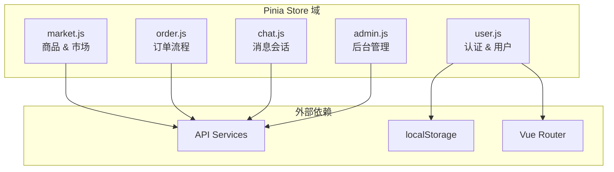

本文档深入解析校园二手交易平台前端的状态管理架构，涵盖 Pinia 状态管理库的组织结构、五个核心域 Stores 的职责划分、组件与 Store 的集成模式，以及跨域状态协调机制。

## 1. 技术选型与架构概览

### 1.1 Pinia 作为状态管理核心

项目采用 **Pinia 2.3.1** 作为官方推荐的 Vue 3 状态管理解决方案。Pinia 相比 Vuex 提供了更简洁的 API、更完整的 TypeScript 支持，以及更轻量的打包体积。在 `src/main.js` 中完成 Pinia 实例的注册：

```javascript
import { createPinia } from "pinia";
app.use(createPinia());
```

Sources: [src/main.js](src/main.js#L1-L11)

### 1.2 Store 域划分策略

系统将状态划分为五个职责明确的域 Store，每个 Store 专注于单一业务领域的全生命周期管理：



| Store | 核心职责 | 状态特征 | 持久化需求 |
|-------|---------|---------|-----------|
| user | 认证状态、用户信息 | 需持久化 token | 高 |
| market | 商品列表、详情 | 临时缓存 | 低 |
| order | 订单状态、进度 | 与后端强同步 | 中 |
| chat | 会话列表、消息 | 实时性要求高 | 低 |
| admin | 统计数据、管理操作 | 只读为主 | 低 |

## 2. Store 设计模式详解

### 2.1 user Store：认证状态中枢

`user.js` 采用 Options API 风格的 Pinia 定义，完整覆盖了认证生命周期的所有状态：

```javascript
export const useUserStore = defineStore("user", {
  state: () => ({
    token: getToken(),           // 从 localStorage 初始化
    profile: null,
    profileLoaded: false
  }),
  getters: {
    isAuthenticated: (state) => Boolean(state.token),
    isAdmin: (state) => state.profile?.role === "ADMIN"
  },
  actions: {
    syncAuthState() { /* 同步 localStorage 与 state */ },
    async loadProfile(force = false) { /* 获取用户信息 */ },
    async login(payload) { /* 登录流程 */ },
    logout() { /* 登出清理 */ }
  }
});
```

Sources: [src/stores/user.js](src/stores/user.js#L1-L67)

**设计亮点**：

- **延迟加载模式**：`loadProfile(force)` 支持强制刷新，`profileLoaded` 标志避免重复请求
- **跨域同步**：通过 `syncAuthState()` 方法在路由切换时同步 localStorage 与内存状态
- **防御性错误处理**：401 响应时自动清理认证状态

### 2.2 market Store：商品浏览状态

```javascript
state: () => ({
  products: [],
  currentProduct: null,
  loading: false,
  errorMessage: ""
})
```

Sources: [src/stores/market.js](src/stores/market.js#L1-L41)

**状态更新策略**：

- 发布新商品后使用 `this.products = [data, ...this.products]` 保持列表顺序
- 错误消息通过 `errorMessage` 统一管理，而非抛出异常

### 2.3 order Store：订单流程状态

```javascript
state: () => ({
  currentOrder: null,
  recentOrders: [],
  loading: false,
  recentLoading: false,
  stepSubmitting: false
})
```

Sources: [src/stores/order.js](src/stores/order.js#L1-L50)

**跨列表同步**：当订单状态推进时，同时更新当前查看的订单和最近订单列表：

```javascript
async nextCurrentOrderStep() {
  const updated = await advanceOrderStep(this.currentOrder.id);
  this.currentOrder = updated;
  this.recentOrders = this.recentOrders.map((item) =>
    item.id === updated.id ? updated : item
  );
}
```

### 2.4 chat Store：消息会话管理

chat Store 是最复杂的 Store，包含会话列表、当前会话、消息历史的完整管理：

```javascript
state: () => ({
  conversations: [],
  activeId: "",
  messages: [],
  loading: false,
  errorMessage: ""
}),
getters: {
  activeConversation(state) {
    return state.conversations.find((item) => item.id === state.activeId) || null;
  }
}
```

Sources: [src/stores/chat.js](src/stores/chat.js#L1-L87)

**草稿会话机制**：支持动态创建未正式建立的会话：

```javascript
function createDraftConversation(id, peerName = "") {
  const normalizedId = String(id || "");
  const numeric = normalizedId.startsWith("u-") ? normalizedId.slice(2) : normalizedId;
  return {
    id: normalizedId,
    peerUser: { id: numeric || "", name: peerName || `用户${numeric || ""}` },
    lastMessage: "",
    unreadCount: 0,
    messages: []
  };
}
```

### 2.5 admin Store：后台管理状态

```javascript
state: () => ({
  stats: null,
  products: [],
  users: [],
  orders: [],
  loading: false,
  errorMessage: ""
})
```

Sources: [src/stores/admin.js](src/stores/admin.js#L1-L88)

admin Store 提供完整的 CRUD 操作封装，包括状态切换、删除确认等业务逻辑。

## 3. 组件集成模式

### 3.1 storeToRefs 与响应式绑定

Pinia 提供了 `storeToRefs` 工具函数，确保解构后的状态保持响应式：

```javascript
import { storeToRefs } from "pinia";

const userStore = useUserStore();
const { isAuthenticated, profile } = storeToRefs(userStore);
```

Sources: [src/components/AppHeader.vue](src/components/AppHeader.vue#L36-L43)

**注意**：`actions` 不需要 `storeToRefs` 包装，可直接使用：

```javascript
function logout() {
  userStore.logout();  // 直接调用 action
  router.push("/login");
}
```

### 3.2 组件内计算属性派生

组件通常在 Store 状态基础上通过 `computed` 派生 UI 所需的展示形态：

```javascript
const actionMode = computed(() => {
  const status = order.value?.status;
  if (status === "已下单") return "pay";
  if (status === "待评价") return "review";
  if (["已付款", "已发货", "待收货"].includes(status)) return "next";
  return "none";
});

const canAction = computed(() => {
  if (!order.value) return false;
  if (actionMode.value === "none") return false;
  if (actionMode.value === "next") return !store.stepSubmitting;
  return true;
});
```

Sources: [src/views/OrderPage.vue](src/views/OrderPage.vue#L59-L81)

### 3.3 组件生命周期与 Store 调用

典型的加载模式结合 `onMounted` 与 Store actions：

```javascript
onMounted(() => {
  if (!authed.value) return;
  store.loadProducts({ sort: "latest", status: "AVAILABLE" });
});
```

Sources: [src/views/HomePage.vue](src/views/HomePage.vue#L95-L102)

## 4. 跨 Store 协调机制

### 4.1 多 Store 协作场景

在复杂业务场景中，单个组件需要协调多个 Store 的状态：

```javascript
// MessagesPage.vue - 同时使用 4 个 Store
const chatStore = useChatStore();
const marketStore = useMarketStore();
const orderStore = useOrderStore();
const userStore = useUserStore();
```

Sources: [src/views/MessagesPage.vue](src/views/MessagesPage.vue#L65-L83)

**典型场景**：从消息页面直接下单购买商品：

```javascript
async function buyNow() {
  const order = await orderStore.submitOrder(relatedProductId.value);
  router.push(`/order/${order.id}`);
}
```

### 4.2 商品详情页的双 Store 联动

ProductPage 协调 market 和 order 两个 Store：

```javascript
const marketStore = useMarketStore();
const orderStore = useOrderStore();

const product = computed(() => marketStore.currentProduct);

async function toOrder() {
  const order = await orderStore.submitOrder(Number(product.value.id));
  router.push(`/order/${order.id}`);
}
```

Sources: [src/views/ProductPage.vue](src/views/ProductPage.vue#L31-L88)

## 5. 路由守卫与状态同步

### 5.1 全局导航守卫的 Store 集成

路由守卫直接依赖 user Store 进行权限判断和状态同步：

```javascript
router.beforeEach(async (to) => {
  const userStore = useUserStore();
  
  userStore.syncAuthState();  // 每次路由切换同步认证状态
  
  if (userStore.isAuthenticated && !userStore.profileLoaded) {
    try {
      await userStore.loadProfile();
    } catch {
      userStore.logout();
    }
  }
  
  if (isAdminRoute && !userStore.isAuthenticated) {
    return createAdminLoginLocation(to);
  }
  // ...
});
```

Sources: [src/router/index.js](src/router/index.js#L68-L108)

### 5.2 登录重定向工具

通过 `createLoginLocation` 工具函数保存登录前的原始路径：

```javascript
export function createLoginLocation(route, fallback = "/profile") {
  return {
    path: "/login",
    query: {
      redirect: resolveRedirectTarget(route?.fullPath, fallback)
    }
  };
}
```

Sources: [src/utils/auth.js](src/utils/auth.js#L14-L21)

## 6. 认证状态持久化策略

### 6.1 localStorage 与内存双写

认证状态同时存在于 localStorage（持久化）和 Pinia state（内存）：

```javascript
// src/api/auth.js
export function setToken(token) {
  if (!token) return;
  window.localStorage.setItem("token", token);
  window.dispatchEvent(new Event("auth-changed"));  // 跨标签页同步
}

export function getToken() {
  return window.localStorage.getItem("token") || "";
}
```

Sources: [src/api/auth.js](src/api/auth.js#L1-L19)

### 6.2 跨标签页状态同步

通过 `auth-changed` 事件实现多标签页状态一致性：

```javascript
window.addEventListener("auth-changed", () => {
  userStore.syncAuthState();
});
```

## 7. 错误处理与边界场景

### 7.1 Store 级错误处理

每个 Store action 都包含完整的 try-catch 包装：

```javascript
async loadProducts(params = {}) {
  this.loading = true;
  this.errorMessage = "";
  try {
    this.products = await fetchProducts(params);
  } catch (error) {
    this.errorMessage = error?.response?.data?.message || "加载商品列表失败";
    this.products = [];
  } finally {
    this.loading = false;
  }
}
```

### 7.2 组件级错误处理

组件可以在 Store action 抛出异常后进行二次处理：

```javascript
async function handleAction() {
  try {
    await store.nextCurrentOrderStep();
  } catch (error) {
    errorMessage.value = error?.response?.data?.message || "推进失败，请稍后重试";
  }
}
```

Sources: [src/views/OrderPage.vue](src/views/OrderPage.vue#L96-L114)

## 8. 进阶阅读

- **[路由与权限守卫](5-lu-you-yu-quan-xian-shou-wei)** — 深入了解路由守卫中的状态校验逻辑
- **[前端架构概览](3-ji-zhu-zhan-yu-mu-lu-jie-gou)** — 了解整体项目结构与模块组织
- **[用户交易闭环](14-yong-hu-jiao-yi-bi-huan)** — 查看 Store 如何支撑完整交易流程