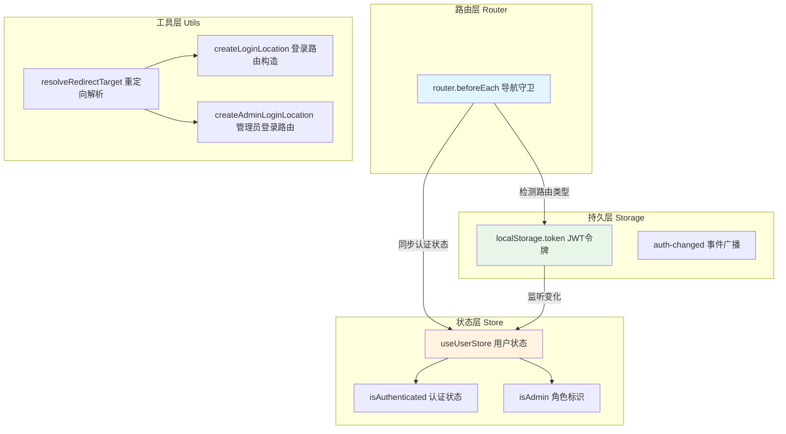
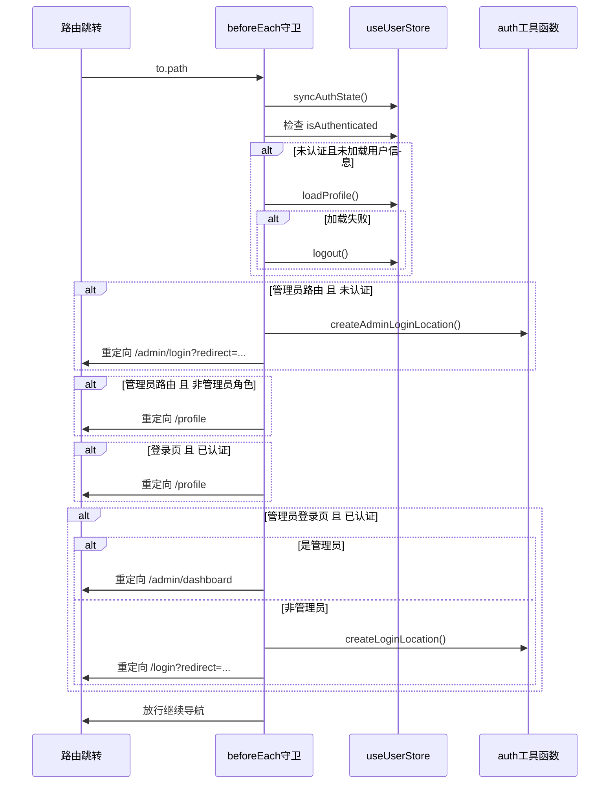
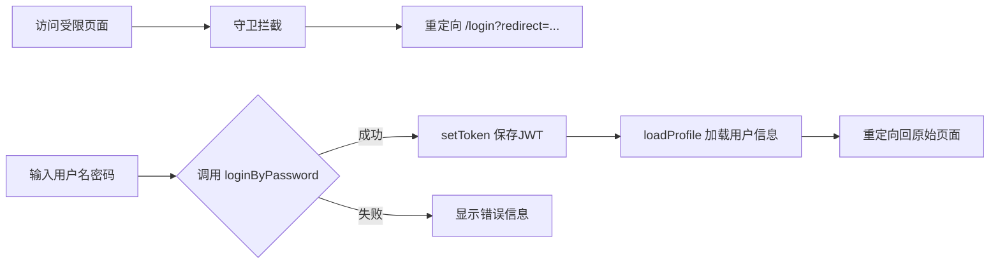

本文档聚焦于 Vue Router 全局导航守卫与用户权限控制机制，阐述认证状态的同步流程、路由守卫的决策逻辑以及双重登录体系（普通用户/管理员）的实现细节。

## 架构概述

前端路由系统采用 **Vue Router 4** 的 `beforeEach` 全局导航守卫作为权限控制的核心入口，结合 Pinia 状态管理与 localStorage token 持久化机制，形成一套完整的身份认证与权限校验体系。



Sources: [src/router/index.js](src/router/index.js#L1-L111)
Sources: [src/stores/user.js](src/stores/user.js#L1-L67)
Sources: [src/utils/auth.js](src/utils/auth.js#L1-L31)

---

## 路由配置结构

### 路由分组策略

系统采用**布局组件嵌套路由**的分组方式，将前台用户页面与管理后台页面物理隔离：

| 路由分组 | 路径前缀 | 布局组件 | 页面数量 | 认证要求 |
|---------|---------|---------|---------|---------|
| MainLayout | `/` | `MainLayout.vue` | 11 个 | 可选（部分页面需登录） |
| AdminLayout | `/admin` | `AdminLayout.vue` | 4 个 | 必须管理员身份 |
| 独立页面 | `/admin/login` | 无 | 1 个 | 未登录可访问 |
| 错误页面 | `/:pathMatch` | 无 | 1 个 | 完全开放 |

Sources: [src/router/index.js](src/router/index.js#L26-L58)

### 路由定义核心代码

```javascript
const routes = [
  {
    path: "/",
    component: MainLayout,
    children: [
      { path: "", name: "home", component: HomePage },
      { path: "publish", name: "publish", component: PublishPage },
      { path: "profile", name: "profile", component: ProfilePage },
      { path: "login", name: "login", component: LoginPage }
      // ... 其他用户页面
    ]
  },
  {
    path: "/admin",
    component: AdminLayout,
    children: [
      { path: "dashboard", name: "adminDashboard", component: AdminDashboardPage },
      { path: "products", name: "adminProducts", component: AdminProductsPage },
      { path: "users", name: "adminUsers", component: AdminUsersPage },
      { path: "orders", name: "adminOrders", component: AdminOrdersPage }
    ]
  },
  { path: "/admin/login", name: "adminLogin", component: AdminLoginPage }
];
```

Sources: [src/router/index.js](src/router/index.js#L26-L57)

---

## 全局导航守卫逻辑

### 守卫执行流程

`beforeEach` 守卫按照**身份预同步 → 角色路由校验 → 登录页状态处理**的顺序执行决策：



Sources: [src/router/index.js](src/router/index.js#L68-L108)

### 守卫决策矩阵

| 目标路由 | 当前状态 | 执行动作 |
|---------|---------|---------|
| 管理员路由 `/admin/*` | 未登录 | 重定向到 `/admin/login?redirect=当前路由` |
| 管理员路由 `/admin/*` | 已登录但非管理员 | 重定向到 `/profile` |
| 用户登录页 `/login` | 已登录 | 重定向到 `/profile` |
| 管理员登录页 `/admin/login` | 未登录 | 允许访问 |
| 管理员登录页 `/admin/login` | 已登录且是管理员 | 重定向到 `/admin/dashboard` |
| 管理员登录页 `/admin/login` | 已登录但非管理员 | 重定向到 `/login?redirect=当前路由` |
| 其他页面 | 任意 | 放行 |

Sources: [src/router/index.js](src/router/index.js#L68-L108)

---

## 认证状态管理

### Token 持久化机制

认证令牌通过 localStorage 存储，并利用自定义事件 `auth-changed` 实现跨标签页状态同步：

```javascript
// src/api/auth.js
export function setToken(token) {
  if (!token) return;
  window.localStorage.setItem("token", token);
  window.dispatchEvent(new Event("auth-changed"));  // 通知所有监听器
}

export function clearToken() {
  window.localStorage.removeItem("token");
  window.dispatchEvent(new Event("auth-changed"));
}
```

Sources: [src/api/auth.js](src/api/auth.js#L1-L19)

### App 层全局状态监听

`App.vue` 在应用启动时注册事件监听器，确保 token 变更时同步刷新用户状态：

```javascript
onMounted(() => {
  syncAuthState();
  window.addEventListener("auth-changed", syncAuthState);  // tab 间同步
  window.addEventListener("storage", syncAuthState);       // localStorage 变化
});
```

Sources: [src/App.vue](src/App.vue#L1-L35)

### UserStore 状态定义

```javascript
state: () => ({
  token: getToken(),        // 从 localStorage 初始化
  profile: null,            // 用户信息缓存
  profileLoaded: false      // 预加载标记
}),
getters: {
  isAuthenticated: (state) => Boolean(state.token),
  isAdmin: (state) => state.profile?.role === "ADMIN"
}
```

Sources: [src/stores/user.js](src/stores/user.js#L1-L14)

---

## 登录路由重定向机制

### 重定向目标解析函数

`resolveRedirectTarget` 函数负责验证并规范化重定向路径，防止重定向劫持攻击：

```javascript
export function resolveRedirectTarget(rawRedirect, fallback = "/profile") {
  // 1. 非字符串类型 → 使用默认回退
  if (typeof rawRedirect !== "string") return fallback;
  
  // 2. 非绝对路径 或 以 // 开头的协议相对URL → 拒绝
  if (!rawRedirect.startsWith("/") || rawRedirect.startsWith("//")) {
    return fallback;
  }
  
  // 3. 防止登录页循环重定向
  if (rawRedirect.startsWith("/login")) return fallback;
  
  // 4. 通过验证，返回原始值
  return rawRedirect;
}
```

Sources: [src/utils/auth.js](src/utils/auth.js#L1-L12)

### 登录路由构造

两种登录场景使用不同的路由构造函数：

| 函数 | 目标路由 | 默认回退 | 使用场景 |
|-----|---------|---------|---------|
| `createLoginLocation` | `/login` | `/profile` | 用户登录后返回原页面 |
| `createAdminLoginLocation` | `/admin/login` | `/admin/dashboard` | 管理员登录后返回原页面 |

Sources: [src/utils/auth.js](src/utils/auth.js#L14-L30)

---

## 双重登录体系

### 普通用户登录流程



Sources: [src/views/LoginPage.vue](src/views/LoginPage.vue#L1-L152)
Sources: [src/api/services/users.js](src/api/services/users.js#L1-L29)

### 管理员登录流程

管理员登录在普通登录基础上增加了**角色校验**：

```javascript
async function submit() {
  await userStore.login(form);
  
  // 核心差异：校验管理员角色
  if (!userStore.isAdmin) {
    userStore.logout();  // 清除非法获取的token
    errorMessage.value = "当前账号没有管理权限，请使用管理员账号登录";
    return;
  }
  
  // 成功后重定向到管理后台
  await router.replace(resolveRedirectTarget(route.query.redirect, "/admin/dashboard"));
}
```

Sources: [src/views/admin/AdminLoginPage.vue](src/views/admin/AdminLoginPage.vue#L58-L75)

---

## 组件层退出登录

AdminLayout 组件在侧边栏底部提供了退出登录功能：

```javascript
function logout() {
  userStore.logout();        // 清除 token 和状态
  router.push("/admin/login"); // 重定向到登录页
}
```

Sources: [src/layouts/AdminLayout.vue](src/layouts/AdminLayout.vue#L37-L56)

---

## 核心设计模式总结

| 设计模式 | 应用位置 | 作用 |
|---------|---------|-----|
| 单一职责 | `utils/auth.js` | 路由构造逻辑与业务逻辑分离 |
| 提前校验 | `beforeEach` 守卫 | 在渲染前拦截未授权访问 |
| 事件驱动同步 | `auth-changed` 事件 | 多标签页 token 状态一致性 |
| 状态缓存 | `profileLoaded` 标记 | 避免重复 API 调用 |
| 优雅降级 | 重定向 fallback | 异常情况下保持可用性 |

---

## 后续阅读

- 了解完整的认证流程实现，请阅读 [JWT认证流程实现](13-jwtren-zheng-liu-cheng-shi-xian)
- 深入理解角色模型与权限规则，请阅读 [角色模型与权限规则](12-jiao-se-mo-xing-yu-quan-xian-gui-ze)
- 查看后端对应的安全配置，请阅读 [安全配置与JWT认证](8-an-quan-pei-zhi-yu-jwtren-zheng)