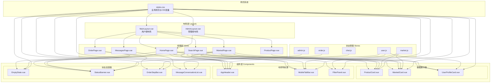
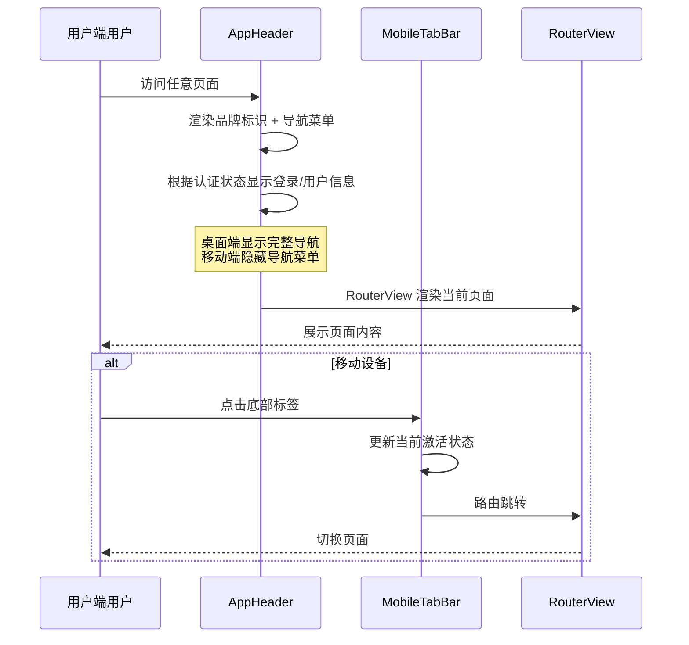
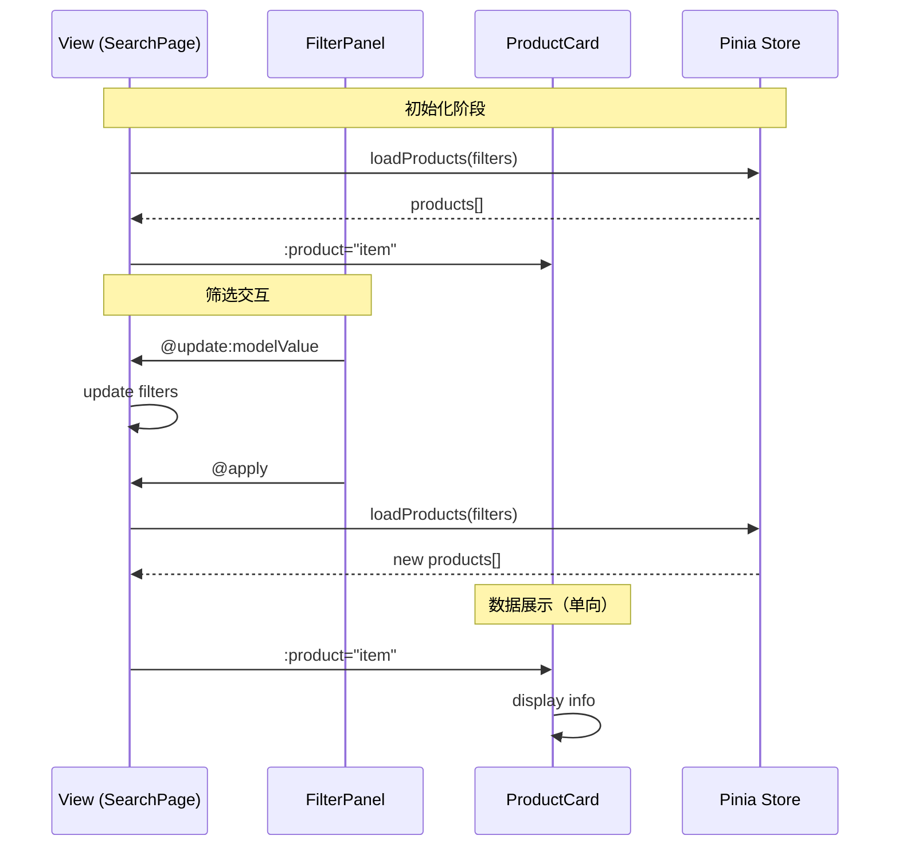

本文档深入解析校园二手交易平台前端项目的组件架构体系，涵盖布局组件、业务组件、UI组件的设计模式，以及组件间的组合复用策略。该组件系统基于 Vue 3 Composition API 和单文件组件规范构建，采用渐进式增强策略同时适配桌面端与移动端。

## 1. 架构概览

该前端项目采用经典的**布局-视图-组件**三层结构，通过 Vue Router 的嵌套路由实现布局与视图的动态组合。组件系统遵循原子设计方法论，按职责划分为布局组件、UI展示组件、交互反馈组件三大类别。



Sources: [src/router/index.js](src/router/index.js#L26-L58), [src/layouts/MainLayout.vue](src/layouts/MainLayout.vue#L1-L29), [src/layouts/AdminLayout.vue](src/layouts/AdminLayout.vue#L1-L56), [src/views/HomePage.vue](src/views/HomePage.vue#L1-L103)

## 2. 布局组件系统

布局组件定义了应用的整体骨架结构，通过 `RouterView` 插槽机制动态渲染子路由页面。项目设计了两套独立的布局体系，分别服务于普通用户和管理员用户。

### 2.1 用户端布局 (MainLayout)

用户端布局采用简洁的三段式结构：顶部固定导航栏、主内容区域、底部移动端标签栏。该布局通过媒体查询控制移动端元素的显隐，实现响应式适配。



MainLayout 的核心职责包括：全局导航状态管理（基于 `useRoute()` 判断激活项）、认证状态展示（从 `useUserStore` 读取）、移动端适配（在 `<=720px` 时显示 MobileTabBar）。主内容区域设置了底部内边距，在移动端需要为固定定位的标签栏预留空间（`76px`）。

Sources: [src/layouts/MainLayout.vue](src/layouts/MainLayout.vue#L1-L29), [src/components/AppHeader.vue](src/components/AppHeader.vue#L1-L60)

### 2.2 管理端布局 (AdminLayout)

管理端采用侧边栏固定布局，由品牌标识区、导航菜单区、底部操作区三部分组成。相比用户端，管理端布局更强调信息密度和操作效率。

| 区域 | 功能描述 | 样式特征 |
|------|----------|---------|
| 品牌区 | 显示"管理中心"标题及功能说明 | 较大字号 + 渐变背景 |
| 导航区 | 四项管理入口（数据概览、商品、用户、订单） | 卡片式导航项 + hover 动效 |
| 操作区 | 当前管理员信息 + 返回前台/退出登录 | 按钮组布局 |

导航激活状态通过 `route.path.startsWith(item.to)` 判断，支持路径前缀匹配（如 `/admin/products` 激活"商品管理"）。导航项采用网格布局，每个入口包含图标（Material Symbols）、标题和描述文字，hover 时触发 `translateX(2px)` 平移动效。

Sources: [src/layouts/AdminLayout.vue](src/layouts/AdminLayout.vue#L1-L182)

### 2.3 布局与路由的组合

路由配置中使用 `children` 数组将页面组件挂载到布局的 `<RouterView>` 下：

```javascript
// src/router/index.js 第 26-58 行
const routes = [
  {
    path: "/",
    component: MainLayout,  // 布局组件
    children: [
      { path: "", name: "home", component: HomePage },
      { path: "search", component: SearchPage },
      { path: "product/:id", component: ProductPage },
      // ...
    ]
  },
  {
    path: "/admin",
    component: AdminLayout,  // 管理端布局
    children: [
      { path: "dashboard", component: AdminDashboardPage },
      { path: "products", component: AdminProductsPage },
      // ...
    ]
  }
];
```

这种嵌套路由模式使得同一布局组件可以服务于多个页面，实现了布局逻辑与页面内容的完全解耦。

Sources: [src/router/index.js](src/router/index.js#L26-L58)

## 3. UI 组件分类解析

### 3.1 数据展示类组件

#### ProductCard（商品卡片）

ProductCard 是项目中使用频率最高的展示组件，采用「图片+信息」的经典卡片布局。该组件接收 `product` 对象作为唯一必需属性，通过可选链操作符处理数据缺失情况。

**Props 定义规范**：

```javascript
// src/components/ProductCard.vue 第 24-29 行
defineProps({
  product: {
    type: Object,
    required: true
  }
});
```

**关键设计细节**：
- 图片区域使用 `aspect-ratio: 4/3` 保持统一比例，`object-fit: cover` 确保图片不变形
- 商品成色标签使用 `position: absolute` 定位在图片左上角
- 价格区域通过 `flex` 布局实现主价格（大字号橙色）与原价（删除线灰色）的视觉层次
- 元信息区包含校区和发布时间两项辅助信息
- 未提供图片时使用 Unsplash 的默认咖啡馆图片作为兜底

Sources: [src/components/ProductCard.vue](src/components/ProductCard.vue#L1-L101)

#### WantedCard（求购卡片）

WantedCard 专为求购场景设计，组件结构包含标题、发布者信息、描述、预期价格与截止日期、以及操作按钮组。相比 ProductCard，该组件增加了事件触发能力（`contact` 事件），支持用户通过"联系TA"按钮发起聊天。

发布者名称的处理逻辑体现了数据预处理的重要性：自动为无"同学"后缀的名称添加后缀，若发布者信息为空则显示"匿名同学"。这种命名规范化避免了界面上出现不一致的称呼形式。

Sources: [src/components/WantedCard.vue](src/components/WantedCard.vue#L1-L100)

#### UserProfileCard（用户信息卡）

UserProfileCard 用于个人中心页面，综合展示用户基本信息与统计数据。组件结构分为上下两个区域：上部展示用户详情（认证状态、学校、角色），下部以四宫格形式展示统计数字。

```javascript
// src/components/UserProfileCard.vue 第 20-37 行
const stats = [
  { label: "我发布的", value: profile?.publishCount ?? 0 },
  { label: "已完成交易", value: profile?.soldCount ?? 0 },
  { label: "我的求购", value: profile?.wantedCount ?? 0 },
  { label: "相关订单", value: profile?.orderCount ?? 0 }
];
```

该组件采用 `grid-template-columns: repeat(4, minmax(0, 1fr))` 实现自适应四栏布局，在移动端（`<=760px`）自动切换为两栏，保持良好的可读性。

Sources: [src/components/UserProfileCard.vue](src/components/UserProfileCard.vue#L1-L140)

### 3.2 布局导航类组件

#### AppHeader（应用头部）

AppHeader 实现了全局导航功能，包含品牌标识、桌面端导航菜单和工具按钮区三大功能模块。该组件使用 `useRoute()` 获取当前路由路径，通过 `isActive()` 函数判断导航项的激活状态。

**导航激活判断逻辑**：

```javascript
// src/components/AppHeader.vue 第 54 行
const isActive = (target) => (
  target === "/" 
    ? current.value === "/" 
    : current.value.startsWith(target)
);
```

该逻辑区分首页与其他页面：首页需要精确匹配（`===`），而其他页面使用前缀匹配（`startsWith`）以便高亮所有子页面路由。组件还根据 `userStore.isAdmin` 状态条件渲染"后台"入口链接。

Sources: [src/components/AppHeader.vue](src/components/AppHeader.vue#L1-L148)

#### MobileTabBar（移动端底部标签栏）

MobileTabBar 是移动端特有的导航组件，采用固定定位在视口底部，包含首页、搜索、发布、消息、个人五个入口。该组件仅在屏幕宽度 `<=720px` 时显示，与 AppHeader 的桌面端导航形成互补。

**激活状态判断**使用与 AppHeader 相同的 `isActive()` 逻辑，确保移动端与桌面端导航状态的一致性。图标使用 Material Symbols Outlined 字体家族的对应图标名称。

Sources: [src/components/MobileTabBar.vue](src/components/MobileTabBar.vue#L1-L67)

#### FilterPanel（筛选面板）

FilterPanel 实现了搜索页面的筛选条件配置功能，采用受控组件模式通过 `v-model` 与父组件双向绑定。组件定义了三个筛选维度：关键词搜索、校区选择、价格排序。

**双向绑定实现**：

```javascript
// src/components/FilterPanel.vue 第 39-44 行
function emitChange(key, value) {
  emit("update:modelValue", {
    ...props.modelValue,
    [key]: value
  });
}
```

组件同时监听 `modelValue` 的变化（通过 `@input` 和 `@change` 事件即时更新）并在用户点击"应用筛选"按钮时触发 `apply` 事件，由父组件统一处理筛选逻辑和 URL 查询参数同步。

Sources: [src/components/FilterPanel.vue](src/components/FilterPanel.vue#L1-L67)

### 3.3 状态反馈类组件

#### EmptyState（空状态）

EmptyState 用于数据列表为空时向用户传达当前状态，包含图标、标题、描述和可选操作按钮四个视觉元素。该组件的设计原则是提供清晰的状态说明和明确的下一步行动指引。

**Props 定义**：

```javascript
// src/components/EmptyState.vue 第 11-24 行
defineProps({
  title: { type: String, default: "暂无数据" },
  description: { type: String, default: "请稍后再试" },
  actionText: { type: String, default: "" }  // 空字符串时不渲染按钮
});
```

使用场景示例（HomePage 中的条件渲染）：

```html
<!-- src/views/HomePage.vue 第 45-49 行 -->
<EmptyState
  v-if="!store.loading && !store.products.length"
  title="暂无在售商品"
  description="请先发布一条商品，或检查后端接口是否可用。"
/>
```

Sources: [src/components/EmptyState.vue](src/components/EmptyState.vue#L1-L49), [src/views/HomePage.vue](src/views/HomePage.vue#L45-L52)

#### OrderStepBar（订单步骤条）

OrderStepBar 组件通过可视化步骤条展示订单流转进度，将后端返回的英文状态码（如 `PENDING`、`PAID`）映射为中文步骤名称。组件接收 `status` 属性，通过 `computed` 属性计算当前步骤索引。

**状态映射逻辑**：

```javascript
// src/components/OrderStepBar.vue 第 21-31 行
const map = {
  PENDING: "已下单",
  PAID: "已付款",
  SHIPPED: "已发货",
  RECEIVED: "待收货",
  COMPLETED: "待评价",
  CANCELLED: "已下单"
};
const normalizedStatus = computed(() => map[props.status] || props.status);
const activeIndex = computed(() => Math.max(0, stepList.indexOf(normalizedStatus.value)));
```

已完成的步骤（索引小于等于 `activeIndex`）通过 `.active` 类获得高亮样式，包括文字颜色变为品牌色、圆点变为实心。

Sources: [src/components/OrderStepBar.vue](src/components/OrderStepBar.vue#L1-L68)

#### StatusBanner（状态提示条）

StatusBanner 是一个简单的信息提示组件，用于提醒用户当前显示的是备用数据。该组件仅接收 `visible` 布尔属性控制显隐，保持了组件职责的单一性。

```html
<!-- 使用示例 -->
<StatusBanner :visible="store.usingFallbackData" />
```

Sources: [src/components/StatusBanner.vue](src/components/StatusBanner.vue#L1-L39)

#### MessageConversationList（消息会话列表）

MessageConversationList 组件以垂直列表形式展示消息会话，支持单选激活状态。每个会话项包含对方用户名、最新消息摘要和未读计数徽章。

```javascript
// src/components/MessageConversationList.vue 第 21-32 行
defineProps({
  conversations: { type: Array, default: () => [] },
  activeId: { type: String, default: "" }
});

defineEmits(["select"]);
```

组件通过 `v-for` 遍历会话数组，使用 `activeId` prop 与当前选中项的 `id` 对比，添加 `.active` 类实现视觉高亮。未读计数 `>0` 时显示红色徽章，徽章最小宽度设为 `20px` 保证数字始终可见。

Sources: [src/components/MessageConversationList.vue](src/components/MessageConversationList.vue#L1-L80)

## 4. 组件设计模式

### 4.1 Props 与 Emits 规范

项目中的组件遵循统一的 Props 定义模式，使用对象语法声明属性类型和验证规则：

```javascript
// 标准 Props 定义
defineProps({
  // 必需的属性
  product: { type: Object, required: true },
  
  // 带默认值的可选属性
  profile: { type: Object, default: null },
  title: { type: String, default: "默认标题" },
  conversations: { type: Array, default: () => [] },
  
  // 带类型校验的属性
  visible: { type: Boolean, default: false },
  activeId: { type: String, default: "" }
});
```

Emits 声明采用数组或对象语法：

```javascript
// 简单事件列表
defineEmits(["action", "select"]);

// 带参数校验
defineEmits({
  contact: (item) => item !== null,
  "update:modelValue": (value) => typeof value === "object"
});
```

Sources: [src/components/ProductCard.vue](src/components/ProductCard.vue#L24-L29), [src/components/FilterPanel.vue](src/components/FilterPanel.vue#L29-L37), [src/components/WantedCard.vue](src/components/WantedCard.vue#L28-L45)

### 4.2 样式作用域与全局样式

组件样式使用 `<style scoped>` 实现作用域隔离，避免样式污染。每个组件可以访问全局 CSS 变量（定义在 `styles.css` 的 `:root` 中），确保视觉一致性。

**全局 CSS 变量体系**：

```css
/* src/styles.css 第 1-17 行 */
:root {
  /* 色彩系统 */
  --bg: #f4f7fb;                    /* 页面背景 */
  --surface: rgba(255,255,255,0.92); /* 卡片表面（玻璃态） */
  --primary: #2453c7;               /* 主色调 */
  --primary-strong: #173a8f;        /* 深主色 */
  --accent: #ea6d27;                /* 强调色（价格、CTA） */
  --muted: #617089;                 /* 次要文字 */
  
  /* 字体 */
  --font-body: "Public Sans", sans-serif;
  --font-display: "Noto Serif SC", serif;
}
```

**全局样式复用**：

```css
/* .card 是全局样式，在 styles.css 中定义 */
.card {
  background: var(--surface);
  border: 1px solid var(--border);
  border-radius: 20px;
  box-shadow: var(--shadow);
  backdrop-filter: blur(14px);
}
```

Sources: [src/styles.css](src/styles.css#L1-L160)

### 4.3 响应式设计策略

项目采用移动优先的响应式设计策略，主要断点为 `720px`（移动端与桌面端切换）和 `960px`（管理端侧边栏折叠）。

**典型响应式实现**：

```css
/* FilterPanel 在桌面端占用固定宽度，移动端全宽 */
@media (max-width: 980px) {
  .layout {
    grid-template-columns: 1fr;  /* 从 280px 1fr 切换为单列 */
  }
}

/* UserProfileCard 统计区域四栏变两栏 */
@media (max-width: 760px) {
  .stats {
    grid-template-columns: repeat(2, minmax(0, 1fr));
  }
}

/* AppHeader 隐藏桌面端导航 */
@media (max-width: 720px) {
  .nav-desktop {
    display: none;
  }
}
```

Sources: [src/components/FilterPanel.vue](src/components/FilterPanel.vue#L47-L66), [src/views/SearchPage.vue](src/views/SearchPage.vue#L165-L174), [src/views/ProfilePage.vue](src/views/ProfilePage.vue#L102-L106)

### 4.4 组件组合模式

视图组件通过导入和组合基础组件构建复杂页面，这种组合模式实现了关注点分离和代码复用。

**SearchPage 组合示例**：

```html
<!-- src/views/SearchPage.vue 第 1-37 行 -->
<template>
  <section class="page-container search-page">
    <div class="layout">
      <!-- 左侧筛选面板 -->
      <FilterPanel v-model="filters" @apply="applyFilters" />
      
      <!-- 右侧结果区域 -->
      <div class="result-panel">
        <!-- 结果计数与筛选标签 -->
        <div class="title-row">
          <div>
            <h2>搜索结果</h2>
            <p>...</p>
          </div>
          <span>{{ products.length }} 条</span>
        </div>
        
        <!-- 加载与空状态 -->
        <article v-if="store.loading" class="card skeleton-card">
          <p>正在加载商品列表，请稍候...</p>
        </article>
        <EmptyState v-else-if="!products.length" ... />
        
        <!-- 商品网格 -->
        <section v-else class="grid-cards">
          <ProductCard v-for="item in visibleProducts" :key="item.id" :product="item" />
        </section>
        
        <!-- 加载更多 -->
        <div v-if="visibleProducts.length < products.length" class="load-more">
          <button class="btn btn-muted" @click="visibleCount += 8">加载更多</button>
        </div>
      </div>
    </div>
  </section>
</template>

<script setup>
import FilterPanel from "@/components/FilterPanel.vue";
import ProductCard from "@/components/ProductCard.vue";
import EmptyState from "@/components/EmptyState.vue";
</script>
```

Sources: [src/views/SearchPage.vue](src/views/SearchPage.vue#L1-L176)

**HomePage 组合示例**：

```html
<!-- src/views/HomePage.vue 第 50-52 行 -->
<section v-else class="grid-cards">
  <ProductCard v-for="item in featuredProducts" :key="item.id" :product="item" />
</section>
```

```html
<!-- src/views/HomePage.vue 第 68-72 行 -->
<script setup>
import ProductCard from "@/components/ProductCard.vue";
import EmptyState from "@/components/EmptyState.vue";
import { useMarketStore } from "@/stores/market";

const store = useMarketStore();
const featuredProducts = computed(() => store.products.slice(0, 8));
</script>
```

Sources: [src/views/HomePage.vue](src/views/HomePage.vue#L50-L52), [src/views/HomePage.vue](src/views/HomePage.vue#L66-L73)

## 5. 组件与视图的协作关系

### 5.1 视图-组件数据流

组件通过 Props 接收数据，通过 Emits 触发事件，父组件（视图）负责状态管理和业务逻辑编排。这种单向数据流模式使组件保持纯粹，易于测试和复用。



### 5.2 状态同步策略

组件与 URL 参数的同步是项目中的重要模式。以 SearchPage 为例，筛选条件同时保存在组件状态（`filters` ref）和 URL 查询参数中，用户刷新页面或分享链接时可以恢复筛选状态。

```javascript
// src/views/SearchPage.vue 第 71-75 行
function syncFiltersFromRoute() {
  filters.value.keyword = route.query.keyword || "";
  filters.value.campus = route.query.campus || "";
  filters.value.sort = route.query.sort || "latest";
}

async function applyFilters() {
  await router.replace({
    path: "/search",
    query: {
      keyword: filters.value.keyword || undefined,
      campus: filters.value.campus || undefined,
      sort: filters.value.sort || undefined
    }
  });
  await store.loadProducts(filters.value);
}
```

Sources: [src/views/SearchPage.vue](src/views/SearchPage.vue#L71-L88)

### 5.3 认证状态条件渲染

多个视图组件采用条件渲染模式，根据用户认证状态显示不同内容。未登录用户看到引导登录的提示卡片，已登录用户看到完整的功能面板。

```html
<!-- src/views/ProfilePage.vue 第 3-7 行 -->
<article v-if="!authed" class="card panel">
  <h3>我的</h3>
  <p>当前未登录，请先登录后查看个人信息、交易统计和后台入口。</p>
  <RouterLink class="btn btn-primary" :to="loginLocation">去登录</RouterLink>
</article>
<template v-else>
  <UserProfileCard :profile="userStore.profile" />
  <!-- 已登录用户的完整功能 -->
</template>
```

Sources: [src/views/ProfilePage.vue](src/views/ProfilePage.vue#L1-L59)

## 6. 设计系统集成

### 6.1 按钮组件体系

项目在全局样式中定义了三种按钮变体，组件使用这些类名实现一致的按钮样式：

| 变体 | 类名 | 视觉特征 | 使用场景 |
|------|------|----------|----------|
| 主按钮 | `.btn-primary` | 蓝色渐变背景、白色文字 | 主要操作如"发布"、"购买" |
| 强调按钮 | `.btn-accent` | 橙色渐变背景、白色文字 | 促销、成交等关键行动点 |
| 次要按钮 | `.btn-muted` | 浅灰背景、深色文字 | 次要操作如"取消"、"查看详情" |

所有按钮共享统一样式规范：圆角 `14px`、内边距 `11px 16px`、粗体字重、hover 时向上平移 `1px` 并增加亮度。

Sources: [src/styles.css](src/styles.css#L84-L118)

### 6.2 卡片组件

`.card` 类提供了玻璃态（glassmorphism）视觉效果，通过半透明白色背景、边框、圆角和 `backdrop-filter: blur()` 实现微妙的毛玻璃质感。这种设计语言贯穿整个应用，从首页英雄区到管理后台的统计卡片均使用统一的卡片样式。

Sources: [src/styles.css](src/styles.css#L65-L71)

### 6.3 网格布局系统

项目定义了 `.grid-cards` 工具类，用于商品列表等场景的自动网格布局：

```css
/* src/styles.css 第 144-148 行 */
.grid-cards {
  display: grid;
  grid-template-columns: repeat(auto-fill, minmax(220px, 1fr));
  gap: 16px;
}
```

该规则使用 `auto-fill` 和 `minmax(220px, 1fr)` 组合，实现卡片宽度最小 `220px`、自动填满容器、响应式换行的效果，无需媒体查询即可适配各种屏幕宽度。

Sources: [src/styles.css](src/styles.css#L144-L148)

---

## 下一步

- [状态管理设计](4-zhuang-tai-guan-li-she-ji) — 深入了解 Pinia Store 的架构模式与组件状态同步机制
- [路由与权限守卫](5-lu-you-yu-quan-xian-shou-wei) — 掌握路由守卫如何与布局组件协同实现访问控制
- [技术栈与目录结构](3-ji-zhu-zhan-yu-mu-lu-jie-gou) — 从项目整体视角理解组件在目录结构中的组织方式