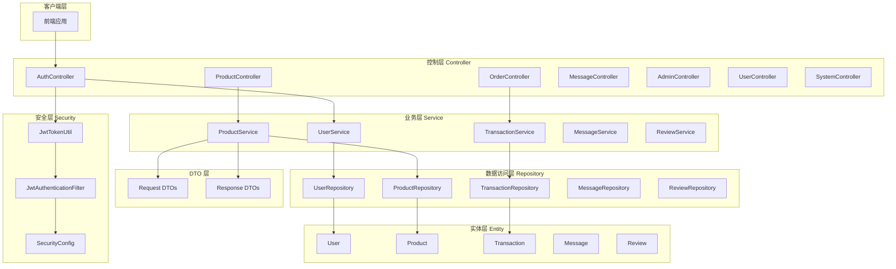
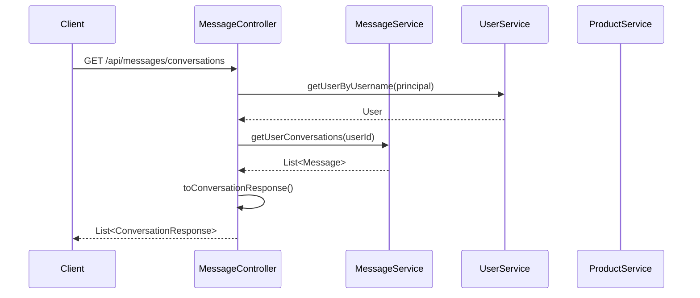
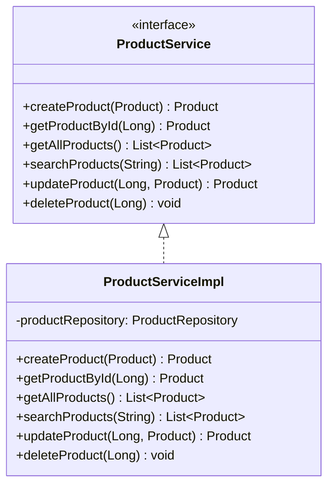

本文档深入解析校园二手交易平台后端的分层架构设计模式，从经典的四层架构出发，详细阐述控制层（Controller）、业务层（Service）、数据访问层（Repository）的职责边界与协作机制，并深入分析控制器设计中遵循的 RESTful 规范、请求处理模式与安全集成策略。

## 整体架构概览

后端采用 Spring Boot 2.7 技术栈，构建于经典的分层架构之上。该架构遵循"关注点分离"（Separation of Concerns）原则，将系统划分为控制层、业务层、数据访问层、实体层、安全层、配置层和 DTO 层七个核心层次。这种分层设计使得代码结构清晰、职责明确、便于维护和测试。



Sources: [server/README.md](server/README.md#L1-L30)

## 分层职责定义

### 层次职责对照表

| 层次 | 包路径 | 核心职责 | 关键特征 |
|------|--------|----------|----------|
| 控制层 | `controller/` | 接收 HTTP 请求、参数校验、调用业务层、返回响应 | `@RestController` 注解、RESTful 端点设计 |
| 业务层 | `service/` | 封装业务逻辑、事务管理、数据处理 | 接口与实现分离、`@Transactional` 事务控制 |
| 数据访问层 | `repository/` | 数据库操作、JPA 查询方法定义 | `JpaRepository` 扩展、自定义查询 |
| 实体层 | `entity/` | 数据模型定义、ORM 映射 | `@Entity`、`@Table` 注解配置 |
| DTO 层 | `dto/` | 数据传输对象、请求响应结构 | 不可变设计、字段选择控制 |
| 安全层 | `security/` | JWT 认证、权限校验、过滤器链 | Token 生成与验证、请求拦截 |
| 配置层 | `config/` | 全局配置、异常处理、数据初始化 | `@Configuration`、`@RestControllerAdvice` |

Sources: [server/src/main/java/com/secondhand/controller/](server/src/main/java/com/secondhand/controller/) [server/src/main/java/com/secondhand/service/](server/src/main/java/com/secondhand/service/)

## 控制层设计模式

### 控制器基础结构

控制层是系统的入口点，负责处理 HTTP 请求并将响应返回给客户端。每个控制器遵循一致的编写模式：类级别注解定义路由前缀，方法级别注解定义 HTTP 动词和具体路径，依赖注入服务层实例。

以 `ProductController` 为例，其基础结构展示了标准的控制器设计范式：

```java
@RestController
@RequestMapping("/api/products")
public class ProductController {

    @Autowired
    private ProductService productService;

    @Autowired
    private UserService userService;
    // ...
}
```

Sources: [ProductController.java](server/src/main/java/com/secondhand/controller/ProductController.java#L20-L28)

### RESTful 端点设计

控制器遵循 RESTful 设计规范，通过 HTTP 动词语义表达操作类型，使用路径变量和查询参数传递数据。以下是商品控制器的端点设计：

| HTTP 方法 | 端点路径 | 功能描述 | 认证要求 |
|-----------|----------|----------|----------|
| `GET` | `/api/products` | 查询商品列表（支持筛选排序） | 不需要 |
| `GET` | `/api/products/{id}` | 获取单个商品详情 | 不需要 |
| `GET` | `/api/products/search` | 关键词搜索商品 | 不需要 |
| `GET` | `/api/products/category/{category}` | 按分类查询 | 不需要 |
| `GET` | `/api/products/seller/{sellerId}` | 查询卖家商品 | 不需要 |
| `POST` | `/api/products` | 发布新商品 | 需要 |
| `PUT` | `/api/products/{id}` | 更新商品信息 | 需要 |
| `DELETE` | `/api/products/{id}` | 删除商品 | 需要 |
| `PATCH` | `/api/products/{id}/status` | 更新商品状态 | 需要 |

Sources: [ProductController.java](server/src/main/java/com/secondhand/controller/ProductController.java#L30-L115)

### 控制器方法模式

控制器的处理方法遵循统一的编写模式：获取当前用户信息、处理请求参数、调用业务层、进行数据转换、返回响应。这种模式确保了代码的一致性和可维护性。

```java
@PostMapping
public ResponseEntity<ProductResponse> createProduct(
        @Valid @RequestBody ProductCreateRequest request, 
        Principal principal) {
    User currentUser = userService.getUserByUsername(principal.getName());
    Product product = toProduct(request, new Product(), currentUser);
    return ResponseEntity.ok(toResponse(productService.createProduct(product)));
}
```

该方法展示了典型的创建资源流程：通过 `Principal` 获取认证用户，将请求 DTO 转换为实体对象，调用服务层执行创建，最后将结果转换为响应 DTO 返回。

Sources: [ProductController.java](server/src/main/java/com/secondhand/controller/ProductController.java#L30-L35)

### 查询参数处理

控制器的查询方法支持灵活的筛选和排序参数。在 `ProductController.getAllProducts()` 方法中，实现了多维度筛选逻辑：

```java
@GetMapping
public ResponseEntity<List<ProductResponse>> getAllProducts(
        @RequestParam(required = false) String keyword,
        @RequestParam(required = false) String campus,
        @RequestParam(required = false) String sort,
        @RequestParam(required = false) String status) {
    List<Product> products = (keyword == null || keyword.trim().isEmpty())
            ? productService.getAllProducts()
            : productService.searchProducts(keyword.trim());

    List<ProductResponse> list = products.stream()
            .filter(item -> matchesCampus(item, campus))
            .filter(item -> matchesStatus(item, status))
            .sorted(resolveComparator(sort))
            .map(this::toResponse)
            .collect(Collectors.toList());
    return ResponseEntity.ok(list);
}
```

该实现采用先查询后内存筛选的模式，支持可选参数组合，通过流式 API 实现数据转换和过滤。

Sources: [ProductController.java](server/src/main/java/com/secondhand/controller/ProductController.java#L42-L59)

## 控制器安全集成

### 认证用户获取

控制器通过 `java.security.Principal` 接口获取当前认证用户信息。Spring Security 在请求到达控制器之前已将认证信息注入到 `Principal` 对象中，控制器方法可以直接使用。

```java
@PostMapping
public ResponseEntity<?> createOrder(
        @Valid @RequestBody OrderCreateRequest request, 
        Principal principal) {
    User buyer = userService.getUserByUsername(principal.getName());
    Product product = productService.getProductById(request.getProductId());
    User seller = product.getSeller();

    if (seller != null && seller.getId().equals(buyer.getId())) {
        return ResponseEntity.badRequest()
            .body(Collections.singletonMap("message", "不能购买自己发布的商品"));
    }
    // ...后续逻辑
}
```

Sources: [OrderController.java](server/src/main/java/com/secondhand/controller/OrderController.java#L43-L51)

### 权限校验模式

在 `OrderController.nextStep()` 方法中展示了业务层权限校验的实现模式。控制器负责提取当前用户信息，实际的权限判断逻辑可以委托给服务层或使用 Spring Security 的方法级安全注解。

```java
@PostMapping("/{id}/next-step")
public ResponseEntity<?> nextStep(@PathVariable String id, Principal principal) {
    Long transactionId = parseOrderId(id);
    Transaction transaction = transactionService.getTransactionById(transactionId);
    User currentUser = userService.getUserByUsername(principal.getName());

    boolean canOperate = transaction.getBuyer().getId().equals(currentUser.getId())
            || transaction.getSeller().getId().equals(currentUser.getId());
    if (!canOperate) {
        return ResponseEntity.status(403)
            .body(Collections.singletonMap("message", "无权操作该订单"));
    }
    // ...
}
```

Sources: [OrderController.java](server/src/main/java/com/secondhand/controller/OrderController.java#L95-L109)

## 消息控制器设计

`MessageController` 展示了复杂的业务场景下控制器的设计方法。其实现了一个完整的多轮对话系统，包括会话列表、消息收发、未读计数等功能。



消息控制器实现了复杂的数据聚合逻辑，在获取会话列表时需要按对话方聚合消息并计算未读数量：

```java
@GetMapping("/conversations")
public ResponseEntity<List<ConversationResponse>> getConversations(Principal principal) {
    User currentUser = userService.getUserByUsername(principal.getName());
    Long currentUserId = currentUser.getId();

    List<Message> raw = messageService.getUserConversations(currentUserId);
    Map<Long, ConversationResponse> map = new LinkedHashMap<>();

    for (Message item : raw) {
        User peer = item.getSender().getId().equals(currentUserId) 
            ? item.getReceiver() : item.getSender();
        // 聚合逻辑...
    }
    return ResponseEntity.ok(new ArrayList<>(map.values()));
}
```

Sources: [MessageController.java](server/src/main/java/com/secondhand/controller/MessageController.java#L38-L64)

### ID 解析模式

控制器中大量使用路径变量和查询参数传递资源标识符。为兼容前端标识符格式（通常带有前缀如 "u-"、"o-"），控制器实现了统一的 ID 解析方法：

```java
private Long parsePeerId(String peerUserId) {
    if (peerUserId != null && peerUserId.startsWith("u-")) {
        return Long.parseLong(peerUserId.substring(2));
    }
    return Long.parseLong(peerUserId);
}

private Long parseOrderId(String id) {
    if (id != null && id.startsWith("o-")) {
        return Long.parseLong(id.substring(2));
    }
    return Long.parseLong(id);
}
```

Sources: [MessageController.java](server/src/main/java/com/secondhand/controller/MessageController.java#L205-L210) [OrderController.java](server/src/main/java/com/secondhand/controller/OrderController.java#L111-L116)

## 业务层设计

### 服务接口与实现分离

业务层采用接口与实现分离的设计模式。接口定义在 `service/` 目录，实现类位于 `service/impl/` 目录。这种设计提供了更好的可测试性和扩展性。



Sources: [ProductService.java](server/src/main/java/com/secondhand/service/ProductService.java) [ProductServiceImpl.java](server/src/main/java/com/secondhand/service/impl/ProductServiceImpl.java)

### 事务管理

服务层方法使用 `@Transactional` 注解声明事务边界。对于只读操作，Spring 会自动优化为只读事务；对于涉及数据修改的操作，确保原子性执行。

```java
@Service
public class ProductServiceImpl implements ProductService {

    @Override
    @Transactional
    public Product createProduct(Product product) {
        return productRepository.save(product);
    }

    @Override
    public Product getProductById(Long id) {
        return productRepository.findById(id)
                .orElseThrow(() -> new EntityNotFoundException("Product not found with id: " + id));
    }
}
```

Sources: [ProductServiceImpl.java](server/src/main/java/com/secondhand/service/impl/ProductServiceImpl.java#L19-L29)

### 业务状态机

`TransactionServiceImpl` 展示了业务状态机的实现模式。通过预定义状态转换映射，控制订单状态的有序流转：

```java
@Service
public class TransactionServiceImpl implements TransactionService {
    private static final Map<String, String> STATUS_FLOW = new HashMap<>();

    static {
        STATUS_FLOW.put("PENDING", "PAID");
        STATUS_FLOW.put("PAID", "SHIPPED");
        STATUS_FLOW.put("SHIPPED", "RECEIVED");
        STATUS_FLOW.put("RECEIVED", "COMPLETED");
    }

    @Override
    @Transactional
    public Transaction advanceTransactionStep(Long id) {
        Transaction transaction = getTransactionById(id);
        String current = transaction.getStatus();

        if ("CANCELLED".equals(current)) {
            throw new RuntimeException("已取消订单无法推进");
        }

        String next = STATUS_FLOW.get(current);
        if (next == null) {
            return transaction;
        }

        transaction.setStatus(next);
        if ("COMPLETED".equals(next)) {
            transaction.setCompletedAt(LocalDateTime.now());
        }
        return transactionRepository.save(transaction);
    }
}
```

Sources: [TransactionServiceImpl.java](server/src/main/java/com/secondhand/service/impl/TransactionServiceImpl.java#L18-L93)

## 数据访问层设计

### JPA Repository 扩展

数据访问层继承 `JpaRepository` 接口获得标准的 CRUD 操作能力，并添加自定义查询方法以满足业务需求：

```java
public interface ProductRepository extends JpaRepository<Product, Long> {
    List<Product> findByCategory(String category);
    
    List<Product> findBySellerId(Long sellerId);

    long countBySellerId(Long sellerId);

    @Query("SELECT p FROM Product p WHERE " +
           "LOWER(p.name) LIKE LOWER(CONCAT('%', :keyword, '%')) OR " +
           "LOWER(p.description) LIKE LOWER(CONCAT('%', :keyword, '%'))")
    List<Product> searchByKeyword(@Param("keyword") String keyword);
    
    List<Product> findByStatus(String status);
    
    @Query("SELECT p FROM Product p WHERE p.price BETWEEN :minPrice AND :maxPrice")
    List<Product> findByPriceRange(@Param("minPrice") double minPrice, 
                                    @Param("maxPrice") double maxPrice);
}
```

Sources: [ProductRepository.java](server/src/main/java/com/secondhand/repository/ProductRepository.java)

### 查询方法命名规范

Repository 接口支持通过方法命名自动生成查询。常见命名模式包括：

| 方法命名模式 | 示例 | 生成的查询 |
|-------------|------|-----------|
| `findBy` + 属性名 | `findByUsername(String)` | `WHERE username = ?` |
| `findBy` + 属性名 + `Containing` | `findByUsernameContaining(String)` | `WHERE username LIKE '%?%'` |
| `findBy` + 属性1 + `And` + 属性2 | `findByBuyerIdAndStatus(Long, String)` | `WHERE buyer_id = ? AND status = ?` |
| `countBy` + 属性名 | `countBySellerId(Long)` | `SELECT COUNT(*) WHERE seller_id = ?` |

Sources: [UserRepository.java](server/src/main/java/com/secondhand/repository/UserRepository.java) [TransactionRepository.java](server/src/main/java/com/secondhand/repository/)

## DTO 与实体转换

### DTO 设计原则

系统采用 DTO（Data Transfer Object）模式进行数据传输。实体与 DTO 的分离带来以下优势：防止敏感字段泄漏、控制返回字段、适配前端数据需求、降低耦合度。

`ProductResponse` 展示了典型的响应 DTO 设计：

```java
public class ProductResponse {
    private final Long id;
    private final String name;
    private final String description;
    private final BigDecimal price;
    private final BigDecimal originalPrice;
    private final String imageUrl;
    private final String category;
    private final String condition;
    private final String campus;
    private final String status;
    private final String createdAt;
    private final SellerSummary seller;

    // 嵌套的简化对象用于返回关联的卖家信息
    public static class SellerSummary {
        private final Long id;
        private final String username;
        private final String name;
        private final String school;
        // ...
    }
}
```

Sources: [ProductResponse.java](server/src/main/java/com/secondhand/dto/ProductResponse.java#L1-L113)

### 转换方法模式

控制器中实现私有转换方法，将实体对象转换为 DTO 响应对象。这种模式将转换逻辑集中在控制器内部，保持服务层的纯粹性：

```java
private ProductResponse toResponse(Product product) {
    User seller = product.getSeller();
    ProductResponse.SellerSummary sellerSummary = seller == null ? null :
            new ProductResponse.SellerSummary(
                    seller.getId(),
                    seller.getUsername(),
                    displayName(seller),
                    seller.getSchool()
            );
    return new ProductResponse(
            product.getId(),
            product.getName(),
            product.getDescription(),
            product.getPrice(),
            product.getOriginalPrice(),
            product.getImageUrl(),
            product.getCategory(),
            product.getCondition(),
            product.getCampus(),
            product.getStatus(),
            product.getCreatedAt() == null ? "" : product.getCreatedAt().toString(),
            sellerSummary
    );
}
```

Sources: [ProductController.java](server/src/main/java/com/secondhand/controller/ProductController.java#L155-L178)

## 安全配置与过滤器

### SecurityFilterChain 配置

`SecurityConfig` 采用 Spring Security 5.x 新式配置风格，通过 `SecurityFilterChain` Bean 定义安全策略：

```java
@Configuration
@EnableWebSecurity
@EnableGlobalMethodSecurity(prePostEnabled = true)
public class SecurityConfig {

    @Bean
    public SecurityFilterChain securityFilterChain(
            HttpSecurity http,
            JwtAuthenticationFilter jwtAuthenticationFilter,
            JwtAuthenticationEntryPoint jwtAuthenticationEntryPoint) throws Exception {
        http
            .cors().and()
            .csrf().disable()
            .authorizeRequests(auth -> auth
                .antMatchers("/", "/api/auth/**", "/api/system/db-health").permitAll()
                .antMatchers(HttpMethod.GET, "/api/system/summary").permitAll()
                .antMatchers(HttpMethod.GET, "/api/products/**").permitAll()
                .antMatchers(HttpMethod.GET, "/api/wanted").permitAll()
                .antMatchers("/api/admin/**").hasRole("ADMIN")
                .anyRequest().authenticated()
            )
            .exceptionHandling(exception -> exception
                .authenticationEntryPoint(jwtAuthenticationEntryPoint))
            .sessionManagement(session -> session
                .sessionCreationPolicy(SessionCreationPolicy.STATELESS))
            .addFilterBefore(jwtAuthenticationFilter, 
                UsernamePasswordAuthenticationFilter.class);

        return http.build();
    }
}
```

Sources: [SecurityConfig.java](server/src/main/java/com/secondhand/config/SecurityConfig.java#L24-L52)

### JWT 认证过滤器

`JwtAuthenticationFilter` 继承 `OncePerRequestFilter`，在每次请求时从 `Authorization` 头提取并验证 JWT Token：

```java
@Component
public class JwtAuthenticationFilter extends OncePerRequestFilter {

    @Override
    protected void doFilterInternal(HttpServletRequest request, 
                                     HttpServletResponse response, 
                                     FilterChain chain)
            throws ServletException, IOException {

        final String authorizationHeader = request.getHeader("Authorization");

        String username = null;
        String jwt = null;

        if (authorizationHeader != null && authorizationHeader.startsWith("Bearer ")) {
            jwt = authorizationHeader.substring(7);
            try {
                username = jwtTokenUtil.extractUsername(jwt);
            } catch (ExpiredJwtException ex) {
                log.info("JWT 已过期，已忽略本次认证，请求路径: {}", request.getRequestURI());
            } catch (JwtException | IllegalArgumentException ex) {
                log.warn("JWT 无效，已忽略本次认证，请求路径: {}", request.getRequestURI());
            }
        }

        if (username != null && SecurityContextHolder.getContext().getAuthentication() == null) {
            UserDetails userDetails = this.userDetailsService.loadUserByUsername(username);

            if (jwtTokenUtil.validateToken(jwt, userDetails)) {
                UsernamePasswordAuthenticationToken authToken = 
                    new UsernamePasswordAuthenticationToken(
                        userDetails, null, userDetails.getAuthorities());
                authToken.setDetails(
                    new WebAuthenticationDetailsSource().buildDetails(request));
                SecurityContextHolder.getContext().setAuthentication(authToken);
            }
        }
        chain.doFilter(request, response);
    }
}
```

Sources: [JwtAuthenticationFilter.java](server/src/main/java/com/secondhand/security/JwtAuthenticationFilter.java#L22-L65)

## 统一异常处理

### 全局异常处理器

`GlobalExceptionHandler` 使用 `@RestControllerAdvice` 注解实现全局异常处理，将各类异常映射为统一的错误响应格式：

```java
@RestControllerAdvice
public class GlobalExceptionHandler {

    @ExceptionHandler(EntityNotFoundException.class)
    public ResponseEntity<ApiErrorResponse> handleNotFound(EntityNotFoundException ex) {
        return ResponseEntity.status(HttpStatus.NOT_FOUND)
                .body(new ApiErrorResponse(ex.getMessage()));
    }

    @ExceptionHandler(MethodArgumentNotValidException.class)
    public ResponseEntity<ApiErrorResponse> handleValidation(MethodArgumentNotValidException ex) {
        FieldError fieldError = ex.getBindingResult().getFieldError();
        String message = fieldError == null ? "请求参数不合法" : fieldError.getDefaultMessage();
        return ResponseEntity.badRequest().body(new ApiErrorResponse(message));
    }

    @ExceptionHandler(AccessDeniedException.class)
    public ResponseEntity<ApiErrorResponse> handleForbidden(AccessDeniedException ex) {
        return ResponseEntity.status(HttpStatus.FORBIDDEN)
                .body(new ApiErrorResponse("无权执行该操作"));
    }

    @ExceptionHandler(IllegalArgumentException.class)
    public ResponseEntity<ApiErrorResponse> handleIllegalArgument(IllegalArgumentException ex) {
        return ResponseEntity.badRequest().body(new ApiErrorResponse(ex.getMessage()));
    }

    @ExceptionHandler(RuntimeException.class)
    public ResponseEntity<ApiErrorResponse> handleRuntime(RuntimeException ex) {
        return ResponseEntity.badRequest().body(new ApiErrorResponse(ex.getMessage()));
    }

    @ExceptionHandler(Exception.class)
    public ResponseEntity<ApiErrorResponse> handleUnexpected(Exception ex) {
        return ResponseEntity.status(HttpStatus.INTERNAL_SERVER_ERROR)
                .body(new ApiErrorResponse("服务器开小差了，请稍后重试"));
    }
}
```

Sources: [GlobalExceptionHandler.java](server/src/main/java/com/secondhand/config/GlobalExceptionHandler.java#L14-L51)

### 统一错误响应格式

所有错误响应使用 `ApiErrorResponse` 包装，保持响应格式一致性：

```java
public class ApiErrorResponse {
    private final String message;

    public ApiErrorResponse(String message) {
        this.message = message;
    }

    public String getMessage() {
        return message;
    }
}
```

Sources: [ApiErrorResponse.java](server/src/main/java/com/secondhand/dto/ApiErrorResponse.java#L1-L13)

## 管理端控制器设计

`AdminController` 展示了管理端控制器的设计模式。相比普通业务控制器，管理端控制器通常需要聚合多个数据源以生成管理视图：

```java
@RestController
@RequestMapping("/api/admin")
public class AdminController {

    @Autowired
    private UserRepository userRepository;

    @Autowired
    private ProductRepository productRepository;

    @Autowired
    private WantedPostRepository wantedPostRepository;

    @Autowired
    private TransactionRepository transactionRepository;

    @GetMapping("/dashboard/stats")
    public ResponseEntity<AdminDashboardResponse> dashboardStats() {
        long verifiedUserCount = userRepository.findAll().stream()
            .filter(User::isVerified).count();
        long availableProductCount = productRepository.findByStatus("AVAILABLE").size();

        return ResponseEntity.ok(new AdminDashboardResponse(
                userRepository.count(),
                productRepository.count(),
                wantedPostRepository.count(),
                transactionRepository.count(),
                transactionRepository.countByStatus("COMPLETED"),
                verifiedUserCount,
                availableProductCount
        ));
    }
}
```

Sources: [AdminController.java](server/src/main/java/com/secondhand/controller/AdminController.java#L25-L61)

### 管理端统计 DTO

```java
public class AdminDashboardResponse {
    private final long totalUsers;
    private final long totalProducts;
    private final long totalWantedPosts;
    private final long totalTransactions;
    private final long completedTransactions;
    private final long verifiedUsers;
    private final long availableProducts;
    // 构造方法与 getter...
}
```

Sources: [AdminDashboardResponse.java](server/src/main/java/com/secondhand/dto/AdminDashboardResponse.java)

## 控制器设计最佳实践

### 前后置条件校验

控制器应负责请求参数的基本校验，业务规则校验委托给服务层。对于无效请求，应尽早返回错误响应：

```java
// 前置条件校验示例
if (seller != null && seller.getId().equals(buyer.getId())) {
    return ResponseEntity.badRequest()
        .body(Collections.singletonMap("message", "不能购买自己发布的商品"));
}
```

### 响应类型一致性

控制器方法应保持返回类型一致。对于可能返回错误的情况，使用 `ResponseEntity<?>` 作为返回类型；对于正常情况，使用具体的 `ResponseEntity<T>` 类型。

### 辅助方法封装

将重复使用的逻辑抽取为私有方法，如 ID 解析、名称显示格式化等：

```java
private String displayName(User user) {
    if (user.getName() != null && !user.getName().trim().isEmpty()) {
        return user.getName();
    }
    return user.getUsername();
}
```

Sources: [ProductController.java](server/src/main/java/com/secondhand/controller/ProductController.java#L180-L185)

---

## 下一步阅读

- 深入了解安全配置细节：[安全配置与JWT认证](8-an-quan-pei-zhi-yu-jwtren-zheng)
- 学习异常处理机制：[统一异常处理机制](9-tong-yi-chang-chu-li-ji-zhi)
- 理解数据模型设计：[核心实体与关系](10-he-xin-shi-ti-yu-guan-xi)
- 掌握用户交易流程：[用户交易闭环](14-yong-hu-jiao-yi-bi-huan)