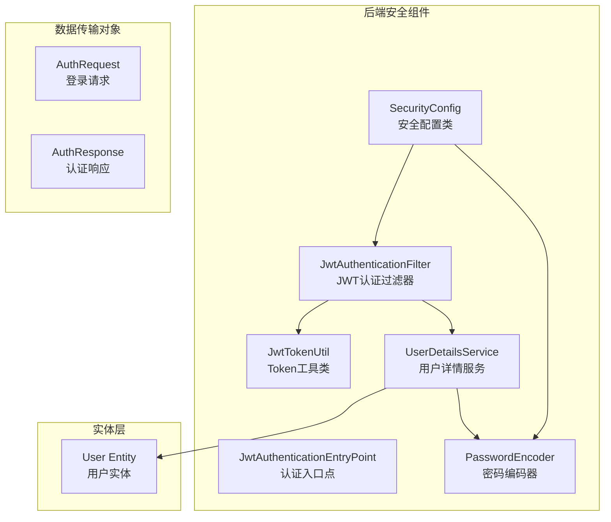
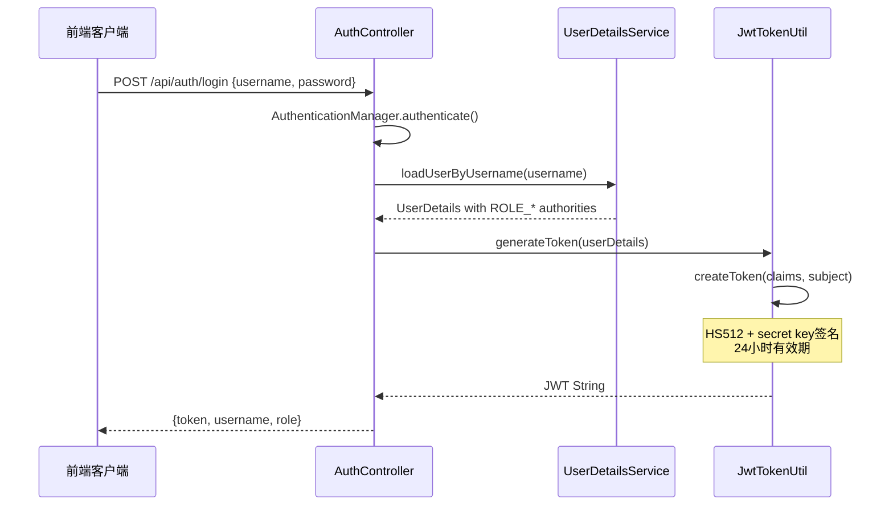
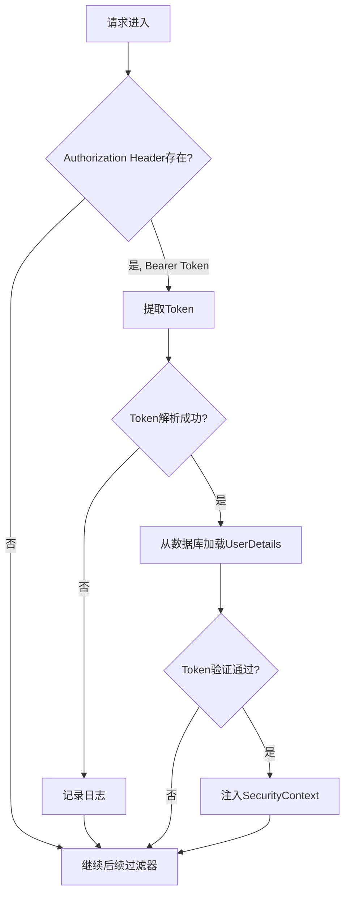
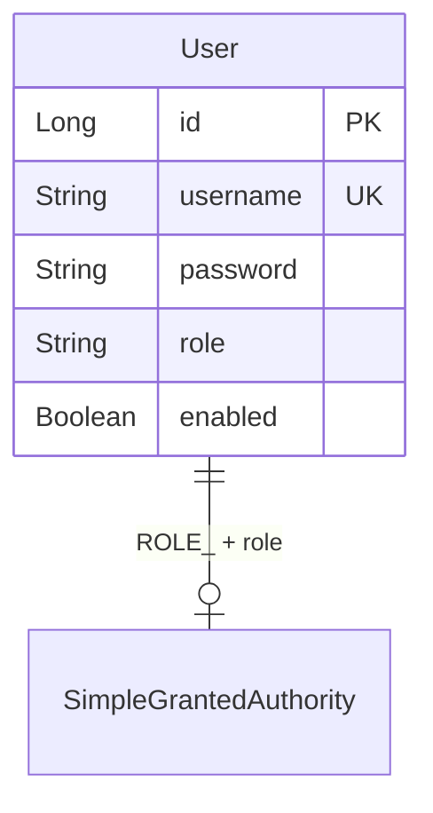
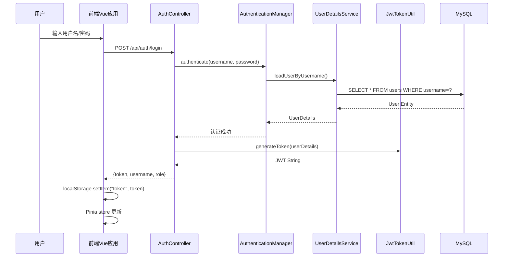

本页面系统阐述二手交易平台后端 Spring Security 安全架构设计与 JWT 无状态认证机制的核心实现。内容涵盖安全配置策略、过滤器链编排、Token 生成与验证流程，以及前后端协同的安全实践。

---

## 1. 安全架构概述

该平台采用 **Spring Security 6.x** 配合 **JWT (JSON Web Token)** 实现无状态认证，采用 HS512 签名算法确保令牌安全。整个认证体系遵循"请求拦截 → Token 解析 → 身份验证 → 上下文注入"的标准流水线设计。

### 1.1 核心组件架构



Sources: [SecurityConfig.java](server/src/main/java/com/secondhand/config/SecurityConfig.java#L1-L82), [JwtTokenUtil.java](server/src/main/java/com/secondhand/security/JwtTokenUtil.java#L1-L73), [JwtAuthenticationFilter.java](server/src/main/java/com/secondhand/security/JwtAuthenticationFilter.java#L1-L66)

### 1.2 组件职责矩阵

| 组件类 | 职责描述 | 依赖关系 |
|--------|----------|----------|
| `SecurityConfig` | 定义安全过滤链、URL 权限规则、CORS 配置 | 配置所有安全组件 |
| `JwtAuthenticationFilter` | 拦截请求、解析 Token、注入 SecurityContext | 依赖 JwtTokenUtil、UserDetailsService |
| `JwtAuthenticationEntryPoint` | 处理未认证请求的 401 响应 | 被 SecurityConfig 引用 |
| `JwtTokenUtil` | Token 生成、验证、Claims 提取 | 无业务依赖 |
| `UserServiceImpl` | 实现 UserDetailsService，封装用户查询逻辑 | 依赖 UserRepository、PasswordEncoder |

Sources: [UserServiceImpl.java](server/src/main/java/com/secondhand/service/impl/UserServiceImpl.java#L14-L28)

---

## 2. 安全配置详解

### 2.1 SecurityFilterChain 配置

`SecurityConfig` 采用 Spring Security 6.x 推荐的新型配置方式，通过 `SecurityFilterChain` Bean 定义安全策略，完全弃用了已弃用的 `WebSecurityConfigurerAdapter`。

```java
@Bean
public SecurityFilterChain securityFilterChain(
        HttpSecurity http,
        JwtAuthenticationFilter jwtAuthenticationFilter,
        JwtAuthenticationEntryPoint jwtAuthenticationEntryPoint) throws Exception {
    http
        .cors().and()
        .csrf().disable()
        .authorizeRequests(auth -> auth
            .antMatchers("/", "/api/auth/**", "/api/system/db-health").permitAll()
            .antMatchers(HttpMethod.GET, "/api/system/summary").permitAll()
            .antMatchers(HttpMethod.GET, "/api/products/**").permitAll()
            .antMatchers(HttpMethod.GET, "/api/wanted").permitAll()
            .antMatchers("/api/admin/**").hasRole("ADMIN")
            .anyRequest().authenticated()
        )
        .exceptionHandling(exception -> exception.authenticationEntryPoint(jwtAuthenticationEntryPoint))
        .sessionManagement(session -> session.sessionCreationPolicy(SessionCreationPolicy.STATELESS))
        .addFilterBefore(jwtAuthenticationFilter, UsernamePasswordAuthenticationFilter.class);

    return http.build();
}
```

Sources: [SecurityConfig.java](server/src/main/java/com/secondhand/config/SecurityConfig.java#L26-L50)

### 2.2 权限规则设计

系统采用 **白名单 + 角色约束** 的双重策略：

| 路径模式 | 访问要求 | 典型场景 |
|----------|----------|----------|
| `/`, `/api/auth/**` | 公开 | 登录、注册页面 |
| `/api/system/db-health` | 公开 | 健康检查 |
| `GET /api/system/summary` | 公开 | 统计数据概览 |
| `GET /api/products/**` | 公开 | 商品浏览 |
| `GET /api/wanted` | 公开 | 求购信息浏览 |
| `/api/admin/**` | 仅 ADMIN 角色 | 管理后台所有操作 |
| 其他所有路径 | 已认证用户 | 个人信息、发布商品、订单操作 |

Sources: [SecurityConfig.java](server/src/main/java/com/secondhand/config/SecurityConfig.java#L33-L40)

### 2.3 无状态会话管理

```java
.sessionManagement(session -> session.sessionCreationPolicy(SessionCreationPolicy.STATELESS))
```

**无状态会话** 是 JWT 认证的核心特征：
- 服务器不存储任何会话数据
- 每个请求必须携带有效 Token
- 有效降低服务器内存开销，适合分布式部署
- 配合 JWT 的过期时间实现会话控制

### 2.4 CORS 跨域配置

```java
@Bean
public CorsConfigurationSource corsConfigurationSource() {
    CorsConfiguration configuration = new CorsConfiguration();
    configuration.setAllowedOrigins(Arrays.asList("*"));
    configuration.setAllowedMethods(Arrays.asList("*"));
    configuration.setAllowedHeaders(Arrays.asList("*"));
    UrlBasedCorsConfigurationSource source = new UrlBasedCorsConfigurationSource();
    source.registerCorsConfiguration("/**", configuration);
    return source;
}
```

**注意**：生产环境中应限制 `allowedOrigins` 为具体的前端域名，而非使用通配符 `*`。

Sources: [SecurityConfig.java](server/src/main/java/com/secondhand/config/SecurityConfig.java#L52-L63)

---

## 3. JWT Token 机制

### 3.1 Token 结构与生成



Token 生成使用 **HS512** 签名算法，包含以下 Claims：

```java
public String generateToken(UserDetails userDetails) {
    Map<String, Object> claims = new HashMap<>();
    return createToken(claims, userDetails.getUsername());
}

private String createToken(Map<String, Object> claims, String subject) {
    return Jwts.builder()
            .setClaims(claims)
            .setSubject(subject)           // 用户名
            .setIssuedAt(new Date(...))    // 签发时间
            .setExpiration(new Date(...))  // 24小时后过期
            .signWith(SignatureAlgorithm.HS512, secret)
            .compact();
}
```

Sources: [JwtTokenUtil.java](server/src/main/java/com/secondhand/security/JwtTokenUtil.java#L23-L37)

### 3.2 Token 配置参数

```yaml
jwt:
  secret: 9a4f2c8d3b7a1e6f45c8a0b3f267d8b1d4e6f3c8a9d2b5f8e3a9c6b1d4f7e2a5
  expiration: 86400  # 24 hours in seconds
```

| 参数 | 值 | 说明 |
|------|-----|------|
| `jwt.secret` | 64位十六进制字符串 | HS512 签名密钥，应通过环境变量配置 |
| `jwt.expiration` | 86400 秒 | Token 有效期，建议生产环境设为 2 小时以内 |

Sources: [application.yml](server/src/main/resources/application.yml#L19-L23)

### 3.3 Token 验证流程

```java
public Boolean validateToken(String token, UserDetails userDetails) {
    try {
        final String username = extractUsername(token);
        return (username.equals(userDetails.getUsername()) 
                && !isTokenExpired(token));
    } catch (ExpiredJwtException ex) {
        return false;
    } catch (JwtException | IllegalArgumentException ex) {
        return false;
    }
}
```

验证逻辑包含两个关键检查：
1. **用户名一致性**：Token 中的 subject 必须与数据库查询的用户名匹配
2. **过期检查**：验证当前时间是否在 Token 过期时间之前

---

## 4. 认证过滤器链

### 4.1 JwtAuthenticationFilter 实现

该过滤器继承 `OncePerRequestFilter`，确保每个请求只被执行一次，是 Spring Security 过滤器链中的关键一环。

```java
@Component
public class JwtAuthenticationFilter extends OncePerRequestFilter {

    @Override
    protected void doFilterInternal(HttpServletRequest request, 
                                    HttpServletResponse response, 
                                    FilterChain chain)
            throws ServletException, IOException {

        final String authorizationHeader = request.getHeader("Authorization");
        String username = null;
        String jwt = null;

        // 提取 Token
        if (authorizationHeader != null && authorizationHeader.startsWith("Bearer ")) {
            jwt = authorizationHeader.substring(7);
            try {
                username = jwtTokenUtil.extractUsername(jwt);
            } catch (ExpiredJwtException ex) {
                log.info("JWT 已过期，已忽略本次认证");
            } catch (JwtException | IllegalArgumentException ex) {
                log.warn("JWT 无效，已忽略本次认证");
            }
        }

        // 验证并注入认证上下文
        if (username != null && SecurityContextHolder.getContext().getAuthentication() == null) {
            UserDetails userDetails = this.userDetailsService.loadUserByUsername(username);
            
            if (jwtTokenUtil.validateToken(jwt, userDetails)) {
                UsernamePasswordAuthenticationToken authToken = 
                    new UsernamePasswordAuthenticationToken(
                        userDetails, null, userDetails.getAuthorities());
                authToken.setDetails(new WebAuthenticationDetailsSource().buildDetails(request));
                SecurityContextHolder.getContext().setAuthentication(authToken);
            }
        }
        chain.doFilter(request, response);
    }
}
```

Sources: [JwtAuthenticationFilter.java](server/src/main/java/com/secondhand/security/JwtAuthenticationFilter.java#L16-L66)

### 4.2 过滤器执行流程图



### 4.3 异常处理策略

| 异常类型 | 处理行为 | 日志级别 |
|----------|----------|----------|
| `ExpiredJwtException` | Token 已过期，静默忽略，请求视为匿名 | INFO |
| `JwtException` | Token 格式错误或签名验证失败，静默忽略 | WARN |
| `IllegalArgumentException` | Token 为空或格式异常，静默忽略 | WARN |
| `UsernameNotFoundException` | 用户不存在，静默忽略 | 由 UserDetailsService 处理 |

**设计意图**：静默忽略策略避免因单一请求 Token 失效导致整个请求失败，保证用户体验。但日志会记录异常便于运维监控。

---

## 5. 用户详情服务

### 5.1 UserDetailsService 实现

`UserServiceImpl` 同时实现 `UserService` 和 `UserDetailsService` 接口，承担业务逻辑与安全认证双重职责。

```java
@Service
public class UserServiceImpl implements UserService, UserDetailsService {

    @Override
    public UserDetails loadUserByUsername(String username) throws UsernameNotFoundException {
        User user = userRepository.findByUsername(username)
                .orElseThrow(() -> new UsernameNotFoundException("User not found with username: " + username));

        return new org.springframework.security.core.userdetails.User(
                user.getUsername(),
                user.getPassword(),
                user.isEnabled(),
                true,  // accountNonExpired
                true,  // credentialsNonExpired
                true,  // accountNonLocked
                Collections.singletonList(new SimpleGrantedAuthority("ROLE_" + resolveRole(user)))
        );
    }
    
    private String resolveRole(User user) {
        if (user.getRole() == null || user.getRole().trim().isEmpty()) {
            return "USER";
        }
        return user.getRole().trim().toUpperCase();
    }
}
```

Sources: [UserServiceImpl.java](server/src/main/java/com/secondhand/service/impl/UserServiceImpl.java#L14-L41)

### 5.2 角色映射机制



角色前缀 `ROLE_` 是 Spring Security 的约定，SecurityConfig 中的 `.hasRole("ADMIN")` 会自动拼接前缀进行匹配。

---

## 6. 认证入口点

当未认证用户访问受保护资源时，`JwtAuthenticationEntryPoint` 统一返回 401 响应：

```java
@Component
public class JwtAuthenticationEntryPoint implements AuthenticationEntryPoint {

    @Override
    public void commence(HttpServletRequest request, 
                         HttpServletResponse response, 
                         AuthenticationException authException)
            throws IOException {
        response.setStatus(HttpServletResponse.SC_UNAUTHORIZED);
        response.setContentType("application/json;charset=UTF-8");
        response.getWriter().write("{\"message\":\"未登录或登录已过期\"}");
    }
}
```

Sources: [JwtAuthenticationEntryPoint.java](server/src/main/java/com/secondhand/security/JwtAuthenticationEntryPoint.java#L1-L22)

---

## 7. 前端 Token 管理

### 7.1 Token 存储与同步

前端采用 `localStorage` 存储 Token，并通过自定义事件 `auth-changed` 实现跨组件状态同步。

```javascript
// src/api/auth.js
export function getToken() {
  return window.localStorage.getItem("token") || "";
}

export function setToken(token) {
  if (!token) return;
  window.localStorage.setItem("token", token);
  window.dispatchEvent(new Event("auth-changed"));
}

export function clearToken() {
  window.localStorage.removeItem("token");
  window.dispatchEvent(new Event("auth-changed"));
}
```

Sources: [src/api/auth.js](src/api/auth.js#L1-L19)

### 7.2 Axios 请求拦截器

```javascript
// src/api/client.js
const apiClient = axios.create({
  baseURL: apiBaseURL,
  timeout: 8000
});

apiClient.interceptors.request.use((config) => {
  const token = getToken();
  if (token) {
    config.headers.Authorization = `Bearer ${token}`;
  }
  return config;
});

apiClient.interceptors.response.use(
  (response) => response,
  (error) => {
    const status = error?.response?.status;
    if (status === 401) {
      clearToken();  // Token 失效时自动清除
    }
    return Promise.reject(error);
  }
);
```

Sources: [src/api/client.js](src/api/client.js#L1-L31)

### 7.3 Pinia 状态管理集成

```javascript
// src/stores/user.js
export const useUserStore = defineStore("user", {
  state: () => ({
    token: getToken(),
    profile: null,
    profileLoaded: false
  }),
  getters: {
    isAuthenticated: (state) => Boolean(state.token),
    isAdmin: (state) => state.profile?.role === "ADMIN"
  },
  actions: {
    syncAuthState() {
      this.token = getToken();
      if (!this.token) {
        this.profile = null;
        this.profileLoaded = false;
      }
      return this.token;
    },
    async loadProfile(force = false) {
      if (!this.isAuthenticated) {
        this.profile = null;
        return null;
      }
      // ... 加载用户信息
    }
  }
});
```

Sources: [src/stores/user.js](src/stores/user.js#L1-L40)

---

## 8. 登录与注册流程

### 8.1 登录接口实现

```java
@PostMapping("/login")
public ResponseEntity<?> login(@Valid @RequestBody AuthRequest authRequest) {
    try {
        // 执行 Spring Security 认证
        authenticationManager.authenticate(
            new UsernamePasswordAuthenticationToken(
                authRequest.getUsername(), 
                authRequest.getPassword()
            )
        );

        // 认证成功后生成 Token
        final UserDetails userDetails = userDetailsService.loadUserByUsername(authRequest.getUsername());
        final String token = jwtTokenUtil.generateToken(userDetails);
        final User currentUser = userService.getUserByUsername(userDetails.getUsername());

        return ResponseEntity.ok(new AuthResponse(token, userDetails.getUsername(), currentUser.getRole()));
    } catch (BadCredentialsException ex) {
        return ResponseEntity.status(401).body(Collections.singletonMap("message", "用户名或密码错误"));
    } catch (DisabledException ex) {
        return ResponseEntity.status(403).body(Collections.singletonMap("message", "账号已被禁用"));
    }
}
```

Sources: [AuthController.java](server/src/main/java/com/secondhand/controller/AuthController.java#L24-L46)

### 8.2 注册接口实现

```java
@PostMapping("/register")
public ResponseEntity<?> register(@RequestBody User user) {
    try {
        User registeredUser = userService.registerUser(user);
        final UserDetails userDetails = userDetailsService.loadUserByUsername(registeredUser.getUsername());
        final String token = jwtTokenUtil.generateToken(userDetails);
        return ResponseEntity.ok(new AuthResponse(token, userDetails.getUsername(), registeredUser.getRole()));
    } catch (RuntimeException ex) {
        return ResponseEntity.badRequest().body(Collections.singletonMap("message", ex.getMessage()));
    }
}
```

Sources: [AuthController.java](server/src/main/java/com/secondhand/controller/AuthController.java#L48-L58)

### 8.3 完整认证流程时序



---

## 9. 密码加密策略

系统使用 **BCrypt** 密码编码器，这是 OWASP 推荐的密码存储方案：

```java
@Bean
public PasswordEncoder passwordEncoder() {
    return new BCryptPasswordEncoder();
}
```

注册时自动加密密码：

```java
public User registerUser(User user) {
    // ... 校验逻辑
    user.setPassword(passwordEncoder.encode(user.getPassword()));
    return userRepository.save(user);
}
```

Sources: [UserServiceImpl.java](server/src/main/java/com/secondhand/service/impl/UserServiceImpl.java#L43-L57)

---

## 10. 安全最佳实践

### 10.1 当前实现的安全措施

| 安全措施 | 实现方式 | 说明 |
|----------|----------|------|
| 密码存储 | BCrypt 加密 | 单向哈希，不可逆 |
| Token 签名 | HS512 算法 | 防篡改、防伪造 |
| Token 有效期 | 24 小时 | 自动过期机制 |
| 会话管理 | 无状态 | 不存储服务端会话 |
| CORS 配置 | 通配符 * | 开发环境，生产应限制 |

### 10.2 生产环境增强建议

1. **缩短 Token 有效期**：建议 1-2 小时，配合 Refresh Token 机制
2. **限制 CORS origins**：将 `*` 替换为具体的前端域名
3. **敏感操作二次验证**：如修改密码、提现等
4. **IP 绑定 Token**：将 Token 与用户 IP 关联，防止 Token 被盗用
5. **敏感路径限流**：防止暴力破解

### 10.3 JWT 密钥管理

当前密钥硬编码于 `application.yml`，生产环境应：
- 使用环境变量 `${JWT_SECRET}`
- 通过 Vault 或 KMS 管理密钥
- 定期轮换密钥

---

## 11. 异常处理集成

GlobalExceptionHandler 统一处理认证相关异常：

```java
@ExceptionHandler(AccessDeniedException.class)
public ResponseEntity<ApiErrorResponse> handleForbidden(AccessDeniedException ex) {
    return ResponseEntity.status(HttpStatus.FORBIDDEN)
            .body(new ApiErrorResponse("无权执行该操作"));
}
```

Sources: [GlobalExceptionHandler.java](server/src/main/java/com/secondhand/config/GlobalExceptionHandler.java#L26-L30)

---

## 12. 相关文档

| 文档 | 内容说明 |
|------|----------|
| [角色模型与权限规则](12-jiao-se-mo-xing-yu-quan-xian-gui-ze) | 深入理解角色体系与权限控制 |
| [JWT认证流程实现](13-jwtren-zheng-liu-cheng-shi-xian) | 完整的认证流程详解 |
| [统一异常处理机制](9-tong-yi-chang-chu-li-ji-zhi) | 全局异常处理设计 |
| [路由与权限守卫](5-lu-you-yu-quan-xian-shou-wei) | 前端路由守卫实现 |