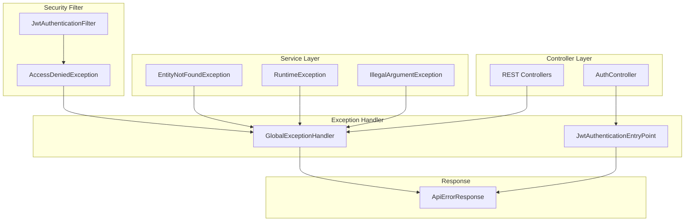
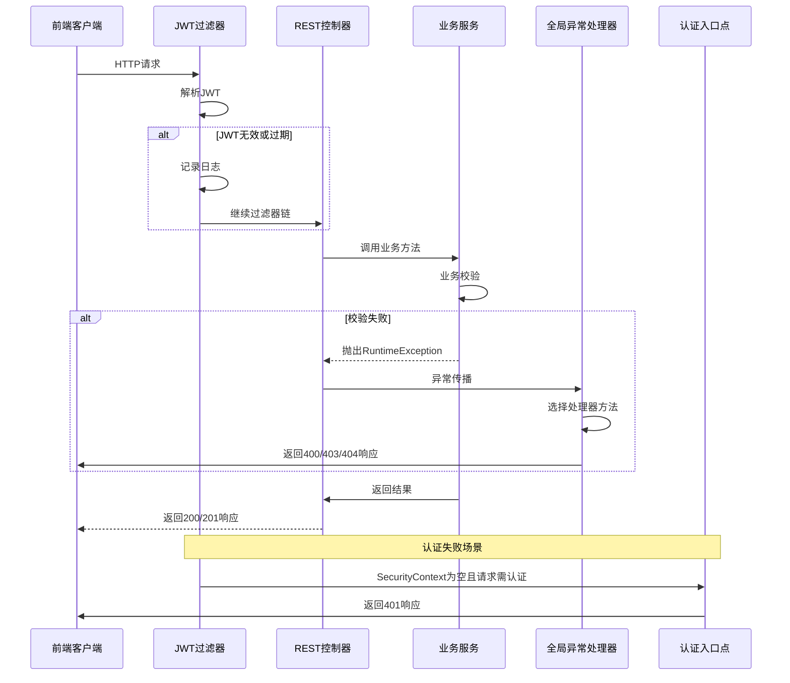

本文档深入解析二手商品交易系统的后端异常处理架构，涵盖异常分类策略、处理器设计、响应规范以及与安全层的集成机制。该机制确保系统在任何异常场景下都能返回结构化的错误信息，提升前端处理能力并便于问题排查。

## 架构设计总览

系统的异常处理采用**三层分离架构**：业务层通过标准异常表达错误状态，控制层借助全局处理器统一转换，认证层独立处理安全异常。这种设计遵循单一职责原则，使异常逻辑与业务逻辑解耦。



三层架构中，业务服务层抛出语义化异常，全局处理器负责将异常转换为统一格式，认证入口点专门处理安全相关异常。

Sources: [GlobalExceptionHandler.java](server/src/main/java/com/secondhand/config/GlobalExceptionHandler.java#L1-L52)
Sources: [JwtAuthenticationEntryPoint.java](server/src/main/java/com/secondhand/security/JwtAuthenticationEntryPoint.java#L1-L22)

## 全局异常处理器

`GlobalExceptionHandler` 是整个异常处理机制的核心组件，通过 `@RestControllerAdvice` 注解实现对所有 REST 控制器异常的自动拦截。该类使用 Spring MVC 的异常处理框架，将各类异常映射为标准 HTTP 响应。

### 异常映射策略

系统定义了六类异常处理方法，每种方法对应特定的异常类型和 HTTP 状态码：

| 异常类型 | HTTP状态码 | 响应消息策略 | 典型使用场景 |
|---------|-----------|-------------|-------------|
| `EntityNotFoundException` | 404 NOT_FOUND | 异常原始消息 | 资源不存在 |
| `MethodArgumentNotValidException` | 400 BAD_REQUEST | 字段验证错误消息 | 请求参数校验失败 |
| `AccessDeniedException` | 403 FORBIDDEN | 固定消息"无权执行该操作" | 权限不足 |
| `IllegalArgumentException` | 400 BAD_REQUEST | 异常原始消息 | 参数非法 |
| `RuntimeException` | 400 BAD_REQUEST | 异常原始消息 | 业务逻辑校验失败 |
| `Exception` | 500 INTERNAL_SERVER_ERROR | 固定消息"服务器开小差了" | 未预期异常 |

处理器采用**降序覆盖**策略：先处理具体异常，最后用通用 `Exception` 处理器兜底。这种设计确保每种异常都能获得最精确的处理，同时避免异常穿透导致系统不可用。

Sources: [GlobalExceptionHandler.java](server/src/main/java/com/secondhand/config/GlobalExceptionHandler.java#L14-L51)

### 验证异常特殊处理

对于 `MethodArgumentNotValidException`，处理器实现了智能提取逻辑。当验证错误存在时，优先提取具体字段的错误描述；若字段错误为空，则返回通用的"请求参数不合法"提示。这种设计既保留了详细的验证反馈，又避免了空指针风险。

```java
@ExceptionHandler(MethodArgumentNotValidException.class)
public ResponseEntity<ApiErrorResponse> handleValidation(MethodArgumentNotValidException ex) {
    FieldError fieldError = ex.getBindingResult().getFieldError();
    String message = fieldError == null ? "请求参数不合法" : fieldError.getDefaultMessage();
    return ResponseEntity.badRequest().body(new ApiErrorResponse(message));
}
```

Sources: [GlobalExceptionHandler.java](server/src/main/java/com/secondhand/config/GlobalExceptionHandler.java#L23-L28)

## 统一响应规范

`ApiErrorResponse` 是系统定义的统一错误响应格式，仅包含一个 `message` 字段。这种极简设计符合 RESTful API 的错误响应最佳实践，便于前端统一处理。

### 响应结构

```json
{
  "message": "具体错误描述信息"
}
```

该 DTO 采用不可变设计，通过构造函数初始化 `message` 字段，并仅提供 getter 方法访问。这种设计确保响应对象在创建后不可被修改，防止响应内容被意外篡改。

Sources: [ApiErrorResponse.java](server/src/main/java/com/secondhand/dto/ApiErrorResponse.java#L1-L14)

### 响应码与消息对照表

| HTTP方法 | 成功状态码 | 错误响应码 | 典型场景 |
|---------|-----------|-----------|---------|
| GET | 200 | 404 | 资源不存在 |
| POST | 201 | 400 | 参数校验失败、业务冲突 |
| PUT/PATCH | 200 | 400/404 | 更新失败 |
| DELETE | 200 | 403/404 | 权限不足、已删除 |

## 业务层异常抛出模式

业务服务层是异常的主要来源，系统采用标准 JPA 异常 `EntityNotFoundException` 表达资源未找到状态，使用 `RuntimeException` 及其子类表达业务校验失败。

### 资源查找模式

所有服务实现遵循统一的资源查找模式：当 repository 返回空 Optional 时，抛出 `EntityNotFoundException` 并附带实体类型和查询条件。

```java
@Override
public User getUserById(Long id) {
    return userRepository.findById(id)
            .orElseThrow(() -> new EntityNotFoundException("User not found with id: " + id));
}

@Override
public Product getProductById(Long id) {
    return productRepository.findById(id)
            .orElseThrow(() -> new EntityNotFoundException("Product not found with id: " + id));
}
```

Sources: [UserServiceImpl.java](server/src/main/java/com/secondhand/service/impl/UserServiceImpl.java#L60-L64)
Sources: [ProductServiceImpl.java](server/src/main/java/com/secondhand/service/impl/ProductServiceImpl.java#L25-L29)
Sources: [TransactionServiceImpl.java](server/src/main/java/com/secondhand/service/impl/TransactionServiceImpl.java#L36-L40)

### 业务校验模式

业务规则校验通过 `RuntimeException` 或 `IllegalArgumentException` 实现。当检测到业务冲突时，抛出异常并附带清晰的错误描述供前端展示。

```java
@Override
@Transactional
public Transaction advanceTransactionStep(Long id) {
    Transaction transaction = getTransactionById(id);
    String current = transaction.getStatus();

    if ("CANCELLED".equals(current)) {
        throw new RuntimeException("已取消订单无法推进");
    }
    // ...
}

@Override
public Review createReview(Review review) {
    if (hasUserReviewedProduct(review.getProduct().getId(), review.getReviewer().getId())) {
        throw new RuntimeException("User has already reviewed this product");
    }
    return reviewRepository.save(review);
}
```

Sources: [TransactionServiceImpl.java](server/src/main/java/com/secondhand/service/impl/TransactionServiceImpl.java#L73-L93)
Sources: [ReviewServiceImpl.java](server/src/main/java/com/secondhand/service/impl/ReviewServiceImpl.java#L19-L26)

### 唯一性校验模式

用户注册和更新时，系统对用户名、邮箱进行唯一性校验，冲突时抛出 `RuntimeException`：

```java
@Override
@Transactional
public User registerUser(User user) {
    if (existsByUsername(user.getUsername())) {
        throw new RuntimeException("Username is already taken");
    }
    if (existsByEmail(user.getEmail())) {
        throw new RuntimeException("Email is already in use");
    }
    user.setPassword(passwordEncoder.encode(user.getPassword()));
    user.setRole(resolveRole(user));
    user.setEnabled(true);
    return userRepository.save(user);
}
```

Sources: [UserServiceImpl.java](server/src/main/java/com/secondhand/service/impl/UserServiceImpl.java#L44-L58)

## 认证异常独立处理

认证相关异常通过 Spring Security 的 `AuthenticationEntryPoint` 接口单独处理，这与全局异常处理器形成互补。当用户未登录或登录过期时，返回 401 状态码。

### JWT认证入口点

`JwtAuthenticationEntryPoint` 实现 `AuthenticationEntryPoint` 接口，专门处理未认证访问：

```java
@Component
public class JwtAuthenticationEntryPoint implements AuthenticationEntryPoint {

    @Override
    public void commence(HttpServletRequest request, HttpServletResponse response, 
                         AuthenticationException authException) throws IOException {
        response.setStatus(HttpServletResponse.SC_UNAUTHORIZED);
        response.setContentType("application/json;charset=UTF-8");
        response.getWriter().write("{\"message\":\"未登录或登录已过期\"}");
    }
}
```

该入口点直接写入 HTTP 响应，跳过 Spring MVC 的异常处理机制，确保未认证请求能获得最快的响应。

Sources: [JwtAuthenticationEntryPoint.java](server/src/main/java/com/secondhand/security/JwtAuthenticationEntryPoint.java#L1-L22)

### JWT过滤器异常处理

`JwtAuthenticationFilter` 在解析 JWT 时捕获两类异常：过期异常和无效异常。这两种情况都被记录但不会中断请求处理链，允许未认证用户访问公开资源。

```java
try {
    username = jwtTokenUtil.extractUsername(jwt);
} catch (ExpiredJwtException ex) {
    log.info("JWT 已过期，已忽略本次认证，请求路径: {}", request.getRequestURI());
} catch (JwtException | IllegalArgumentException ex) {
    log.warn("JWT 无效，已忽略本次认证，请求路径: {}", request.getRequestURI());
}
```

Sources: [JwtAuthenticationFilter.java](server/src/main/java/com/secondhand/security/JwtAuthenticationFilter.java#L42-L51)

## 安全配置集成

`SecurityConfig` 通过 `exceptionHandling()` 方法将 `JwtAuthenticationEntryPoint` 注册到 Spring Security 过滤器链中，确保所有认证失败请求都能被正确处理。

```java
@Bean
public SecurityFilterChain securityFilterChain(
        HttpSecurity http,
        JwtAuthenticationFilter jwtAuthenticationFilter,
        JwtAuthenticationEntryPoint jwtAuthenticationEntryPoint) throws Exception {
    http
        .cors().and()
        .csrf().disable()
        .authorizeRequests(auth -> auth
            .antMatchers("/", "/api/auth/**", "/api/system/db-health").permitAll()
            // ... 其他路径配置
        )
        .exceptionHandling(exception -> exception.authenticationEntryPoint(jwtAuthenticationEntryPoint))
        .sessionManagement(session -> session.sessionCreationPolicy(SessionCreationPolicy.STATELESS))
        .addFilterBefore(jwtAuthenticationFilter, UsernamePasswordAuthenticationFilter.class);

    return http.build();
}
```

Sources: [SecurityConfig.java](server/src/main/java/com/secondhand/config/SecurityConfig.java#L31-L52)

## 控制层异常处理

部分控制器对特定异常进行本地处理，以返回更精确的响应信息或执行额外逻辑。

### 认证控制器异常处理

`AuthController` 对认证异常进行专门处理，区分凭证错误和账号禁用两种情况：

```java
@PostMapping("/login")
public ResponseEntity<?> login(@Valid @RequestBody AuthRequest authRequest) {
    try {
        authenticationManager.authenticate(
                new UsernamePasswordAuthenticationToken(authRequest.getUsername(), authRequest.getPassword())
        );
        // ... 生成令牌
        return ResponseEntity.ok(new AuthResponse(token, userDetails.getUsername(), currentUser.getRole()));
    } catch (BadCredentialsException ex) {
        return ResponseEntity.status(401).body(Collections.singletonMap("message", "用户名或密码错误"));
    } catch (DisabledException ex) {
        return ResponseEntity.status(403).body(Collections.singletonMap("message", "账号已被禁用，请联系管理员"));
    }
}
```

Sources: [AuthController.java](server/src/main/java/com/secondhand/controller/AuthController.java#L40-L57)

### 订单控制器业务校验

`OrderController` 在创建订单时进行买家-卖家身份校验，防止用户购买自己发布的商品：

```java
@PostMapping
public ResponseEntity<?> createOrder(@Valid @RequestBody OrderCreateRequest request, Principal principal) {
    User buyer = userService.getUserByUsername(principal.getName());
    Product product = productService.getProductById(request.getProductId());
    User seller = product.getSeller();

    if (seller != null && seller.getId().equals(buyer.getId())) {
        return ResponseEntity.badRequest().body(Collections.singletonMap("message", "不能购买自己发布的商品"));
    }
    // ...
}
```

Sources: [OrderController.java](server/src/main/java/com/secondhand/controller/OrderController.java#L43-L62)

## 异常处理流程图

以下流程图展示从请求到最终响应的完整异常处理路径：



## 依赖组件

系统异常处理机制依赖以下 Spring Boot Starter：

```xml
<dependency>
    <groupId>org.springframework.boot</groupId>
    <artifactId>spring-boot-starter-web</artifactId>
</dependency>
<dependency>
    <groupId>org.springframework.boot</groupId>
    <artifactId>spring-boot-starter-security</artifactId>
</dependency>
<dependency>
    <groupId>org.springframework.boot</groupId>
    <artifactId>spring-boot-starter-validation</artifactId>
</dependency>
```

- **spring-boot-starter-web**: 提供 `@RestControllerAdvice` 和 `ResponseEntity` 支持
- **spring-boot-starter-security**: 提供 `AccessDeniedException` 和认证异常类
- **spring-boot-starter-validation**: 提供 `MethodArgumentNotValidException` 和验证注解

Sources: [pom.xml](server/pom.xml#L26-L42)

## 设计优势

该异常处理机制具备以下设计优势：**统一性**——所有 API 错误响应遵循相同的结构规范，便于前端统一处理；**可扩展性**——通过添加新的 `@ExceptionHandler` 方法可轻松扩展异常类型支持；**分层清晰**——业务异常、安全异常、验证异常分别处理，职责明确；**用户体验**——友好的中文错误提示帮助用户理解问题原因。

## 进阶阅读建议

建议继续阅读相关页面以深入理解系统架构：[安全配置与JWT认证](8-an-quan-pei-zhi-yu-jwtren-zheng) 详细介绍了安全配置与认证流程；[分层结构与控制器设计](7-fen-ceng-jie-gou-yu-kong-zhi-qi-she-ji) 解析了控制层与业务服务层的职责划分；[角色模型与权限规则](12-jiao-se-mo-xing-yu-quan-xian-gui-ze) 说明了权限校验机制如何与异常处理协同工作。