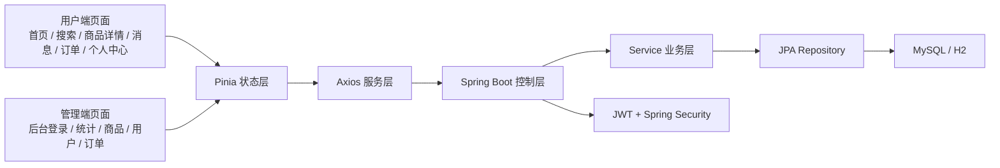

# 系统总览

> **Referenced files**
> - [src/router/index.js](../src/router/index.js)
> - [src/views/HomePage.vue](../src/views/HomePage.vue)
> - [src/views/LoginPage.vue](../src/views/LoginPage.vue)
> - [server/src/main/java/com/secondhand/controller/SystemController.java](../server/src/main/java/com/secondhand/controller/SystemController.java)
> - [server/src/main/java/com/secondhand/controller/AdminController.java](../server/src/main/java/com/secondhand/controller/AdminController.java)

本系统定位为“面向校园二手交易场景的 Web 平台”，兼顾用户真实使用链路与系统完整性。项目当前不仅支持普通用户完成浏览、沟通、下单、评价闭环，也补齐了管理员视角下的系统统计与业务管理能力。

## Table of contents
1. [建设目标](#建设目标)
2. [功能模块](#功能模块)
3. [角色划分](#角色划分)
4. [系统结构图](#系统结构图)
5. [项目亮点](#项目亮点)

## 建设目标

**Section sources**
- [src/views/HomePage.vue](../src/views/HomePage.vue)
- [src/views/LoginPage.vue](../src/views/LoginPage.vue)

- 从基础可用系统提升为结构更完整、说明更清晰、功能闭环更稳定的项目成品。
- 保持技术栈稳定，在有限周期内通过中等重构提升系统完整度。
- 强调校园场景真实性，包括校区信息、实名认证、求购帖、消息沟通和交易流程。

## 功能模块

**Section sources**
- [src/router/index.js](../src/router/index.js)
- [server/src/main/java/com/secondhand/controller/AdminController.java](../server/src/main/java/com/secondhand/controller/AdminController.java)

| 模块 | 主要页面/接口 | 作用 |
| --- | --- | --- |
| 首页与登录 | `/`、`/login`、`/api/system/summary` | 展示平台总览、引导登录、承接项目第一印象 |
| 商品与搜索 | `/search`、`/product/:id`、`/api/products/**` | 完成商品浏览、详情查看、筛选与发布 |
| 消息与求购 | `/messages`、`/wanted`、`/api/messages/**`、`/api/wanted` | 支撑用户沟通与需求匹配 |
| 订单与评价 | `/order/:id`、`/api/orders/**`、`/api/reviews/**` | 完成交易闭环和信用沉淀 |
| 个人中心 | `/profile`、`/verify`、`/api/users/me` | 展示聚合信息和认证状态 |
| 管理端 | `/admin/**`、`/api/admin/**` | 展示后台统计及基础运营管理能力 |

## 角色划分

**Section sources**
- [server/src/main/java/com/secondhand/entity/User.java](../server/src/main/java/com/secondhand/entity/User.java)
- [server/src/main/java/com/secondhand/config/SecurityConfig.java](../server/src/main/java/com/secondhand/config/SecurityConfig.java)

- 普通用户 `USER`
  - 浏览商品、搜索筛选、求购发布、消息沟通、创建订单、发起评价、实名认证。
- 管理员 `ADMIN`
  - 除具备普通用户基础能力外，还可访问 `/api/admin/**` 以及后台路由页面，查看统计并管理用户、商品、订单。

## 系统结构图

**Diagram sources**
- [src/router/index.js](../src/router/index.js)
- [server/src/main/java/com/secondhand/controller/AdminController.java](../server/src/main/java/com/secondhand/controller/AdminController.java)

## 项目亮点

**Section sources**
- [src/views/LoginPage.vue](../src/views/LoginPage.vue)
- [src/views/HomePage.vue](../src/views/HomePage.vue)
- [server/src/main/java/com/secondhand/controller/UserController.java](../server/src/main/java/com/secondhand/controller/UserController.java)
- [server/src/main/java/com/secondhand/controller/AdminController.java](../server/src/main/java/com/secondhand/controller/AdminController.java)

- 登录页承担品牌展示、账号登录与状态反馈三类职责，不再只是简单表单。
- 首页新增平台数据摘要、交易流程与推荐区块，强化首页的信息总览能力。
- 用户资料接口返回聚合统计数据，个人中心升级为工作台而非静态信息页。
- 管理端具备最小可用后台能力，可展示多角色系统与运营管理场景。

## 影响总结
- 本页适合直接改写为论文中的“系统概述”与“可行性分析”前置部分。
- 如果需要快速介绍项目，可优先抽取“功能模块 + 角色划分 + 项目亮点”三部分。
