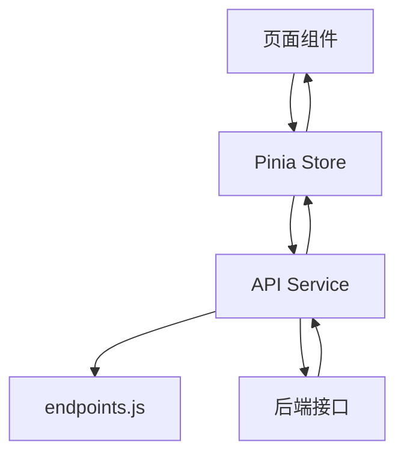

# 前端架构

> **Referenced files**
> - [src/router/index.js](../src/router/index.js)
> - [src/stores/user.js](../src/stores/user.js)
> - [src/stores/admin.js](../src/stores/admin.js)
> - [src/views/LoginPage.vue](../src/views/LoginPage.vue)
> - [src/views/HomePage.vue](../src/views/HomePage.vue)
> - [src/views/SearchPage.vue](../src/views/SearchPage.vue)
> - [src/components/AppHeader.vue](../src/components/AppHeader.vue)
> - [src/api/endpoints.js](../src/api/endpoints.js)

前端基于 `Vue 3 + Pinia + Vite` 搭建，采用“页面组件 + API 服务 + Store 状态管理”的分层方式。本轮优化重点放在首页、登录页、搜索页、个人中心与管理端页面，使其同时具备更完整的使用体验和更清晰的信息结构。

## Table of contents
1. [目录与分层](#目录与分层)
2. [路由设计](#路由设计)
3. [状态管理](#状态管理)
4. [界面设计重点](#界面设计重点)
5. [前端数据流图](#前端数据流图)
6. [示例代码](#示例代码)

## 目录与分层

**Section sources**
- [src/router/index.js](../src/router/index.js)
- [src/api/endpoints.js](../src/api/endpoints.js)

| 层次 | 目录 | 说明 |
| --- | --- | --- |
| 页面层 | `src/views` | 用户端与管理端页面，负责场景编排与交互表现 |
| 组件层 | `src/components`、`src/layouts` | 复用型卡片、头部、布局容器 |
| 状态层 | `src/stores` | 用户态、市场数据、后台数据等响应式状态 |
| 服务层 | `src/api/services` | 封装具体接口调用 |
| 接口描述层 | `src/api/endpoints.js` | 统一管理 API 路由定义 |
| 工具层 | `src/utils` | 登录跳转、重定向等通用逻辑 |

## 路由设计

**Section sources**
- [src/router/index.js](../src/router/index.js)

- 用户端主路由挂载在 `MainLayout` 下，包含首页、搜索、商品详情、消息、订单、个人中心等页面。
- 管理端采用独立路由前缀 `/admin`，并使用 `AdminLayout` 承载后台页面。
- 管理员登录页单独拆出为 `/admin/login`，与普通用户登录页职责分离。
- 路由中保留 `NotFoundPage` 以支撑完整的单页应用访问路径。

## 状态管理

**Section sources**
- [src/stores/user.js](../src/stores/user.js)
- [src/stores/admin.js](../src/stores/admin.js)

### 用户状态
- `token`
  - 从本地存储同步，作为登录态基础。
- `profile`
  - 通过 `/api/users/me` 获取当前用户聚合资料。
- `profileLoaded`
  - 避免页面重复拉取资料。
- `isAuthenticated`
  - 由 token 推导的响应式登录态。
- `isAdmin`
  - 由 `profile.role === "ADMIN"` 推导的管理员身份。

### 后台状态
- `stats`
  - 后台统计概览。
- `products`
  - 商品管理列表。
- `users`
  - 用户管理列表。
- `orders`
  - 订单管理列表。

## 界面设计重点

**Section sources**
- [src/views/LoginPage.vue](../src/views/LoginPage.vue)
- [src/views/HomePage.vue](../src/views/HomePage.vue)
- [src/views/SearchPage.vue](../src/views/SearchPage.vue)

- 登录页采用双区块布局，左侧负责品牌和能力展示，右侧负责登录表单和反馈。
- 首页承担“平台总览页”角色，包含数据摘要、平台优势、流程说明和精选推荐。
- 搜索页补齐筛选标签回显、加载态、空状态和排序区，提升信息反馈与可用性。
- 整体视觉延续浅色背景、柔和渐变、卡片分层、统一圆角和清晰标题层级。

## 前端数据流图

**Diagram sources**
- [src/stores/user.js](../src/stores/user.js)
- [src/stores/admin.js](../src/stores/admin.js)
- [src/api/endpoints.js](../src/api/endpoints.js)



## 示例代码

**Section sources**
- [src/stores/user.js](../src/stores/user.js)
- [src/utils/auth.js](../src/utils/auth.js)

下面的逻辑体现了前端登录成功后立即同步用户资料的实现方式：

```js
async login(payload) {
  const result = await loginByPassword(payload);
  this.syncAuthState();
  await this.loadProfile(true);
  return result;
}
```

这个设计解决了“只有 token 变化，但页面头部和个人中心没有立即刷新”的问题。

## 影响总结
- 本页内容可直接转化为论文中的“前端架构设计”和“前端关键实现”章节。
- 若后续继续优化，可在此页追加组件复用策略和响应式状态图。
