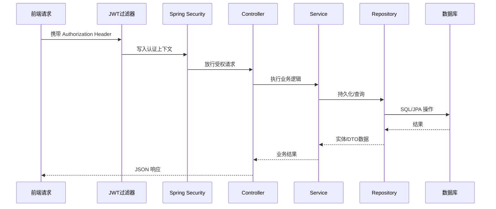

# 后端架构

> **Referenced files**
> - [server/src/main/java/com/secondhand/config/SecurityConfig.java](../server/src/main/java/com/secondhand/config/SecurityConfig.java)
> - [server/src/main/java/com/secondhand/config/GlobalExceptionHandler.java](../server/src/main/java/com/secondhand/config/GlobalExceptionHandler.java)
> - [server/src/main/java/com/secondhand/controller/AuthController.java](../server/src/main/java/com/secondhand/controller/AuthController.java)
> - [server/src/main/java/com/secondhand/controller/AdminController.java](../server/src/main/java/com/secondhand/controller/AdminController.java)
> - [server/src/main/java/com/secondhand/controller/UserController.java](../server/src/main/java/com/secondhand/controller/UserController.java)
> - [server/src/main/java/com/secondhand/service/impl/UserServiceImpl.java](../server/src/main/java/com/secondhand/service/impl/UserServiceImpl.java)

后端采用典型的 Spring Boot 分层架构，通过控制层、业务层、持久层与安全层协同完成交易平台业务。本轮优化的重点，是把原本分散的接口输出和权限判断收口成更适合维护的结构。

## Table of contents
1. [分层结构](#分层结构)
2. [控制器职责](#控制器职责)
3. [安全与异常处理](#安全与异常处理)
4. [后端请求链路图](#后端请求链路图)
5. [代码示例](#代码示例)

## 分层结构

**Section sources**
- [server/README.md](../server/README.md)
- [server/src/main/java/com/secondhand/service/impl/UserServiceImpl.java](../server/src/main/java/com/secondhand/service/impl/UserServiceImpl.java)

| 层次 | 说明 |
| --- | --- |
| Controller | 暴露 REST 接口，负责参数接收、响应组装和部分权限校验 |
| Service | 封装用户、商品、订单、消息、评价等业务逻辑 |
| Repository | 基于 JPA 访问 MySQL/H2 数据 |
| Security | 处理 JWT、角色授权、认证入口和过滤器 |
| Config | 配置跨域、安全策略、异常处理、初始化数据 |

## 控制器职责

**Section sources**
- [server/src/main/java/com/secondhand/controller/AuthController.java](../server/src/main/java/com/secondhand/controller/AuthController.java)
- [server/src/main/java/com/secondhand/controller/AdminController.java](../server/src/main/java/com/secondhand/controller/AdminController.java)
- [server/src/main/java/com/secondhand/controller/UserController.java](../server/src/main/java/com/secondhand/controller/UserController.java)

- `AuthController`
  - 登录、注册，返回 JWT 与角色信息。
- `UserController`
  - 获取当前用户聚合资料，提交实名认证。
- `ProductController`
  - 发布、查询、筛选、修改商品。
- `OrderController`
  - 创建订单、查看订单、推进订单状态。
- `MessageController`
  - 会话列表、消息发送、已读与未读统计。
- `ReviewController`
  - 评价创建、修改、删除及统计。
- `SystemController`
  - 数据库健康检查和首页摘要。
- `AdminController`
  - 后台统计、商品管理、用户管理、订单管理。

## 安全与异常处理

**Section sources**
- [server/src/main/java/com/secondhand/config/SecurityConfig.java](../server/src/main/java/com/secondhand/config/SecurityConfig.java)
- [server/src/main/java/com/secondhand/config/GlobalExceptionHandler.java](../server/src/main/java/com/secondhand/config/GlobalExceptionHandler.java)
- [server/src/main/java/com/secondhand/service/impl/UserServiceImpl.java](../server/src/main/java/com/secondhand/service/impl/UserServiceImpl.java)

- 使用 `SecurityFilterChain` 配置无状态认证流程，关闭 Session。
- `JwtAuthenticationFilter` 在请求进入控制器前解析 token 并恢复认证信息。
- `/api/admin/**` 通过 `hasRole("ADMIN")` 统一保护。
- `GlobalExceptionHandler` 统一处理校验异常、权限异常、实体不存在和通用运行时异常。
- 登录失败、账号禁用、未登录访问均返回统一 `message` 字段，便于前端直接展示。

## 后端请求链路图

**Diagram sources**
- [server/src/main/java/com/secondhand/config/SecurityConfig.java](../server/src/main/java/com/secondhand/config/SecurityConfig.java)
- [server/src/main/java/com/secondhand/service/impl/UserServiceImpl.java](../server/src/main/java/com/secondhand/service/impl/UserServiceImpl.java)



## 代码示例

**Section sources**
- [server/src/main/java/com/secondhand/service/impl/UserServiceImpl.java](../server/src/main/java/com/secondhand/service/impl/UserServiceImpl.java)

下面的逻辑说明了系统如何把数据库中的角色转换为 Spring Security 的授权信息：

```java
return new org.springframework.security.core.userdetails.User(
        user.getUsername(),
        user.getPassword(),
        user.isEnabled(),
        true,
        true,
        true,
        Collections.singletonList(new SimpleGrantedAuthority("ROLE_" + resolveRole(user)))
);
```

## 影响总结
- 本页适合作为论文中的“后端总体设计”和“权限控制设计”基础材料。
- 如果后续继续做扩展功能，可在本页追加 DTO 映射策略与异常分类表。
