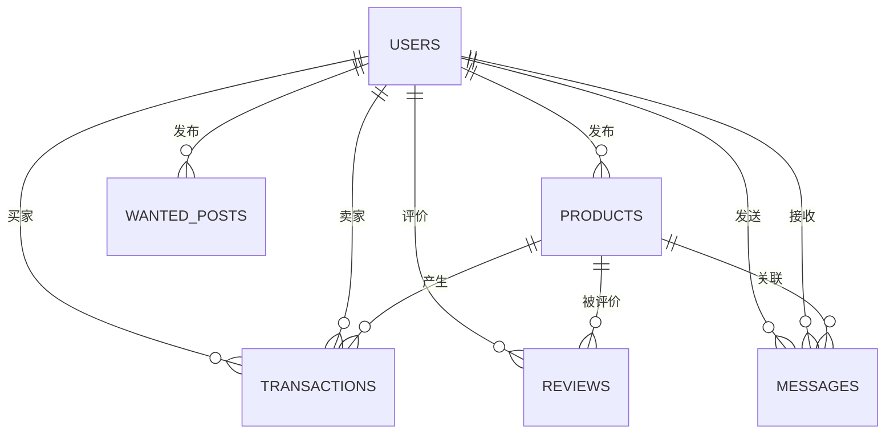

# 数据库设计

> **Referenced files**
> - [server/sql/init.sql](../server/sql/init.sql)
> - [server/src/main/java/com/secondhand/entity/User.java](../server/src/main/java/com/secondhand/entity/User.java)
> - [server/src/main/java/com/secondhand/entity/Product.java](../server/src/main/java/com/secondhand/entity/Product.java)
> - [server/src/main/java/com/secondhand/entity/Transaction.java](../server/src/main/java/com/secondhand/entity/Transaction.java)
> - [server/src/main/java/com/secondhand/config/DemoDataInitializer.java](../server/src/main/java/com/secondhand/config/DemoDataInitializer.java)

数据库层采用 `MySQL 8`，测试环境使用 `H2` 模拟 MySQL 方言。本轮优化后，用户表补充了角色与启用状态，商品表补齐了原价和校区字段，能够更好支撑前端展示和后台统计。

## Table of contents
1. [核心实体](#核心实体)
2. [ER 关系图](#er-关系图)
3. [关键字段说明](#关键字段说明)
4. [初始化数据策略](#初始化数据策略)
5. [SQL 示例](#sql-示例)

## 核心实体

**Section sources**
- [server/sql/init.sql](../server/sql/init.sql)
- [server/src/main/java/com/secondhand/entity/User.java](../server/src/main/java/com/secondhand/entity/User.java)

| 表名 | 作用 | 关键字段 |
| --- | --- | --- |
| `users` | 用户信息与身份状态 | `username`、`role`、`enabled`、`verified` |
| `products` | 商品主数据 | `price`、`original_price`、`campus`、`status` |
| `transactions` | 订单与交易流转 | `buyer_id`、`seller_id`、`status`、`amount` |
| `messages` | 会话消息 | `sender_id`、`receiver_id`、`product_id`、`is_read` |
| `wanted_posts` | 求购信息 | `expected_price`、`campus`、`deadline` |
| `reviews` | 评价信息 | `product_id`、`reviewer_id`、`rating` |

## ER 关系图

**Diagram sources**
- [server/sql/init.sql](../server/sql/init.sql)
- [server/src/main/java/com/secondhand/entity/Transaction.java](../server/src/main/java/com/secondhand/entity/Transaction.java)



## 关键字段说明

**Section sources**
- [server/src/main/java/com/secondhand/entity/User.java](../server/src/main/java/com/secondhand/entity/User.java)
- [server/src/main/java/com/secondhand/entity/Product.java](../server/src/main/java/com/secondhand/entity/Product.java)

### 用户表
- `role`
  - 用于区分普通用户和管理员。
- `enabled`
  - 用于控制账号是否可登录。
- `verified`
  - 表示是否完成实名认证。

### 商品表
- `original_price`
  - 支撑前端展示折扣和性价比。
- `campus`
  - 体现校园交易的地理场景。
- `status`
  - 用于在售、售出、保留等状态区分。

### 订单表
- `status`
  - 体现交易推进状态。
- `completed_at`
  - 用于统计成交数据。
- `cancelled_at`
  - 用于识别异常取消订单。

## 初始化数据策略

**Section sources**
- [server/sql/init.sql](../server/sql/init.sql)
- [server/src/main/java/com/secondhand/config/DemoDataInitializer.java](../server/src/main/java/com/secondhand/config/DemoDataInitializer.java)

- `init.sql`
  - 适合手动初始化 MySQL 环境。
- `DemoDataInitializer`
  - 适合 Spring Boot 启动时自动注入默认用户、商品、订单、消息和评价。
- 两套初始化数据共同服务于本地开发和功能验证，保证登录、搜索、消息、订单、后台统计都有完整内容。

## SQL 示例

**Section sources**
- [server/sql/init.sql](../server/sql/init.sql)

### 查询系统概览数据

```sql
SELECT COUNT(*) AS user_count FROM users;
SELECT COUNT(*) AS product_count FROM products;
SELECT COUNT(*) AS wanted_count FROM wanted_posts;
SELECT COUNT(*) AS order_count FROM transactions;
SELECT COUNT(*) AS completed_order_count
FROM transactions
WHERE status = 'COMPLETED';
```

### 查询后台管理常用订单信息

```sql
SELECT t.id,
       t.status,
       p.name AS product_name,
       buyer.username AS buyer_username,
       seller.username AS seller_username,
       t.amount
FROM transactions t
JOIN products p ON p.id = t.product_id
JOIN users buyer ON buyer.id = t.buyer_id
JOIN users seller ON seller.id = t.seller_id
ORDER BY t.created_at DESC;
```

## 影响总结
- 本页可以直接转为论文中的“数据库设计”章节。
- 若后续需要补充 E-R 图截图或数据字典，可在此页继续展开字段约束与索引说明。
