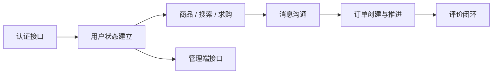

# 接口设计

> **Referenced files**
> - [API.md](../API.md)
> - [src/api/endpoints.js](../src/api/endpoints.js)
> - [server/src/main/java/com/secondhand/controller/AuthController.java](../server/src/main/java/com/secondhand/controller/AuthController.java)
> - [server/src/main/java/com/secondhand/controller/ProductController.java](../server/src/main/java/com/secondhand/controller/ProductController.java)
> - [server/src/main/java/com/secondhand/controller/MessageController.java](../server/src/main/java/com/secondhand/controller/MessageController.java)
> - [server/src/main/java/com/secondhand/controller/ReviewController.java](../server/src/main/java/com/secondhand/controller/ReviewController.java)
> - [server/src/main/java/com/secondhand/controller/AdminController.java](../server/src/main/java/com/secondhand/controller/AdminController.java)

本项目接口按“认证、公共系统、用户、商品、订单、求购、消息、评价、管理端”九大类组织。本轮优化后，消息、评价、商品与管理端接口均已采用 DTO 输出，前后端的接口契约更加稳定。

## Table of contents
1. [Introduction](#introduction)
2. [Core endpoints](#core-endpoints)
3. [Endpoint reference](#endpoint-reference)

## Introduction

**Section sources**
- [API.md](../API.md)
- [src/api/endpoints.js](../src/api/endpoints.js)

- 基础前缀统一为 `/api`
- 需要登录的接口使用 `Authorization: Bearer <token>`
- 失败结构统一为 `{ "message": "..." }`
- 管理端接口统一前缀为 `/api/admin/**`

## Core endpoints

**Diagram sources**
- [src/api/endpoints.js](../src/api/endpoints.js)
- [server/src/main/java/com/secondhand/controller/AdminController.java](../server/src/main/java/com/secondhand/controller/AdminController.java)



| 接口族 | 前缀 | 作用 |
| --- | --- | --- |
| 认证 | `/api/auth` | 登录、注册 |
| 系统 | `/api/system` | 健康检查、首页摘要 |
| 用户 | `/api/users` | 当前用户资料与实名认证 |
| 商品 | `/api/products` | 商品 CRUD 与筛选 |
| 订单 | `/api/orders` | 创建订单与推进状态 |
| 求购 | `/api/wanted` | 求购列表与创建 |
| 消息 | `/api/messages` | 会话、详情、已读、未读 |
| 评价 | `/api/reviews` | 评价创建、查询、修改、删除 |
| 管理端 | `/api/admin` | 统计、商品、用户、订单管理 |

## Endpoint reference

### 认证接口

**Section sources**
- [server/src/main/java/com/secondhand/controller/AuthController.java](../server/src/main/java/com/secondhand/controller/AuthController.java)

| 项 | 说明 |
| --- | --- |
| 方法 | `POST` |
| 路径 | `/api/auth/login` |
| 请求体 | `username`、`password` |
| 成功响应 | `token`、`username`、`role` |
| 失败状态 | `401` 用户名或密码错误；`403` 账号禁用 |
| 错误体 | `{ "message": "..." }` |

### 用户资料接口

**Section sources**
- [server/src/main/java/com/secondhand/controller/UserController.java](../server/src/main/java/com/secondhand/controller/UserController.java)

| 项 | 说明 |
| --- | --- |
| 方法 | `GET` |
| 路径 | `/api/users/me` |
| 请求头 | `Authorization` |
| 响应字段 | `id`、`username`、`name`、`school`、`verified`、`role`、`enabled`、`publishCount`、`soldCount`、`wantedCount`、`orderCount`、`unreadMessageCount`、`favoriteCount`、`latestOrderId` |
| 作用 | 为头部、个人中心和后台入口展示提供统一资料来源 |

### 商品列表接口

**Section sources**
- [server/src/main/java/com/secondhand/controller/ProductController.java](../server/src/main/java/com/secondhand/controller/ProductController.java)

| 项 | 说明 |
| --- | --- |
| 方法 | `GET` |
| 路径 | `/api/products` |
| 查询参数 | `keyword`、`campus`、`sort`、`status` |
| 关键返回字段 | `originalPrice`、`campus`、`status`、`seller` |
| 说明 | 同时为首页精选、搜索页筛选和后台商品列表提供基础数据 |

### 消息接口

**Section sources**
- [server/src/main/java/com/secondhand/controller/MessageController.java](../server/src/main/java/com/secondhand/controller/MessageController.java)

| 路径 | 方法 | 说明 |
| --- | --- | --- |
| `/api/messages/conversations` | `GET` | 获取会话列表 |
| `/api/messages/conversations/{peerUserId}` | `GET` | 获取会话消息 |
| `/api/messages/conversations/{peerUserId}` | `POST` | 发送消息 |
| `/api/messages/user/{userId}/unread-count` | `GET` | 获取用户未读数量 |

### 评价接口

**Section sources**
- [server/src/main/java/com/secondhand/controller/ReviewController.java](../server/src/main/java/com/secondhand/controller/ReviewController.java)

| 项 | 说明 |
| --- | --- |
| 方法 | `POST` |
| 路径 | `/api/reviews` |
| 请求体 | `productId`、`rating`、`comment` |
| 响应 | DTO 化评价结构，不再返回 JPA 实体 |
| 约束 | 用户只能修改自己的评价，管理员可删除评价 |

### 管理端统计接口

**Section sources**
- [server/src/main/java/com/secondhand/controller/AdminController.java](../server/src/main/java/com/secondhand/controller/AdminController.java)

| 项 | 说明 |
| --- | --- |
| 方法 | `GET` |
| 路径 | `/api/admin/dashboard/stats` |
| 权限 | `ADMIN` |
| 响应字段 | `userCount`、`productCount`、`wantedCount`、`orderCount`、`completedOrderCount`、`verifiedUserCount`、`availableProductCount` |

## 客户端调用示例

**Section sources**
- [src/api/endpoints.js](../src/api/endpoints.js)

```js
export const adminEndpoints = {
  stats: [{ method: "get", url: "/admin/dashboard/stats" }],
  products: [{ method: "get", url: "/admin/products" }],
  users: [{ method: "get", url: "/admin/users" }],
  orders: [{ method: "get", url: "/admin/orders" }]
};
```

## 影响总结
- 本页适合作为论文中的“接口设计”章节与项目说明中的“前后端协同设计”材料。
- 更完整的字段列表和错误码说明可继续参考根目录 [`API.md`](../API.md)。
