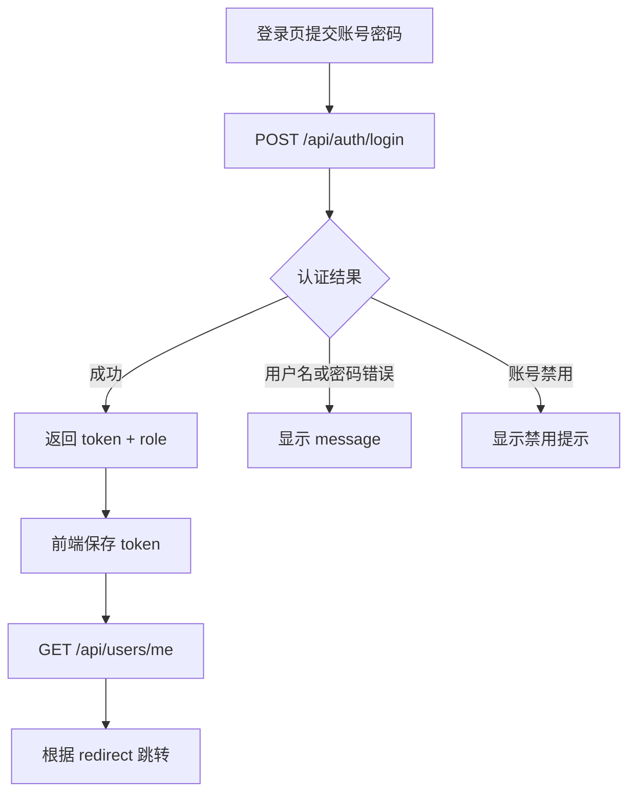

# 认证与权限

> **Referenced files**
> - [server/src/main/java/com/secondhand/config/SecurityConfig.java](../server/src/main/java/com/secondhand/config/SecurityConfig.java)
> - [server/src/main/java/com/secondhand/security/JwtAuthenticationEntryPoint.java](../server/src/main/java/com/secondhand/security/JwtAuthenticationEntryPoint.java)
> - [server/src/main/java/com/secondhand/security/JwtAuthenticationFilter.java](../server/src/main/java/com/secondhand/security/JwtAuthenticationFilter.java)
> - [server/src/main/java/com/secondhand/controller/AuthController.java](../server/src/main/java/com/secondhand/controller/AuthController.java)
> - [server/src/main/java/com/secondhand/service/impl/UserServiceImpl.java](../server/src/main/java/com/secondhand/service/impl/UserServiceImpl.java)
> - [src/stores/user.js](../src/stores/user.js)
> - [src/utils/auth.js](../src/utils/auth.js)

系统采用 `Spring Security + JWT` 完成前后端分离场景下的认证授权。本轮优化除了保留原有 token 方案，还补齐了管理员角色隔离、禁用账号提示、登录后资料同步和来源页跳转逻辑。

## Table of contents
1. [认证流程](#认证流程)
2. [角色模型](#角色模型)
3. [权限规则](#权限规则)
4. [登录流程图](#登录流程图)
5. [代码示例](#代码示例)

## 认证流程

**Section sources**
- [server/src/main/java/com/secondhand/controller/AuthController.java](../server/src/main/java/com/secondhand/controller/AuthController.java)
- [src/stores/user.js](../src/stores/user.js)

1. 用户提交用户名和密码到 `/api/auth/login`
2. 后端使用 `AuthenticationManager` 校验身份
3. 登录成功后返回 `token + username + role`
4. 前端保存 token，并立即调用 `/api/users/me` 刷新用户资料
5. 前端根据 `redirect` 参数跳转到原目标页或默认页

## 角色模型

**Section sources**
- [server/src/main/java/com/secondhand/entity/User.java](../server/src/main/java/com/secondhand/entity/User.java)
- [server/src/main/java/com/secondhand/service/impl/UserServiceImpl.java](../server/src/main/java/com/secondhand/service/impl/UserServiceImpl.java)

| 角色 | 字段值 | 说明 |
| --- | --- | --- |
| 普通用户 | `USER` | 默认角色，可访问普通业务功能 |
| 管理员 | `ADMIN` | 可访问管理端页面和 `/api/admin/**` 接口 |

同时，用户表中的 `enabled` 字段用于控制账号是否可登录。

## 权限规则

**Section sources**
- [server/src/main/java/com/secondhand/config/SecurityConfig.java](../server/src/main/java/com/secondhand/config/SecurityConfig.java)
- [server/src/main/java/com/secondhand/security/JwtAuthenticationEntryPoint.java](../server/src/main/java/com/secondhand/security/JwtAuthenticationEntryPoint.java)

- `/api/auth/**`、`/api/system/db-health`、`GET /api/system/summary`、`GET /api/products/**`、`GET /api/wanted`
  - 允许匿名访问
- `/api/admin/**`
  - 必须具备 `ADMIN` 角色
- 其他业务接口
  - 需要登录
- 未登录或 token 过期
  - 返回 `401` 与 `"未登录或登录已过期"`
- 权限不足
  - 返回 `403` 与 `"无权执行该操作"`

## 登录流程图

**Diagram sources**
- [server/src/main/java/com/secondhand/controller/AuthController.java](../server/src/main/java/com/secondhand/controller/AuthController.java)
- [src/stores/user.js](../src/stores/user.js)
- [src/utils/auth.js](../src/utils/auth.js)



## 代码示例

**Section sources**
- [server/src/main/java/com/secondhand/controller/AuthController.java](../server/src/main/java/com/secondhand/controller/AuthController.java)

```java
} catch (BadCredentialsException ex) {
    return ResponseEntity.status(401).body(Collections.singletonMap("message", "用户名或密码错误"));
} catch (DisabledException ex) {
    return ResponseEntity.status(403).body(Collections.singletonMap("message", "账号已被禁用，请联系管理员"));
}
```

## 影响总结
- 本页适合直接写入论文中的“安全设计”“身份认证设计”“权限控制设计”章节。
- 如果后续扩展为更复杂的权限体系，可在本页继续演进为 RBAC 设计说明。
