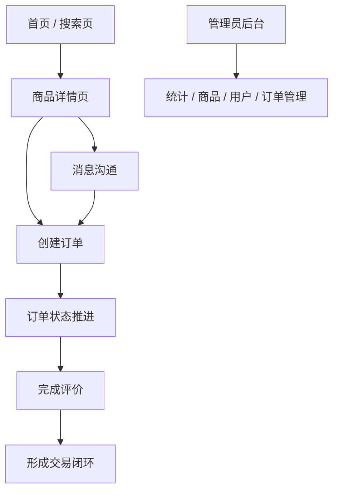
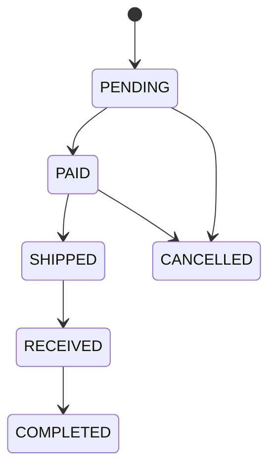

# 核心业务流程

> **Referenced files**
> - [src/views/HomePage.vue](../src/views/HomePage.vue)
> - [src/views/ProductPage.vue](../src/views/ProductPage.vue)
> - [src/views/MessagesPage.vue](../src/views/MessagesPage.vue)
> - [src/views/OrderPage.vue](../src/views/OrderPage.vue)
> - [src/views/OrderReviewPage.vue](../src/views/OrderReviewPage.vue)
> - [server/src/main/java/com/secondhand/controller/OrderController.java](../server/src/main/java/com/secondhand/controller/OrderController.java)
> - [server/src/main/java/com/secondhand/controller/MessageController.java](../server/src/main/java/com/secondhand/controller/MessageController.java)
> - [server/src/main/java/com/secondhand/controller/ReviewController.java](../server/src/main/java/com/secondhand/controller/ReviewController.java)

本平台的核心价值不在于某一个静态页面，而在于“浏览商品 -> 沟通确认 -> 创建订单 -> 推进交易 -> 完成评价”的业务闭环。本轮优化围绕这条主链路展开，使系统既有功能闭环，也有较好的使用体验。

## Table of contents
1. [用户交易主流程](#用户交易主流程)
2. [消息协同流程](#消息协同流程)
3. [管理端监管流程](#管理端监管流程)
4. [业务流程图](#业务流程图)

## 用户交易主流程

**Section sources**
- [src/views/HomePage.vue](../src/views/HomePage.vue)
- [server/src/main/java/com/secondhand/controller/OrderController.java](../server/src/main/java/com/secondhand/controller/OrderController.java)

1. 用户在首页或搜索页浏览商品。
2. 进入商品详情页查看商品、卖家和评价信息。
3. 通过消息页与卖家沟通，确认价格与交付方式。
4. 发起订单创建，系统自动绑定买家、卖家、商品与金额。
5. 订单在支付、发货、收货、完成等阶段推进。
6. 用户在订单完成后提交评价，形成交易闭环。

## 消息协同流程

**Section sources**
- [src/views/MessagesPage.vue](../src/views/MessagesPage.vue)
- [server/src/main/java/com/secondhand/controller/MessageController.java](../server/src/main/java/com/secondhand/controller/MessageController.java)

- 消息与商品上下文关联，减少“消息脱离商品”的理解成本。
- 会话列表根据用户关系聚合，并维护未读消息数量。
- 管理员可查看商品维度的消息汇总，用于后台监管与问题排查。

## 管理端监管流程

**Section sources**
- [server/src/main/java/com/secondhand/controller/AdminController.java](../server/src/main/java/com/secondhand/controller/AdminController.java)
- [src/views/admin/AdminUsersPage.vue](../src/views/admin/AdminUsersPage.vue)

- 管理员登录后台查看系统概览。
- 在商品管理页可以查看、上下架或删除异常商品。
- 在用户管理页可以筛选用户，并调整启用状态与认证状态。
- 在订单管理页可以定位不同状态订单，辅助查看平台治理能力。

## 业务流程图

**Diagram sources**
- [server/src/main/java/com/secondhand/controller/OrderController.java](../server/src/main/java/com/secondhand/controller/OrderController.java)
- [server/src/main/java/com/secondhand/controller/ReviewController.java](../server/src/main/java/com/secondhand/controller/ReviewController.java)

## 订单状态示意

**Section sources**
- [server/src/main/java/com/secondhand/entity/Transaction.java](../server/src/main/java/com/secondhand/entity/Transaction.java)

## 影响总结
- 本页可直接支撑论文中的“系统业务流程分析”与“核心流程设计”章节。
- 介绍项目时可按照本页顺序梳理，减少讲解跳跃感。
