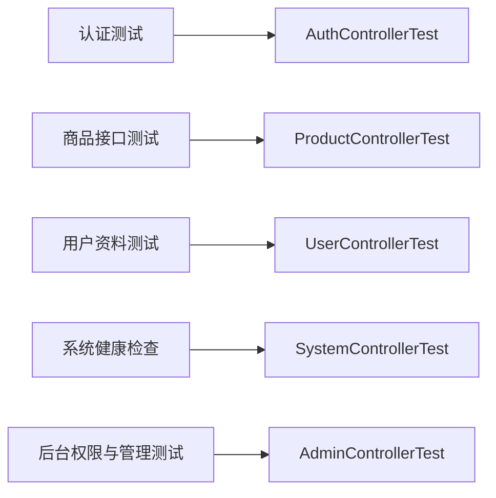

# 测试与项目验证

> **Referenced files**
> - [server/src/test/java/com/secondhand/controller/AdminControllerTest.java](../server/src/test/java/com/secondhand/controller/AdminControllerTest.java)
> - [server/src/test/java/com/secondhand/controller/AuthControllerTest.java](../server/src/test/java/com/secondhand/controller/AuthControllerTest.java)
> - [server/src/test/java/com/secondhand/controller/ProductControllerTest.java](../server/src/test/java/com/secondhand/controller/ProductControllerTest.java)
> - [server/src/test/java/com/secondhand/controller/UserControllerTest.java](../server/src/test/java/com/secondhand/controller/UserControllerTest.java)
> - [server/src/test/java/com/secondhand/controller/SystemControllerTest.java](../server/src/test/java/com/secondhand/controller/SystemControllerTest.java)
> - [FRONTEND_DEMO.md](../FRONTEND_DEMO.md)

为了保证系统稳定性，项目不仅补充了页面观感和接口结构，也同步增加了关键后端测试与说明文档，使项目具备“可验证、可复现、可讲解”的交付特征。

## Table of contents
1. [已覆盖测试](#已覆盖测试)
2. [推荐验收清单](#推荐验收清单)
3. [使用说明建议](#使用说明建议)
4. [测试矩阵图](#测试矩阵图)

## 已覆盖测试

**Section sources**
- [server/src/test/java/com/secondhand/controller/AdminControllerTest.java](../server/src/test/java/com/secondhand/controller/AdminControllerTest.java)
- [server/src/test/java/com/secondhand/controller/AuthControllerTest.java](../server/src/test/java/com/secondhand/controller/AuthControllerTest.java)
- [server/src/test/java/com/secondhand/controller/ProductControllerTest.java](../server/src/test/java/com/secondhand/controller/ProductControllerTest.java)

| 测试类 | 覆盖重点 |
| --- | --- |
| `AuthControllerTest` | 登录成功、错误账号密码返回统一 message |
| `ProductControllerTest` | 商品 DTO 新字段与发布逻辑 |
| `UserControllerTest` | 当前用户资料接口与登录保护 |
| `SystemControllerTest` | 数据库健康检查 |
| `AdminControllerTest` | 后台统计、权限拦截、商品/用户后台操作落库 |

## 推荐验收清单

**Section sources**
- [FRONTEND_DEMO.md](../FRONTEND_DEMO.md)

### 用户端
- 首页可正常展示统计数据和精选商品。
- 登录页支持错误提示、登录成功跳转和完整反馈。
- 搜索页在有结果、无结果和加载中状态下都有明确反馈。
- 商品详情、消息、订单、评价链路可完整走通。
- 个人中心能展示认证状态、统计数据和未读消息信息。

### 管理端
- 管理员可登录后台。
- 普通用户无法访问后台路由与后台接口。
- 后台概览能正确展示系统统计。
- 商品、用户、订单管理页能正常加载数据并执行基本操作。

## 使用说明建议

**Section sources**
- [FRONTEND_DEMO.md](../FRONTEND_DEMO.md)
- [server/README.md](../server/README.md)

1. 先展示首页与登录页，强调系统定位与成品感。
2. 用普通用户完成一条“搜索商品 -> 消息沟通 -> 下单 -> 评价”的主链路。
3. 切换到个人中心展示聚合数据、认证状态和系统完整性。
4. 使用管理员账号进入后台，展示统计数据与用户/商品管理能力。
5. 如果需要补充技术细节，可继续说明 JWT 认证、DTO 化和统一异常输出等实现方式。

## 测试矩阵图

**Diagram sources**
- [server/src/test/java/com/secondhand/controller/AdminControllerTest.java](../server/src/test/java/com/secondhand/controller/AdminControllerTest.java)
- [server/src/test/java/com/secondhand/controller/AuthControllerTest.java](../server/src/test/java/com/secondhand/controller/AuthControllerTest.java)

## 影响总结
- 本页可以直接沉淀为论文中的“系统测试”章节大纲。
- 结合真实运行截图和测试结果，即可形成较完整的项目验证材料。
